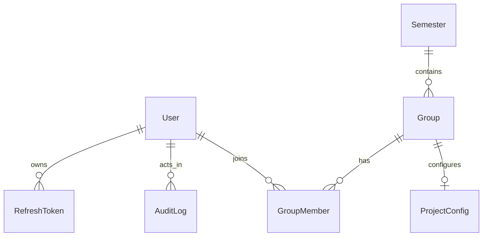

# SAMT Backend to Frontend Integration Architecture

## 1. Project Overview

### System purpose
SAMT (Student Assignment Management Tool) is a microservices backend for identity, student group management, and project configuration integrations (Jira/GitHub).

### Business domain
- Academic workflow and assignment team management
- User identity and role-based administration
- External tool integration for project execution

### Target users
- `ADMIN`: global user/admin operations and auditing
- `LECTURER`: manage teaching groups and group context
- `STUDENT`: member-level operations and project collaboration

### Main feature areas
- Authentication and token lifecycle
- Admin user lifecycle (lock/unlock/soft delete/restore)
- Semester and group management
- Group member and leadership management
- Project configuration and verification
- Security audit visibility

### High-level modules
- `api-gateway` (single entrypoint)
- `identity-service`
- `user-group-service`
- `project-config-service`
- Supporting services: `sync-service`, `analysis-service`, `report-service`, `notification-service`

## 2. Backend Architecture

### Framework and platform
- Language: Java 21
- Framework: Spring Boot 3.x
- Gateway: Spring Cloud Gateway
- Security: Spring Security + JWT bearer auth
- API contract: OpenAPI 3.0.3 (`openapi.yaml`)

### Architecture pattern
- Modular microservices with gateway-centric ingress
- Mostly layered per service (`controller -> service -> repository/entity`)
- Hybrid communication: REST via gateway + gRPC internal calls

### API style
- Primary external API style: REST JSON
- Internal service-to-service: gRPC (for selected flows)

### Database and persistence
- PostgreSQL (identity DB + core DB)
- ORM: Spring Data JPA / Hibernate
- Migration: Flyway
- Redis used for gateway concerns (rate limiting/session-related concerns)

### Authentication and authorization
- External JWT access token validated at API Gateway
- Gateway mints short-lived internal JWT for downstream services
- Role model: `ADMIN`, `LECTURER`, `STUDENT`
- Refresh token rotation flow in identity

### API versioning
- No URL version segment (`/api/v1`) currently used
- Version tracked in OpenAPI metadata: `1.0.0`
- Frontend compatibility should be contract-tested against `openapi.yaml`

### Folder structure (integration-relevant)
- `openapi.yaml`: unified contract exposed via gateway
- `identity-service/src/main/java/...`: auth and admin user lifecycle
- `user-group-service/src/main/java/...`: semesters/groups/members
- `project-config-service/src/main/java/...`: external integration config
- `api-gateway/src/main/java/...`: auth validation, forwarding, security filters

### Cross-cutting concerns
- JWT/JWKS-based auth
- Role-based access
- Audit logs for security/admin actions
- Soft delete behavior for key entities
- Validation via DTO constraints
- Standard error schema (`StandardError`)

## 3. Domain Model Overview

| Entity | Description |
|------|------|
| User | System account with role/status and lifecycle controls |
| RefreshToken | Rotating refresh token records per user |
| AuditLog | Security/admin event trail |
| Semester | Academic period definition |
| Group | Student group scoped to semester and lecturer |
| GroupMember | Membership and leadership role inside group |
| ProjectConfig | Jira/GitHub integration credentials and state |

### Relationships
- User -> RefreshToken (1:N)
- User -> AuditLog actor linkage
- Semester -> Group (1:N)
- Group -> GroupMember (1:N)
- User -> GroupMember (1:N via memberships)
- Group -> ProjectConfig (1:0..1 expected in business flow)

## 4. ERD Diagram



## 5. Domain -> API -> UI Mapping

| Entity | DB/Storage | API | Frontend Pages |
|------|------|------|------|
| User | `users` | `/api/auth/*`, `/api/admin/users*`, `/api/users*` | Login, Admin Users, Profile |
| RefreshToken | `refresh_tokens` | `/api/auth/refresh`, `/api/auth/logout` | Session management |
| AuditLog | `audit_logs` | `/api/admin/audit/*` | Security Audit Dashboard |
| Semester | core DB | `/api/semesters*` | Semester Management |
| Group | core DB | `/api/groups*` | Group List, Group Detail |
| GroupMember | core DB | `/api/groups/{groupId}/members*` | Group Members Panel |
| ProjectConfig | core DB | `/api/project-configs*` | Project Config Settings |

## 6. User Roles and Permissions

| Action | ADMIN | LECTURER | STUDENT |
|------|------|------|------|
| Register student account | Yes | Yes | Yes |
| Create lecturer/admin account | Yes | No | No |
| Soft delete/restore user | Yes | No | No |
| Read security audit logs | Yes | No | No |
| Manage semesters | Yes | Yes | No |
| Manage groups | Yes | Lecturer scope | No |
| Manage group members/leader | Yes | Lecturer scope | No |
| Create/update project config | Yes | Group leader/lecturer flow | Restricted |

Note: Service-level business rules are stricter than route-level auth in some endpoints. Always handle `403`/`409` in UI.

## 7. Authentication System

### Strategy
- Bearer JWT (`Authorization: Bearer <access_token>`)
- Refresh token rotation

### Login flow
1. Frontend calls `POST /api/auth/login` with email/password.
2. Backend returns `accessToken`, `refreshToken`, `tokenType`, `expiresIn`.
3. Frontend stores access token in memory and refresh token in secure storage strategy per app security policy.
4. Frontend sends bearer token on protected requests.

### Refresh flow
1. On `401`, frontend calls `POST /api/auth/refresh` with refresh token.
2. Backend returns new access token and refresh token.
3. Retry original request once.
4. If refresh fails, clear session and redirect to login.

### Logout flow
- Call `POST /api/auth/logout` with refresh token and clear local auth state.

## 8. API Versioning

- Current strategy: unversioned path namespace (`/api/*`)
- Contract version source: `openapi.info.version = 1.0.0`
- Frontend risk: breaking backend changes are not isolated by URL version
- Recommendation: pin frontend against OpenAPI snapshot and run CI contract checks

## 9. API Base Configuration

- Base URL (local): `http://localhost:9080`
- API base path: `/api`
- Required headers:
  - `Content-Type: application/json`
  - `Authorization: Bearer <token>` (when required)
- Recommended timeout: `10000 ms`

## 10. Global API Response Format

No single envelope across all modules. Observed patterns:

1. Direct DTO response:
```json
{
  "id": 1,
  "email": "student@example.com"
}
```

2. Envelope response (project-config):
```json
{
  "data": { "id": "uuid", "groupId": 12 },
  "timestamp": "2026-03-10T08:20:00Z"
}
```

3. Paged response:
```json
{
  "content": [],
  "page": 0,
  "size": 20,
  "totalElements": 0,
  "totalPages": 0
}
```

## 11. Error Handling

### Standard schema
```json
{
  "statusCode": 400,
  "error": "Bad Request",
  "message": "Validation failed",
  "timestamp": "2026-03-10T08:20:00Z"
}
```

### Common HTTP errors
| Code | Meaning |
|------|------|
| 400 | Validation/domain state error |
| 401 | Unauthorized/expired token |
| 403 | Forbidden by role/business policy |
| 404 | Resource not found |
| 409 | Conflict (duplicate/state conflict) |
| 500 | Server error |
| 503 | Dependency unavailable (notably project-config create) |

## 12. API Modules

- Auth API: `/api/auth/*`
- Identity Admin API: `/api/admin/users*`, `/api/admin/audit*`
- User API: `/api/users*`
- Semester API: `/api/semesters*`
- Group API: `/api/groups*`
- Project Config API: `/api/project-configs*`
- Internal-only API: `/internal/project-configs/*` (not for browser client)

## 13. API Endpoint Documentation

### Authentication
| Method | Endpoint | Request | Response | Frontend usage |
|------|------|------|------|------|
| POST | `/api/auth/register` | `identity_RegisterRequest` | `identity_RegisterResponse` | Public Register page |
| POST | `/api/auth/login` | `identity_LoginRequest` | `identity_LoginResponse` | Login page |
| POST | `/api/auth/refresh` | `identity_RefreshTokenRequest` | `identity_LoginResponse` | Token refresh interceptor |
| POST | `/api/auth/logout` | `identity_LogoutRequest` | `204` | Logout action |

### Identity Admin
| Method | Endpoint | Request | Response | Frontend usage |
|------|------|------|------|------|
| POST | `/api/admin/users` | `identity_AdminCreateUserRequest` | `identity_AdminCreateUserResponse` | Admin create user modal |
| DELETE | `/api/admin/users/{userId}` | path | `identity_AdminActionResponse` | Admin user list row action |
| POST | `/api/admin/users/{userId}/restore` | path | `identity_AdminActionResponse` | Deleted users tab |
| POST | `/api/admin/users/{userId}/lock` | path + query `reason?` | `identity_AdminActionResponse` | Admin security action |
| POST | `/api/admin/users/{userId}/unlock` | path | `identity_AdminActionResponse` | Admin security action |
| PUT | `/api/admin/users/{userId}/external-accounts` | `identity_ExternalAccountsRequest` | `identity_ExternalAccountsResponse` | Admin user integration mapping |
| GET | `/api/admin/audit/security-events` | pageable query | `identity_PageAuditLog` | Security dashboard |
| GET | `/api/admin/audit/range` | date/page query | `identity_PageAuditLog` | Audit filters |
| GET | `/api/admin/audit/entity/{entityType}/{entityId}` | path + pageable | `identity_PageAuditLog` | Entity audit panel |
| GET | `/api/admin/audit/actor/{actorId}` | path + pageable | `identity_PageAuditLog` | Actor activity panel |

### Users / Groups / Semesters
| Method | Endpoint | Request | Response | Frontend usage |
|------|------|------|------|------|
| GET | `/api/users` | query page/size/search | `userGroup_PageResponseUserResponse` | User selector/admin list |
| GET | `/api/users/{userId}` | path | `userGroup_UserResponse` | Profile details |
| PUT | `/api/users/{userId}` | `userGroup_UpdateUserRequest` | `userGroup_UserResponse` | Profile edit form |
| GET | `/api/users/{userId}/groups` | path | `userGroup_UserGroupsResponse` | User membership view |
| GET | `/api/semesters` | query | list | Semester list |
| POST | `/api/semesters` | `userGroup_CreateSemesterRequest` | `userGroup_SemesterResponse` | Semester create form |
| GET | `/api/semesters/{id}` | path | `userGroup_SemesterResponse` | Semester detail |
| PUT | `/api/semesters/{id}` | `userGroup_UpdateSemesterRequest` | `userGroup_SemesterResponse` | Semester edit form |
| PATCH | `/api/semesters/{id}/activate` | path | `200/204` | Activate semester action |
| GET | `/api/semesters/code/{code}` | path | `userGroup_SemesterResponse` | Resolver by code |
| GET | `/api/semesters/active` | none | `userGroup_SemesterResponse` | Context bootstrap |
| GET | `/api/groups` | paging/filter query | `userGroup_PageResponseGroupListResponse` | Group list page |
| POST | `/api/groups` | `userGroup_CreateGroupRequest` | `userGroup_GroupResponse` | Group create modal |
| GET | `/api/groups/{groupId}` | path | `userGroup_GroupDetailResponse` | Group detail page |
| PUT | `/api/groups/{groupId}` | `userGroup_UpdateGroupRequest` | `userGroup_GroupResponse` | Group edit modal |
| DELETE | `/api/groups/{groupId}` | path | `200/204` | Group delete action |
| PATCH | `/api/groups/{groupId}/lecturer` | `userGroup_UpdateLecturerRequest` | `userGroup_GroupResponse` | Reassign lecturer |
| GET | `/api/groups/{groupId}/members` | path | list | Members table |
| POST | `/api/groups/{groupId}/members` | `userGroup_AddMemberRequest` | `userGroup_MemberResponse` | Add member modal |
| DELETE | `/api/groups/{groupId}/members/{userId}` | path | `200/204` | Remove member action |
| PUT | `/api/groups/{groupId}/members/{userId}/promote` | path | `userGroup_MemberResponse` | Promote to leader |
| PUT | `/api/groups/{groupId}/members/{userId}/demote` | path | `userGroup_MemberResponse` | Demote leader |

### Project Config
| Method | Endpoint | Request | Response | Frontend usage |
|------|------|------|------|------|
| POST | `/api/project-configs` | `projectConfig_CreateConfigRequest` | `projectConfig_ConfigEnvelope` | Project config create page |
| GET | `/api/project-configs/{id}` | path | object | Config detail page |
| PUT | `/api/project-configs/{id}` | `projectConfig_UpdateConfigRequest` | object | Config edit form |
| DELETE | `/api/project-configs/{id}` | path | object | Soft delete action |
| POST | `/api/project-configs/{id}/verify` | path | `projectConfig_VerificationEnvelope` | Verify connection action |
| POST | `/api/project-configs/admin/{id}/restore` | path | object | Admin restore action |
| GET | `/api/project-configs/group/{groupId}` | path | `projectConfig_ConfigEnvelope` | Group config view |

## 14. Pagination, Filtering, Sorting

### Common query patterns
- Pagination: `page`, `size` (sometimes `limit` style in docs, but OpenAPI uses pageable)
- Filtering examples: `status`, `role`, `search`, date ranges
- Sorting: `sort=field,asc|desc`

### TypeScript query models
```ts
export interface PageableQuery {
  page?: number
  size?: number
  sort?: string[]
}

export interface UserListQuery extends PageableQuery {
  role?: "ADMIN" | "LECTURER" | "STUDENT"
  status?: string
  search?: string
}

export interface GroupListQuery extends PageableQuery {
  semesterId?: number
  lecturerId?: number
  search?: string
}

export interface AuditRangeQuery extends PageableQuery {
  startDate?: string
  endDate?: string
  outcome?: "SUCCESS" | "FAILURE" | "DENIED"
}
```

## 15. Enum Definitions

- `UserRole`: `ADMIN`, `LECTURER`, `STUDENT`
- `RegisterRole`: `STUDENT` (self-register only)
- `GroupRole`: `LEADER`, `MEMBER`
- `AuditAction`:
  `CREATE`, `UPDATE`, `SOFT_DELETE`, `RESTORE`, `LOGIN_SUCCESS`, `LOGIN_FAILED`, `LOGIN_DENIED`, `LOGOUT`, `REFRESH_SUCCESS`, `REFRESH_REUSE`, `REFRESH_EXPIRED`, `ACCOUNT_LOCKED`, `ACCOUNT_UNLOCKED`, `PASSWORD_CHANGE`
- `AuditOutcome`: `SUCCESS`, `FAILURE`, `DENIED`

## 16. Frontend TypeScript Models

Implemented scaffold models:
- `frontend-integration/src/types/common.ts`
- `frontend-integration/src/types/auth.ts`
- `frontend-integration/src/types/identity.ts`
- `frontend-integration/src/types/userGroup.ts`
- `frontend-integration/src/types/projectConfig.ts`

## 17. Zod Validation Schemas

Implemented scaffold schemas:
- `frontend-integration/src/schemas/authSchema.ts`
- `frontend-integration/src/schemas/groupSchema.ts`
- `frontend-integration/src/schemas/projectConfigSchema.ts`

## 18. API Client Configuration

Implemented in:
- `frontend-integration/src/api/apiClient.ts`
- `frontend-integration/src/api/tokenStore.ts`

Includes:
- Axios instance with `baseURL`, timeout
- Request interceptor for bearer injection
- Response interceptor with one-time refresh retry
- Refresh token rotation write-back
- Logout fallback on refresh failure

## 19. API SDK

Implemented API modules:
- `frontend-integration/src/api/authApi.ts`
- `frontend-integration/src/api/identityAdminApi.ts`
- `frontend-integration/src/api/userGroupApi.ts`
- `frontend-integration/src/api/projectConfigApi.ts`

## 20. React Query Hooks

Implemented hooks:
- `frontend-integration/src/hooks/useAuth.ts`
- `frontend-integration/src/hooks/useIdentityAdmin.ts`
- `frontend-integration/src/hooks/useUserGroups.ts`
- `frontend-integration/src/hooks/useProjectConfigs.ts`

## 21. Query Key Convention

Implemented in `frontend-integration/src/hooks/queryKeys.ts`.

Examples:
- `['auth', 'session']`
- `['admin', 'users', filters]`
- `['groups', filters]`
- `['group', groupId]`
- `['projectConfig', id]`
- `['projectConfigByGroup', groupId]`

## 22. Caching Strategy

Recommended defaults:
- User/group list: `staleTime = 60s`
- Semester active context: `staleTime = 5m`
- Audit/security events: `staleTime = 15s` + manual refresh
- Project config details: `staleTime = 30s`
- Mutations: invalidate relevant list/detail keys after success

## 23. Frontend Pages

| Route | Purpose | Primary APIs |
|------|------|------|
| `/login` | user login | `/api/auth/login` |
| `/register` | student registration | `/api/auth/register` |
| `/admin/users` | user lifecycle and external accounts | `/api/admin/users*` |
| `/admin/audit` | audit and security events | `/api/admin/audit/*` |
| `/semesters` | semester management | `/api/semesters*` |
| `/groups` | list groups | `/api/groups` |
| `/groups/:groupId` | group detail/member actions | `/api/groups/{groupId}*` |
| `/project-configs/:id` | config view/update/verify | `/api/project-configs/{id}*` |

## 24. Table UI Schema

### Users table
| Column | Field | Sortable | Filter |
|------|------|------|------|
| Email | `email` | Yes | search |
| Full Name | `fullName` | Yes | search |
| Role | `role/roles` | Yes | role |
| Status | `status` | Yes | status |
| Actions | - | No | - |

### Groups table
| Column | Field | Sortable | Filter |
|------|------|------|------|
| Group Name | `groupName` | Yes | search |
| Semester | `semesterCode` | Yes | semester |
| Lecturer | `lecturerName` | Yes | lecturer |
| Members | `memberCount` | Yes | - |

## 25. UI States

- Loading: skeleton rows/spinner for list/detail pages
- Empty: explicit empty-state text with retry and clear filters action
- Error: map `StandardError.message` when available, fallback generic message
- Forbidden (`403`): show permission-specific message and hide restricted actions

## 26. State Management

- Global auth/session state: lightweight store or context
- Server state: React Query (queries/mutations/caching)
- Local state: form values, dialogs, table filters, selected IDs

## 27. Frontend Folder Structure

```text
frontend-integration/src
  api
  hooks
  types
  schemas
  config
```

If integrating into existing app, map these folders to:
```text
src/api
src/hooks
src/types
src/schemas
src/config
```

## 28. Mock API Responses

### Login response
```json
{
  "accessToken": "eyJ...",
  "refreshToken": "a1b2c3d4-e5f6-7890-abcd-ef1234567890",
  "tokenType": "Bearer",
  "expiresIn": 900
}
```

### Group detail response
```json
{
  "id": 101,
  "groupName": "SE24-G1",
  "semesterId": 7,
  "semesterCode": "2026S1",
  "lecturer": { "id": 9, "fullName": "Dr. A", "email": "a@uni.edu" },
  "members": [
    { "userId": 21, "fullName": "Student One", "email": "s1@uni.edu", "role": "LEADER" }
  ],
  "memberCount": 5
}
```

### Project config envelope
```json
{
  "data": {
    "id": "b7b5dfe8-6ed5-4f4f-9c55-3b12be0f7dad",
    "groupId": 101,
    "jiraHostUrl": "https://example.atlassian.net",
    "jiraApiToken": "********",
    "githubRepoUrl": "https://github.com/org/repo",
    "githubToken": "********",
    "state": "ACTIVE",
    "lastVerifiedAt": "2026-03-10T08:20:00Z",
    "invalidReason": null,
    "createdAt": "2026-03-01T08:20:00Z",
    "updatedAt": "2026-03-10T08:20:00Z"
  },
  "timestamp": "2026-03-10T08:20:00Z"
}
```

## 29. API Dependency Graph

```mermaid
flowchart TD
  A[App Bootstrap] --> B[GET /api/semesters/active]
  A --> C[GET /api/users/{userId}]
  D[Admin Users Page] --> E[GET /api/users]
  D --> F[POST/DELETE /api/admin/users*]
  G[Group Detail Page] --> H[GET /api/groups/{groupId}]
  G --> I[GET /api/groups/{groupId}/members]
  G --> J[POST/DELETE/PUT member actions]
  K[Project Config Page] --> L[GET /api/project-configs/{id}]
  K --> M[POST /api/project-configs/{id}/verify]
```

## 30. Edge Cases

- Soft-deleted user/group behavior vs visible lists
- `409` conflicts: duplicate group names, invalid transitions, account mapping conflicts
- `401` due to access token expiry during background fetches
- Refresh token invalid/reused -> force logout flow
- Role-based forbidden actions (`403`) after UI-level optimistic enablement
- Mixed response envelopes across modules
- Nullables in profile/project config fields
- Potential `503` during external integration checks
- Network timeouts during verification endpoints
- Internal endpoint exposure: never call `/internal/project-configs/*` from browser app

## Immediate Implementation Checklist

1. Copy `frontend-integration/src/*` into your frontend repo.
2. Set `VITE_API_URL` (or `NEXT_PUBLIC_API_URL`) to gateway URL.
3. Wire token persistence adapter in `tokenStore.ts`.
4. Mount React Query provider and use provided hooks by page.
5. Implement route guards from role claims in access token payload.
6. Add contract test in frontend CI against this repo `openapi.yaml`.
