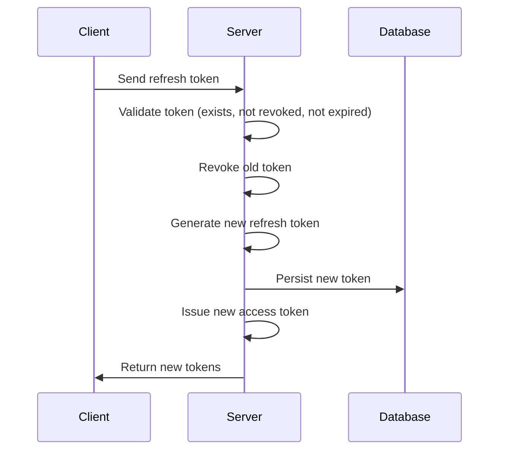
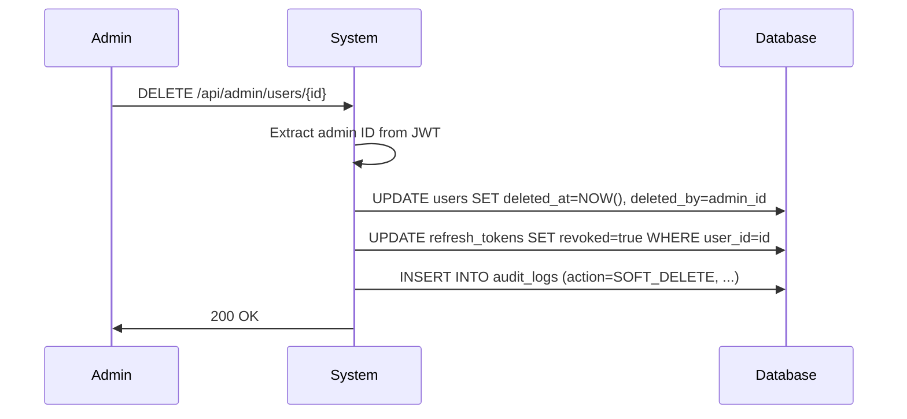
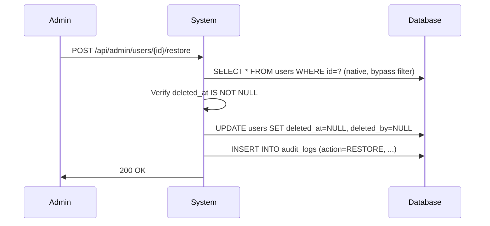
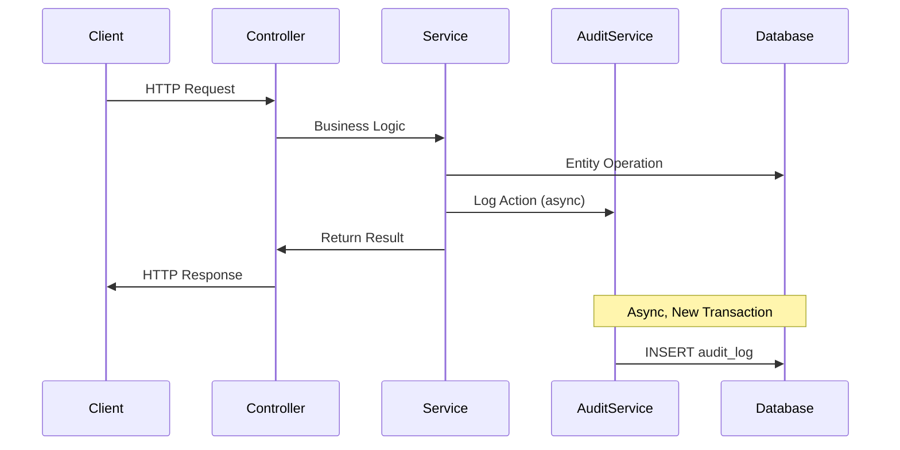

# Authentication & Authorization Design – Identity Service

## 1. Overview

- **Service**: Identity Service
- **Security Model**: Stateless JWT + Refresh Token Rotation
- **Standards**: Enterprise Security, Defense in Depth

---

## 2. JWT Specification

### 2.1 Algorithm

- **Algorithm**: `HS256`
- **Signing Key**: `JWT_SECRET` (environment variable)

### 2.2 Token Types

| Token Type       | TTL       |
|------------------|-----------|
| Access Token     | 15 minutes |
| Refresh Token    | 7 days    |

### 2.3 JWT Claims (Access Token)

| Claim        | Description                    |
|--------------|--------------------------------|
| `sub`        | User ID                        |
| `email`      | User email                     |
| `roles`      | List of roles (ROLE_*)         |
| `iat`        | Issued at                      |
| `exp`        | Expiration                     |
| `token_type` | ACCESS                         |

### 2.4 Refresh Token Format

- **Type**: Opaque random UUID string
- **Not a JWT**: Stored in database, not self-contained

---

## 3. Refresh Token Rotation Flow



**Steps:**

1. Client sends refresh token
2. Server validates token:
   - ✅ Exists in DB
   - ✅ Not revoked
   - ✅ Not expired
3. **Server checks user account status** ⚠️ CRITICAL
   - Fetch user from token: `User user = refreshToken.getUser()`
   - Check status: `if (user.getStatus() == LOCKED)`
   - If LOCKED → Revoke ALL tokens (`revokeAllByUser()`), throw 403 AccountLockedException
4. Server revokes old token (set `revoked = true`)
5. Generate new refresh token (new UUID, new expiration)
6. Persist new token to database
7. Issue new access token (new JWT, 15min TTL)
8. Return both new tokens to client

> **Design Decision (CRITICAL SECURITY FIX):** Account status MUST be checked during token refresh to ensure locked users cannot obtain new access tokens even with a valid refresh token issued before the lock. Without this check, locked accounts can bypass the lockout by refreshing tokens.

> **Implementation Note:** This check was initially missing in RefreshTokenService and was added after security review. See Security-Review.md § 3.

### Reuse Detection

⚠️ **Security**: If revoked token is reused → **revoke all refresh tokens** of user and force re-login

---

## 4. Password Security

- **Encoder**: `BCryptPasswordEncoder`
- **Strength**: 10

---

## 5. Roles & Authorities

### 5.1 Role Format at Different Layers

**IMPORTANT**: Role format varies depending on where it's used:

| Layer | Format | Example | Notes |
|-------|--------|---------|-------|
| **Database** | Plain enum | `ADMIN`, `STUDENT`, `LECTURER` | No prefix in `users.role` column |
| **Java Entity** | Enum | `Role.ADMIN`, `Role.STUDENT` | Direct mapping from DB |
| **JWT Claims** | Array of strings | `["ADMIN"]`, `["STUDENT"]` | No prefix in token |
| **Spring Security** | Granted Authority | `ROLE_ADMIN`, `ROLE_STUDENT` | Prefix added internally |
| **@PreAuthorize** | hasRole() argument | `hasRole('ADMIN')` | Spring auto-adds `ROLE_` prefix |

### 5.2 Implementation Details

**Database Schema:**
```sql
CREATE TABLE users (
  ...
  role VARCHAR(50) NOT NULL,  -- Values: 'ADMIN', 'STUDENT', 'LECTURER'
  ...
);
```

**JWT Token Payload:**
```json
{
  "sub": "1",
  "email": "user@example.com",
  "roles": ["ADMIN"],  // No ROLE_ prefix
  "iat": 1234567890,
  "exp": 1234567890
}
```

**Spring Security Internal:**
```java
// JwtAuthenticationFilter adds ROLE_ prefix when creating authority
UsernamePasswordAuthenticationToken authToken = new UsernamePasswordAuthenticationToken(
    user,
    null,
    List.of(new SimpleGrantedAuthority("ROLE_" + user.getRole().name()))
);
```

**Controller Authorization:**
```java
@PreAuthorize("hasRole('ADMIN')")  // Spring automatically looks for ROLE_ADMIN
public ResponseEntity<?> adminEndpoint() { ... }
```

### 5.3 Key Points

✅ **Database & JWT**: Store plain role names without prefix  
✅ **Spring Security**: Automatically adds `ROLE_` prefix internally  
✅ **@PreAuthorize**: Use `hasRole('ADMIN')` NOT `hasRole('ROLE_ADMIN')`  
⚠️ **Never store** `ROLE_` prefix in database or JWT claims

---

## ✅ Status

**READY FOR IMPLEMENTATION**

---

## 6. Soft Delete Design

### 6.1 Overview

Users are never permanently deleted. Instead, soft delete marks records as deleted while preserving data integrity and audit history.

### 6.2 Soft Delete Fields

| Field | Type | Description |
|-------|------|-------------|
| `deleted_at` | TIMESTAMP | When user was deleted (NULL = active) |
| `deleted_by` | BIGINT | Admin user ID who performed deletion |

### 6.3 Hibernate Integration

```java
@Entity
@SQLRestriction("deleted_at IS NULL")
public class User {
    // Hibernate automatically filters deleted users
}
```

**Behavior:**
- All JPA queries automatically exclude soft-deleted users
- Native queries required to access deleted users (admin only)
- No manual `WHERE deleted_at IS NULL` needed

### 6.4 Soft Delete Flow



### 6.5 Restore Flow



### 6.6 Authorization Rules

| Operation | Required Role |
|-----------|---------------|
| Soft delete user | `ROLE_ADMIN` |
| Restore user | `ROLE_ADMIN` |
| View deleted users | `ROLE_ADMIN` |

---

## 7. Audit Logging Architecture

### 7.1 Overview

All security-sensitive actions are logged asynchronously to `audit_logs` table for compliance, forensics, and accountability.

### 7.2 Audit Log Structure

| Field | Description |
|-------|-------------|
| `entity_type` | Affected entity (User, RefreshToken) |
| `entity_id` | ID of affected entity |
| `action` | Action performed (see Action Types) |
| `outcome` | SUCCESS, FAILURE, DENIED |
| `actor_id` | User ID from JWT (NULL for anonymous) |
| `actor_email` | Denormalized for query performance |
| `timestamp` | When action occurred |
| `ip_address` | Client IP address |
| `user_agent` | Client user agent |
| `old_value` | JSON state before change |
| `new_value` | JSON state after change |

### 7.3 Audit Flow



### 7.4 Async Processing

```java
@Async
@Transactional(propagation = Propagation.REQUIRES_NEW)
public void logAction(...) {
    // Runs in separate thread
    // Separate transaction (persists even if main tx rolls back)
}
```

**Benefits:**
- Non-blocking: main request not delayed by logging
- Fault-tolerant: audit failure doesn't affect business logic
- Independent: audit persists even if main transaction fails

### 7.5 Request Context Capture for Async Audit

Since audit logging is asynchronous (`@Async`), request context (IP address, User-Agent) must be captured BEFORE the async call:

```java
// In service layer (synchronous)
String ipAddress = extractClientIp(request);
String userAgent = extractUserAgent(request);

// Pass to async audit method
auditService.logActionAsync(..., ipAddress, userAgent);
```

**Rationale:** `RequestContextHolder` may be cleared after the HTTP request completes, before the async task executes.

### 7.6 Actor Resolution

| Scenario | Actor Resolution |
|----------|-----------------|
| Authenticated request | Extract from `SecurityContext` |
| Login attempt | Use request email, lookup user ID |
| Registration | Use newly created user ID |
| System action | `actor_id = NULL`, `actor_email = "SYSTEM"` |

### 7.6 Action Types

| Category | Actions |
|----------|---------|
| **Authentication** | `LOGIN_SUCCESS`, `LOGIN_FAILED`, `LOGIN_DENIED`, `LOGOUT` |
| **Token** | `REFRESH_SUCCESS`, `REFRESH_REUSE` |
| **User Lifecycle** | `CREATE`, `UPDATE`, `SOFT_DELETE`, `RESTORE` |
| **Account Status** | `ACCOUNT_LOCKED`, `ACCOUNT_UNLOCKED` |
**Clarification:**

| Action | Trigger | Outcome |
|--------|---------|---------||
| `LOGIN_FAILED` | Wrong password OR user not found | FAILURE |
| `LOGIN_DENIED` | Correct password BUT account locked | DENIED |

> **Note:** `LOGIN_DENIED` is only logged when password validation succeeds but account is locked. This prevents attackers from using audit logs to enumerate locked accounts.
### 7.7 Security Event Monitoring

High-priority events for security monitoring:

| Event | Action | Alert Level |
|-------|--------|-------------|
| Token theft suspected | `REFRESH_REUSE` | 🔴 Critical |
| Brute force attempt | Multiple `LOGIN_FAILED` | 🟠 Warning |
| Account takeover | `LOGIN_SUCCESS` from new IP | 🟡 Info |

---

## 8. Admin Operations Design

### 8.1 Admin Endpoints

| Endpoint | Method | Description |
|----------|--------|-------------|
| `/api/admin/users/{id}` | DELETE | Soft delete user |
| `/api/admin/users/{id}/restore` | POST | Restore user |
| `/api/admin/users/{id}/lock` | POST | Lock account |
| `/api/admin/users/{id}/unlock` | POST | Unlock account |
| `/api/admin/audit/**` | GET | Query audit logs |

### 8.2 Admin Authorization

```java
@RestController
@RequestMapping("/api/admin")
@PreAuthorize("hasRole('ADMIN')")
public class AdminController {
    // All endpoints require ROLE_ADMIN
}
```

### 8.3 Admin Action Effects

| Action | User Table | Refresh Tokens | Audit Log | Self-Action |
|--------|------------|----------------|-----------|-------------|
| Soft Delete | `deleted_at`, `deleted_by` set | All revoked | `SOFT_DELETE` logged | ❌ Blocked |
| Restore | `deleted_at`, `deleted_by` cleared | (none) | `RESTORE` logged | N/A |
| Lock | `status = LOCKED` | All revoked | `ACCOUNT_LOCKED` logged | ❌ Blocked |
| Unlock | `status = ACTIVE` | (none) | `ACCOUNT_UNLOCKED` logged | N/A |

### 8.4 Admin Self-Action Prevention

Admin users are prevented from performing destructive actions on their own account:

| Action | Self-Action | Reason |
|--------|-------------|--------|
| Soft Delete | ❌ Blocked | Prevents admin lockout, requires another admin to delete |
| Lock | ❌ Blocked | Prevents accidental self-lockout |
| Unlock | ✅ Allowed | N/A (cannot self-lock) |
| Restore | ✅ Allowed | N/A (cannot self-delete) |

**Implementation:**
```java
if (userId.equals(currentAdminId)) {
    throw new InvalidUserStateException("Cannot perform this action on own account");
}
```

---

## ✅ Updated Status

**READY FOR IMPLEMENTATION** (including Soft Delete + Audit Log)

