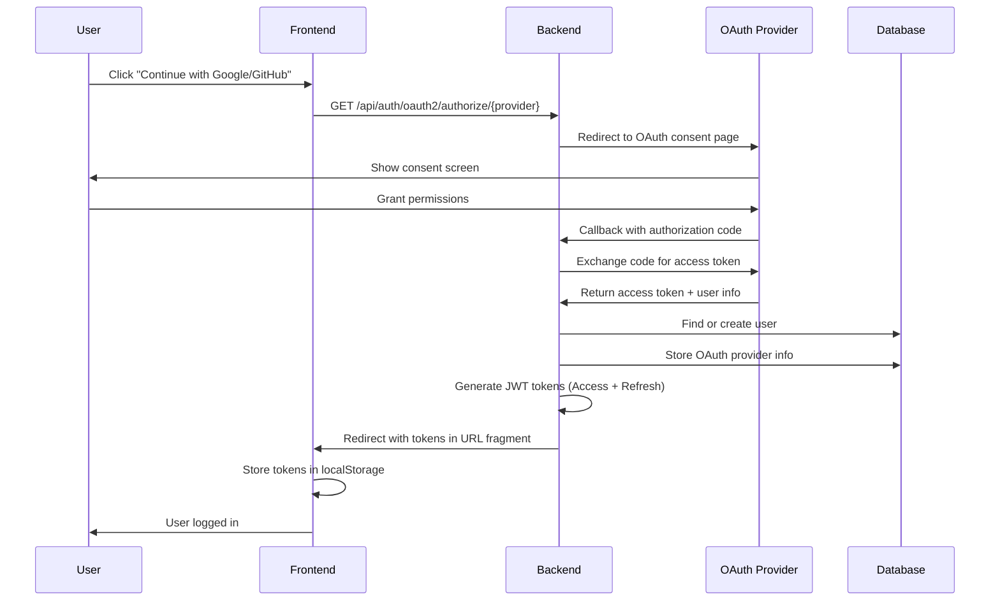

# OAuth 2.0 Integration Design – Identity Service

**Status:** ✅ IMPLEMENTED (January 2026)

---

## 1. Overview

Identity Service hỗ trợ OAuth 2.0 authentication với **Google** và **GitHub** providers, cho phép users đăng nhập bằng tài khoản external thay vì email/password.

### Features

- ✅ Login with Google OAuth 2.0
- ✅ Login with GitHub OAuth 2.0
- ✅ Link/unlink OAuth providers to existing accounts
- ✅ Auto-create user accounts on first OAuth login
- ✅ Auto-map GitHub username for external account integration
- ✅ Multiple OAuth providers per user (Google + GitHub)
- ✅ Encrypted OAuth token storage (AES-256-GCM)

---

## 2. OAuth 2.0 Flow

### Authorization Code Flow



---

## 3. Use Cases

### 3.1 UC-OAUTH-LOGIN-GOOGLE

**Actor:** Any user (Guest, STUDENT, LECTURER, ADMIN)

**Endpoint:** `GET /api/auth/oauth2/authorize/google`

**Flow:**

1. User clicks "Continue with Google" button
2. Frontend redirects to backend OAuth endpoint
3. Backend redirects to Google OAuth consent page
4. User grants permissions (openid, profile, email)
5. Google redirects back to backend callback URL with authorization code
6. Backend exchanges code for access token
7. Backend fetches user info from Google (`https://www.googleapis.com/oauth2/v3/userinfo`)
8. Backend checks if user exists by email:
   - **If exists:** Link Google account to existing user
   - **If not exists:** Create new user with STUDENT role
9. Backend stores OAuth provider info in `oauth_providers` table
10. Backend generates JWT tokens (Access Token + Refresh Token)
11. Backend redirects to frontend with tokens
12. Frontend stores tokens and redirects to dashboard

**Response (Success):**

Frontend receives redirect to:
```
https://frontend.com/#/auth/callback?access_token=<JWT>&refresh_token=<UUID>
```

**Business Rules:**

- BR-OAUTH-G-01: Email must be verified by Google (no SAMT email confirmation needed)
- BR-OAUTH-G-02: New users created with `role = STUDENT`, `status = ACTIVE`
- BR-OAUTH-G-03: Cannot link Google account if email already used by another user (409 CONFLICT)
- BR-OAUTH-G-04: Profile sync (name from Google) on every login
- BR-OAUTH-G-05: OAuth tokens encrypted with AES-256-GCM before storage

**Error Codes:**

| Code | Condition | Message |
|------|-----------|---------|
| 400 | Invalid authorization code | "Invalid OAuth authorization code" |
| 409 | Email conflict | "Email already associated with another account" |
| 500 | OAuth provider error | "Failed to authenticate with Google" |

---

### 3.2 UC-OAUTH-LOGIN-GITHUB

**Actor:** Any user (Guest, STUDENT, LECTURER, ADMIN)

**Endpoint:** `GET /api/auth/oauth2/authorize/github`

**Flow:**

1. User clicks "Continue with GitHub" button
2. Frontend redirects to backend OAuth endpoint
3. Backend redirects to GitHub OAuth authorization page
4. User grants permissions (read:user, user:email, repo)
5. GitHub redirects back to backend callback URL with authorization code
6. Backend exchanges code for access token
7. Backend fetches user info from GitHub (`https://api.github.com/user`)
8. Backend checks if user exists by email:
   - **If exists:** Link GitHub account + update `github_username`
   - **If not exists:** Create new user with STUDENT role
9. Backend stores OAuth provider info in `oauth_providers` table
10. Backend generates JWT tokens
11. Backend redirects to frontend with tokens

**Additional Feature:** Auto-map `github_username`

- If `users.github_username IS NULL`, auto-update from GitHub profile
- Enables automatic commit author mapping for Sync Service

**Business Rules:**

- BR-OAUTH-GH-01: Fetch primary verified email from GitHub
- BR-OAUTH-GH-02: Auto-update `users.github_username` if NULL (won't overwrite existing manual mapping)
- BR-OAUTH-GH-03: Cannot link GitHub account if username already used (409 CONFLICT)
- BR-OAUTH-GH-04: GitHub tokens don't expire (no refresh token from GitHub)
- BR-OAUTH-GH-05: Fetch public repositories for project linking (future feature)

**Error Codes:**

| Code | Condition | Message |
|------|-----------|---------|
| 400 | Invalid authorization code | "Invalid OAuth authorization code" |
| 409 | Username conflict | "GitHub username already associated with another account" |
| 500 | OAuth provider error | "Failed to authenticate with GitHub" |

---

### 3.3 UC-OAUTH-LINK-ACCOUNT

**Actor:** Authenticated user (any role)

**Endpoint:** `POST /api/users/me/oauth/link`

**Purpose:** Link Google/GitHub to existing email/password account

**Request Body:**

```json
{
  "provider": "GOOGLE",  // or "GITHUB"
  "authorizationCode": "4/0AY0e-g7X..."  // From OAuth callback
}
```

**Flow:**

1. User already logged in with email/password
2. User goes to Settings → Connected Accounts
3. User clicks "Link Google" or "Link GitHub"
4. Frontend redirects to OAuth consent page
5. OAuth provider redirects back with authorization code
6. Frontend sends code to backend
7. Backend exchanges code for access token + user info
8. Backend validates OAuth email matches current user email
9. Backend creates record in `oauth_providers` table
10. Backend returns success

**Business Rules:**

- BR-OAUTH-L-01: Cannot link if OAuth email differs from user email (400 BAD REQUEST)
- BR-OAUTH-L-02: Cannot link if provider already linked (409 CONFLICT)
- BR-OAUTH-L-03: User can link multiple providers (Google + GitHub)
- BR-OAUTH-L-04: Audit log required (action: `OAUTH_LINK_ACCOUNT`)

**Response (Success):**

```json
{
  "message": "Google account linked successfully",
  "provider": "GOOGLE",
  "linkedAt": "2026-01-30T10:00:00Z"
}
```

---

### 3.4 UC-OAUTH-UNLINK-ACCOUNT

**Actor:** Authenticated user (any role)

**Endpoint:** `DELETE /api/users/me/oauth/{provider}`

**Purpose:** Remove OAuth provider from account

**Flow:**

1. User goes to Settings → Connected Accounts
2. User clicks "Unlink Google" or "Unlink GitHub"
3. Frontend sends DELETE request
4. Backend validates user has at least one login method remaining
5. Backend soft-deletes record from `oauth_providers` table
6. Backend returns success

**Business Rules:**

- BR-OAUTH-U-01: Cannot unlink if it's the only login method (400 BAD REQUEST)
  - Must have email/password OR another OAuth provider
- BR-OAUTH-U-02: Soft delete (set `linked_at = NULL` or delete row)
- BR-OAUTH-U-03: Audit log required (action: `OAUTH_UNLINK_ACCOUNT`)

**Response (Success):**

```json
{
  "message": "Google account unlinked successfully"
}
```

---

## 4. Database Schema

### Table: `oauth_providers`

```sql
CREATE TABLE oauth_providers (
  id UUID PRIMARY KEY DEFAULT gen_random_uuid(),
  user_id BIGINT NOT NULL,
  provider VARCHAR(20) NOT NULL,  -- 'GOOGLE' or 'GITHUB'
  provider_user_id VARCHAR(255) NOT NULL,  -- Google sub or GitHub user ID
  provider_email VARCHAR(255) NULL,
  provider_username VARCHAR(255) NULL,  -- GitHub username
  access_token TEXT NULL,  -- Encrypted with AES-256-GCM
  refresh_token TEXT NULL,  -- Encrypted (Google only)
  token_expires_at TIMESTAMP NULL,
  linked_at TIMESTAMP NOT NULL DEFAULT NOW(),
  last_used_at TIMESTAMP NULL,  -- Updated on each OAuth login
  created_at TIMESTAMP NOT NULL DEFAULT NOW(),
  updated_at TIMESTAMP NOT NULL DEFAULT NOW(),
  
  CONSTRAINT fk_oauth_user FOREIGN KEY (user_id) 
    REFERENCES users(id) ON DELETE CASCADE,
  
  UNIQUE(provider, provider_user_id),
  UNIQUE(provider, provider_email)
);

CREATE INDEX idx_oauth_user ON oauth_providers(user_id);
CREATE INDEX idx_oauth_provider ON oauth_providers(provider);
CREATE INDEX idx_oauth_provider_user ON oauth_providers(provider, provider_user_id);
```

### Column Details

| Column | Type | Description |
|--------|------|-------------|
| `provider` | VARCHAR(20) | OAuth provider enum: GOOGLE, GITHUB |
| `provider_user_id` | VARCHAR(255) | Google `sub` claim or GitHub user ID |
| `provider_email` | VARCHAR(255) | Email from OAuth provider |
| `provider_username` | VARCHAR(255) | GitHub username (NULL for Google) |
| `access_token` | TEXT | Encrypted OAuth access token |
| `refresh_token` | TEXT | Encrypted OAuth refresh token (Google only) |
| `token_expires_at` | TIMESTAMP | Token expiration (Google: 1 hour, GitHub: never) |
| `last_used_at` | TIMESTAMP | Last OAuth login timestamp |

---

## 5. Security

### 5.1 Token Encryption

OAuth tokens encrypted same as Jira/GitHub project tokens:

- **Algorithm:** AES-256-GCM
- **Key:** 256-bit symmetric key from environment variable
- **IV:** Random 12-byte nonce per encryption
- **Storage format:** `{iv}:{encrypted_data}:{auth_tag}`

**Why encrypt OAuth tokens?**
- Google/GitHub tokens can access user's external resources
- Prevent token theft if database compromised
- Compliance with data protection regulations

### 5.2 CSRF Protection

OAuth 2.0 `state` parameter used for CSRF protection:

1. Backend generates random state token before OAuth redirect
2. State stored in session/Redis with 5-minute TTL
3. OAuth provider includes state in callback URL
4. Backend validates state matches stored value
5. Invalid state → 400 BAD REQUEST

**Implementation (Spring Security):**

```java
@Bean
public SecurityFilterChain filterChain(HttpSecurity http) {
    http.oauth2Login()
        .authorizationEndpoint()
        .authorizationRequestRepository(
            cookieAuthorizationRequestRepository()
        );
    return http.build();
}
```

### 5.3 Session Management

OAuth login creates same JWT tokens as email/password:

- **Access Token:** 15 minutes TTL, contains user ID + role
- **Refresh Token:** 7 days TTL, stored in `refresh_tokens` table
- **Token rotation:** Same rotation/reuse detection as email/password
- **Logout:** Revokes refresh token, OAuth tokens remain in database (for re-link)

---

## 6. Configuration

### 6.1 application.yml

```yaml
spring:
  security:
    oauth2:
      client:
        registration:
          google:
            client-id: ${GOOGLE_CLIENT_ID}
            client-secret: ${GOOGLE_CLIENT_SECRET}
            scope:
              - openid
              - profile
              - email
            redirect-uri: "{baseUrl}/api/auth/oauth2/callback/google"
            authorization-grant-type: authorization_code
          
          github:
            client-id: ${GITHUB_CLIENT_ID}
            client-secret: ${GITHUB_CLIENT_SECRET}
            scope:
              - read:user
              - user:email
              - repo
            redirect-uri: "{baseUrl}/api/auth/oauth2/callback/github"
            authorization-grant-type: authorization_code
        
        provider:
          google:
            authorization-uri: https://accounts.google.com/o/oauth2/v2/auth
            token-uri: https://oauth2.googleapis.com/token
            user-info-uri: https://www.googleapis.com/oauth2/v3/userinfo
            user-name-attribute: sub
          
          github:
            authorization-uri: https://github.com/login/oauth/authorize
            token-uri: https://github.com/login/oauth/access_token
            user-info-uri: https://api.github.com/user
            user-name-attribute: id

# Token encryption
encryption:
  oauth-tokens:
    algorithm: AES/GCM/NoPadding
    key: ${OAUTH_TOKEN_ENCRYPTION_KEY}  # 256-bit hex string
```

### 6.2 Environment Variables

| Variable | Description | Example |
|----------|-------------|---------|
| `GOOGLE_CLIENT_ID` | Google OAuth 2.0 Client ID | `123456789-abcdef.apps.googleusercontent.com` |
| `GOOGLE_CLIENT_SECRET` | Google OAuth 2.0 Client Secret | `GOCSPX-xxxxxxxxxxxx` |
| `GITHUB_CLIENT_ID` | GitHub OAuth App Client ID | `Iv1.abc123def456` |
| `GITHUB_CLIENT_SECRET` | GitHub OAuth App Client Secret | `abcdef1234567890` |
| `OAUTH_TOKEN_ENCRYPTION_KEY` | AES-256 encryption key (hex) | `0123456789abcdef...` (64 chars) |

### 6.3 OAuth App Registration

#### Google OAuth 2.0

1. Go to [Google Cloud Console](https://console.cloud.google.com/)
2. Create new project or select existing
3. Enable "Google+ API"
4. Create OAuth 2.0 Client ID (Web application)
5. Add authorized redirect URI: `https://your-domain.com/api/auth/oauth2/callback/google`
6. Copy Client ID and Client Secret

#### GitHub OAuth App

1. Go to [GitHub Settings → Developer settings → OAuth Apps](https://github.com/settings/developers)
2. Click "New OAuth App"
3. Fill in:
   - Application name: "SAMT System"
   - Homepage URL: `https://your-domain.com`
   - Authorization callback URL: `https://your-domain.com/api/auth/oauth2/callback/github`
4. Click "Register application"
5. Copy Client ID and generate Client Secret

---

## 7. Audit Logging

### Actions

| Action | Trigger | Actor Type |
|--------|---------|------------|
| `OAUTH_LOGIN_GOOGLE_SUCCESS` | Successful Google login | USER |
| `OAUTH_LOGIN_GOOGLE_FAILED` | Failed Google login | SYSTEM |
| `OAUTH_LOGIN_GITHUB_SUCCESS` | Successful GitHub login | USER |
| `OAUTH_LOGIN_GITHUB_FAILED` | Failed GitHub login | SYSTEM |
| `OAUTH_LINK_ACCOUNT` | Link OAuth provider | USER |
| `OAUTH_UNLINK_ACCOUNT` | Unlink OAuth provider | USER |
| `OAUTH_TOKEN_REFRESH` | Auto-refresh OAuth token | SYSTEM |

### Example Audit Event

```json
{
  "action": "OAUTH_LOGIN_GOOGLE_SUCCESS",
  "actorId": "user-uuid",
  "actorType": "USER",
  "actorEmail": "student@gmail.com",
  "outcome": "SUCCESS",
  "resourceType": "User",
  "resourceId": "user-uuid",
  "serviceName": "IdentityService",
  "timestamp": "2026-01-30T10:00:00Z",
  "ipAddress": "192.168.1.100",
  "userAgent": "Mozilla/5.0...",
  "metadata": {
    "provider": "GOOGLE",
    "providerUserId": "google-sub-123456",
    "newUserCreated": true,
    "linkedToExistingAccount": false,
    "githubUsername": null  // Only for GitHub logins
  }
}
```

---

## 8. Frontend Integration

### 8.1 Login Page

```html
<!-- Email/Password Form -->
<form onsubmit="loginWithEmail()">
  <input type="email" name="email" required />
  <input type="password" name="password" required />
  <button type="submit">Login with Email</button>
</form>

<!-- Divider -->
<div class="divider">OR</div>

<!-- OAuth Buttons -->
<button class="oauth-button google" onclick="loginWithGoogle()">
  
  Continue with Google
</button>

<button class="oauth-button github" onclick="loginWithGitHub()">
  
  Continue with GitHub
</button>
```

### 8.2 JavaScript

```javascript
function loginWithGoogle() {
  window.location.href = 'https://api.samt.com/api/auth/oauth2/authorize/google';
}

function loginWithGitHub() {
  window.location.href = 'https://api.samt.com/api/auth/oauth2/authorize/github';
}

// Handle OAuth callback
if (window.location.hash.includes('access_token')) {
  const params = new URLSearchParams(window.location.hash.substring(1));
  const accessToken = params.get('access_token');
  const refreshToken = params.get('refresh_token');
  
  // Store tokens
  localStorage.setItem('accessToken', accessToken);
  localStorage.setItem('refreshToken', refreshToken);
  
  // Redirect to dashboard
  window.location.href = '/dashboard';
}
```

---

## 9. Testing

### 9.1 Manual Test Cases

| Test Case | Expected Result |
|-----------|-----------------|
| TC-OAUTH-01: Login with Google (new user) | ✅ User created with STUDENT role, redirected to dashboard |
| TC-OAUTH-02: Login with Google (existing user) | ✅ Google account linked, logged in |
| TC-OAUTH-03: Login with GitHub (new user) | ✅ User created, `github_username` auto-populated |
| TC-OAUTH-04: Login with GitHub (existing user with NULL github_username) | ✅ `github_username` auto-updated |
| TC-OAUTH-05: Link Google to email/password account | ✅ Provider linked successfully |
| TC-OAUTH-06: Unlink provider (has email/password fallback) | ✅ Provider unlinked |
| TC-OAUTH-07: Unlink provider (only login method) | ❌ 400 BAD REQUEST |
| TC-OAUTH-08: Link Google with conflicting email | ❌ 409 CONFLICT |
| TC-OAUTH-09: Token encryption | ✅ OAuth tokens encrypted in database |
| TC-OAUTH-10: CSRF attack (invalid state) | ❌ 400 BAD REQUEST |

### 9.2 Integration Tests

```java
@Test
void testGoogleOAuthLogin_NewUser() {
    // Given
    MockHttpServletRequest request = createOAuthCallbackRequest("google", "valid_code");
    
    // When
    ResponseEntity<AuthResponse> response = authController.oauthCallback("google", "valid_code", "valid_state");
    
    // Then
    assertEquals(HttpStatus.OK, response.getStatusCode());
    assertNotNull(response.getBody().getAccessToken());
    
    // Verify user created
    User user = userRepository.findByEmail("test@gmail.com").orElseThrow();
    assertEquals(Role.STUDENT, user.getRole());
    
    // Verify OAuth provider linked
    OAuthProvider provider = oauthProviderRepository.findByUserAndProvider(user, "GOOGLE").orElseThrow();
    assertEquals("google-sub-123", provider.getProviderUserId());
}
```

---

## 10. Known Limitations

### 10.1 GitHub Username Auto-Mapping

**Issue:** GitHub username auto-update only works if `users.github_username IS NULL`

**Scenario:**
1. Admin manually maps `github_username = "old-username"` via UC-MAP-EXTERNAL-ACCOUNTS
2. User changes GitHub username to "new-username"
3. User logs in with GitHub OAuth
4. **Result:** `users.github_username` still shows "old-username" (not updated)

**Workaround:** Admin must manually update via UC-MAP-EXTERNAL-ACCOUNTS

**Reason:** Prevent overwriting intentional manual mappings

---

### 10.2 OAuth Token Expiration

**Google:**
- Access token expires after 1 hour
- Refresh token issued (stored encrypted)
- Auto-refresh handled by Spring Security OAuth2 Client

**GitHub:**
- Access token NEVER expires
- No refresh token issued by GitHub
- Token remains valid until manually revoked by user on GitHub

**Implication:** GitHub tokens in database may become invalid if user revokes access on GitHub. Next login will fail → user must re-authenticate.

---

### 10.3 Email Verification

**Google:**
- Emails are pre-verified by Google
- No SAMT email confirmation required

**GitHub:**
- GitHub emails may NOT be verified
- **Behavior:** SAMT sends confirmation email if GitHub email not verified
- User must confirm email before full access

---

## 11. Future Enhancements

### 11.1 Planned Features (Phase 3)

- ⏳ OAuth token refresh background job (auto-renew Google tokens)
- ⏳ OAuth scope escalation (request additional permissions dynamically)
- ⏳ Multi-factor authentication (MFA) for OAuth logins
- ⏳ OAuth provider metrics (most used provider, login success rate)

### 11.2 Additional Providers (Future)

- ⏳ Microsoft OAuth (Office 365 / Azure AD)
- ⏳ GitLab OAuth
- ⏳ Bitbucket OAuth

---

## 12. References

- [OAuth 2.0 RFC 6749](https://datatracker.ietf.org/doc/html/rfc6749)
- [Google OAuth 2.0 Documentation](https://developers.google.com/identity/protocols/oauth2)
- [GitHub OAuth Documentation](https://docs.github.com/en/developers/apps/building-oauth-apps/authorizing-oauth-apps)
- [Spring Security OAuth 2.0 Client](https://docs.spring.io/spring-security/reference/servlet/oauth2/client/index.html)

---

**Document Version:** 1.0  
**Last Updated:** January 30, 2026  
**Status:** ✅ IMPLEMENTED
