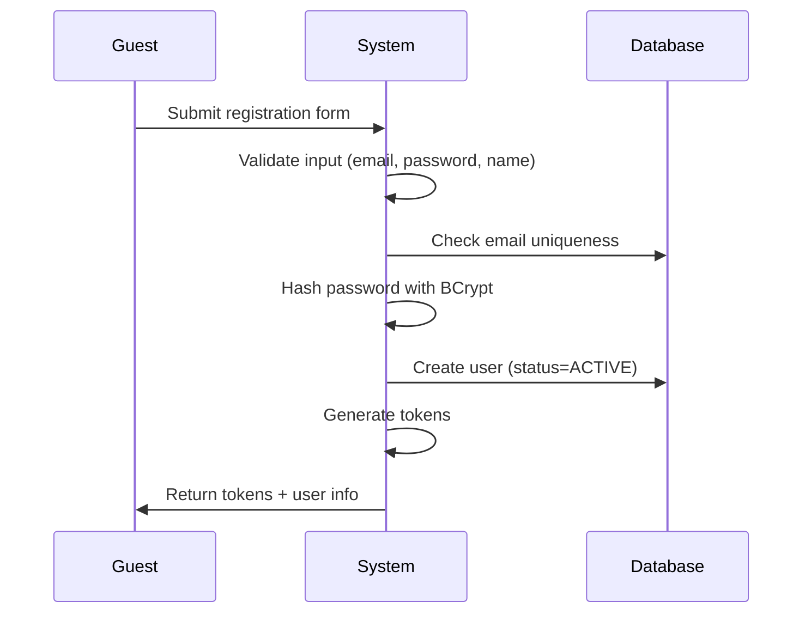
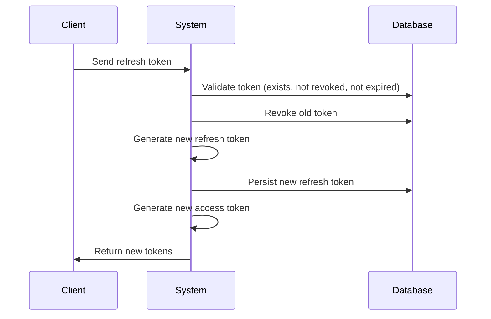
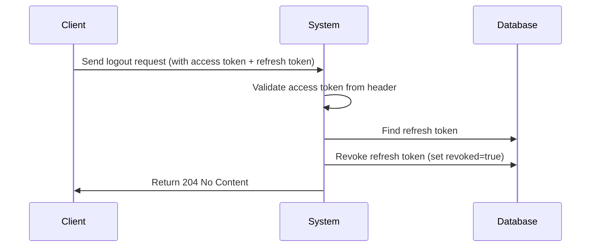
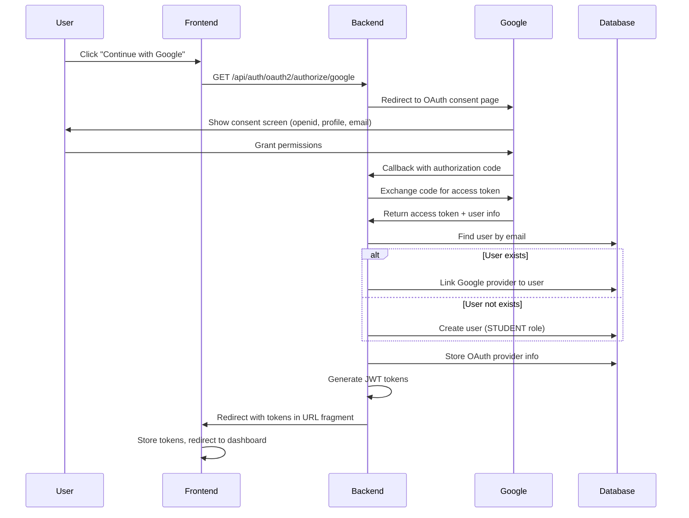
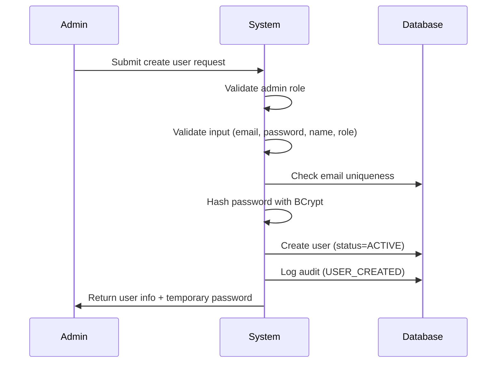
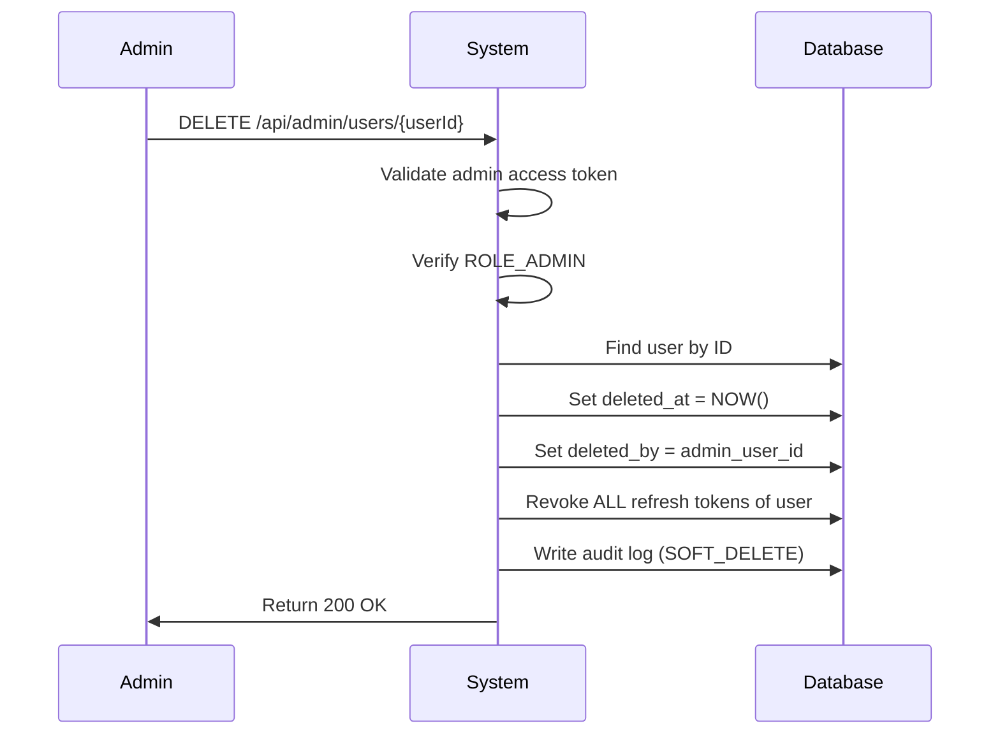
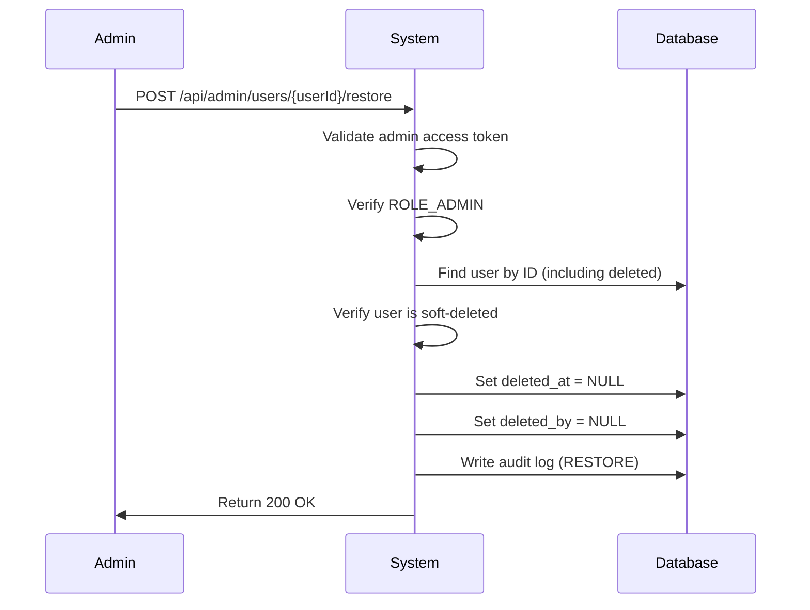
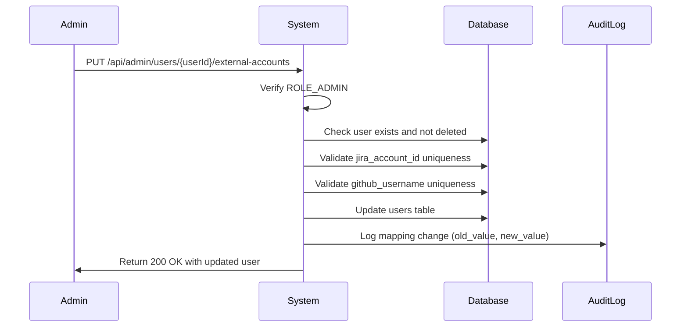

# SRS – Authentication & Authorization

---

## Validation Rules

### Email Validation

| Rule | Constraint |
|------|------------|
| Format | RFC 5322 compliant |
| Max length | 255 characters |
| Required | ✅ Yes |
| Unique | ✅ Yes |

### Password Validation

| Rule | Constraint |
|------|------------|
| Min length | 8 characters |
| Max length | 128 characters |
| Uppercase | ≥ 1 character |
| Lowercase | ≥ 1 character |
| Digit | ≥ 1 character |
| Special char | ≥ 1 of `@$!%*?&` |
| Required | ✅ Yes |

**Regex Pattern:**
```regex
^(?=.*[a-z])(?=.*[A-Z])(?=.*\d)(?=.*[@$!%*?&])[A-Za-z\d@$!%*?&]{8,128}$
```

### Name Validation (for Registration)

| Rule | Constraint |
|------|------------|
| Min length | 2 characters |
| Max length | 100 characters |
| Pattern | Letters (Unicode), spaces, hyphens only |
| Required | ✅ Yes |

**Regex Pattern:**
```regex
^[\p{L}\s\-]{2,100}$
```

**Note**: `\p{L}` matches any Unicode letter (supports Vietnamese names like "Nguyễn Văn A")

---

## UC-REGISTER – User Registration

### Actor

- Guest (unauthenticated user)

### Pre-conditions

- ❌ Email must NOT exist in database

### Input

```json
{
  "email": "student@university.edu",
  "password": "SecurePass@123",
  "confirmPassword": "SecurePass@123",
  "fullName": "Nguyen Van A",
  "role": "STUDENT"
}
```

### Main Flow



**Steps:**

1. Guest submits registration form
2. System validates all input fields
3. System checks email uniqueness in database
4. System hashes password with BCrypt (strength 10)
5. System creates user with `status = ACTIVE`
6. System generates access token & refresh token
7. System returns tokens and user info

### Response (Success)

```json
{
  "user": {
    "id": 1,
    "email": "student@university.edu",
    "fullName": "Nguyen Van A",
    "role": "STUDENT",
    "status": "ACTIVE",
    "createdAt": "2026-01-24T10:30:00Z"
  },
  "accessToken": "eyJhbGciOiJIUzI1NiIsInR5cCI6IkpXVCJ9...",
  "refreshToken": "550e8400-e29b-41d4-a716-446655440000",
  "tokenType": "Bearer",
  "expiresIn": 900
}
```

### Alternate Flows

| Flow | Condition | Response Code | Message |
|------|-----------|---------------|---------|
| A1 | Email already exists | 409 Conflict | "Email already registered" |
| A2 | Invalid email format | 400 Bad Request | "Invalid email format" |
| A3 | Password too weak | 400 Bad Request | "Password does not meet requirements" |
| A4 | Passwords don't match | 400 Bad Request | "Passwords do not match" |
| A5 | Invalid role | 400 Bad Request | "Invalid role specified" |
| A6 | Name too short/long | 400 Bad Request | "Name must be 2-100 characters" |

### Allowed Roles for Registration

| Role | Self-Register | Admin-Only |
|------|---------------|------------|
| `STUDENT` | ✅ Yes | - |
| `LECTURER` | ❌ No | ✅ Yes |
| `ADMIN` | ❌ No | ✅ Yes |

---

## UC-LOGIN – User Login

### Actor

- Student
- Lecturer
- Admin

### Pre-conditions

- ✅ User exists in database
- ✅ User status = `ACTIVE`

### Input

```json
{
  "email": "user@example.com",
  "password": "securePassword123"
}
```

### Main Flow

```mermaid
sequenceDiagram
    Actor->>System: Submit credentials (email, password)
    System->>System: Validate email exists
    System->>System: Validate password with BCrypt
    System->>System: Generate access token (15min)
    System->>System: Generate refresh token (7 days)
    System->>Database: Persist refresh token
    System->>Actor: Return tokens
```

**Steps:**

1. User submits credentials (`email`, `password`)
2. System validates email exists → if not found, return 401 "Invalid credentials"
3. **System validates password with BCrypt** (constant-time comparison) → if incorrect, return 401 "Invalid credentials"
4. **System checks account status** → if LOCKED, return 403 "Account is locked. Contact admin."
5. System generates **access token** (JWT, 15 min TTL)
6. System generates **refresh token** (UUID, 7 days TTL)
7. System persists refresh token in database
8. System returns both tokens to client

> **CRITICAL SECURITY: Check Order**
> 
> **Password MUST be validated BEFORE status check** to prevent account enumeration:
> - ✅ CORRECT: Validate password → Check status
> - ❌ WRONG: Check status → Validate password
>
> **Why:** If status is checked first, attacker can determine if account exists and is locked without knowing the password:
> - Try login with email + wrong password → "Account locked" = account exists and is locked ❌
> - Try login with wrong email + wrong password → "Invalid credentials" = no such account
>
> **With correct order:** Attacker must know valid password to get "Account locked" message ✅

### Response (Success)

```json
{
  "accessToken": "eyJhbGciOiJIUzI1NiIsInR5cCI6IkpXVCJ9...",
  "refreshToken": "550e8400-e29b-41d4-a716-446655440000",
  "tokenType": "Bearer",
  "expiresIn": 900
}
```

### Alternate Flows

| Flow | Condition              | Response Code | Message                |
|------|------------------------|---------------|------------------------|
| A1   | Email not found        | 401 Unauthorized | "Invalid credentials" |
| A2   | Password incorrect     | 401 Unauthorized | "Invalid credentials" |
| A3   | Account status = LOCKED| 403 Forbidden    | "Account is locked"   |

---

## UC-REFRESH-TOKEN – Refresh Access Token

### Actor

- Authenticated client (any role)

### Pre-conditions

- ✅ Valid refresh token exists
- ✅ Token not revoked
- ✅ Token not expired

### Input

```json
{
  "refreshToken": "550e8400-e29b-41d4-a716-446655440000"
}
```

### Main Flow



**Steps:**

1. Client sends refresh token
2. System validates token:
   - Token exists in database
   - Token is not revoked
   - Token has not expired
3. **System checks user account status** ⚠️ CRITICAL SECURITY CHECK
   - Fetch user from token: `User user = refreshToken.getUser()`
   - Check status: `if (user.getStatus() == User.Status.LOCKED)`
   - **If LOCKED:** Revoke ALL tokens for user (`revokeAllByUser(user)`), throw 403 AccountLockedException
   - **Why:** Prevents locked users from bypassing lockout by refreshing tokens issued before the lock
4. System **revokes old token** (set `revoked = true`)
5. System generates **new refresh token** (new UUID, new 7-day expiration)
6. System persists new token in database
7. System generates **new access token** (new JWT, 15-min expiration)
8. System returns new tokens to client

> **CRITICAL SECURITY FIX:** Account status MUST be checked during refresh to prevent locked users from obtaining new tokens with pre-existing refresh tokens. This check was initially missing and added after security review (see Security-Review.md § 3).

### Response (Success)

```json
{
  "accessToken": "eyJhbGciOiJIUzI1NiIsInR5cCI6IkpXVCJ9...",
  "refreshToken": "a1b2c3d4-e5f6-47g8-h9i0-j1k2l3m4n5o6",
  "tokenType": "Bearer",
  "expiresIn": 900
}
```

### Alternate Flows

| Flow | Condition                     | Response Code     | Action                                      |
|------|-------------------------------|-------------------|---------------------------------------------|
| A1   | Token expired                 | 401 Unauthorized  | Return error "Token expired"                |
| A2   | Token revoked                 | 401 Unauthorized  | Return error "Token invalid"                |
| A3   | **Token reuse detected**      | 401 Unauthorized  | **Revoke ALL tokens** of user, force re-login |

### Security: Token Reuse Detection

⚠️ **Critical Security Feature**

If a client attempts to use a **revoked token**, it indicates:
- Token theft
- Security compromise
- Replay attack

**System Response:**
1. Detect revoked token usage
2. **Revoke ALL refresh tokens** for that user
3. Force user to re-login
4. Log security event

---

## UC-LOGOUT – User Logout

### Actor

- Authenticated user (Student, Lecturer, Admin)

### Pre-conditions

- ✅ Valid access token in Authorization header
- ✅ Valid refresh token in request body

### Input

**Headers:**
```
Authorization: Bearer <accessToken>
```

**Body:**
```json
{
  "refreshToken": "550e8400-e29b-41d4-a716-446655440000"
}
```

### Main Flow



**Steps:**

1. Client sends logout request with:
   - Access token in `Authorization` header
   - Refresh token in request body
2. System validates access token (JWT signature + expiration)
3. System finds refresh token in database
4. System revokes refresh token (set `revoked = true`)
5. System returns 204 No Content

### Response (Success)

```
HTTP/1.1 204 No Content
```

### Alternate Flows

| Flow | Condition | Response Code | Message |
|------|-----------|---------------|---------|
| A1 | Missing/Invalid access token | 401 Unauthorized | "Unauthorized" |
| A2 | Refresh token not found | 204 No Content | (Silent success - idempotent) |
| A3 | Refresh token already revoked | 204 No Content | (Silent success - idempotent) |

### Design Decisions

1. **Idempotent**: Logout is idempotent - calling multiple times has same effect
2. **Silent failure for token**: If refresh token not found/already revoked, still return 204 (no information leakage)
3. **Requires authentication**: Must have valid access token to logout (prevents abuse)

---

## UC-OAUTH-LOGIN-GOOGLE – Login with Google OAuth

### Actor

- Guest (unauthenticated user)

### Pre-conditions

- ❌ None (public endpoint)

### Flow



### Response (Success)

Frontend receives redirect to:
```
https://frontend.com/#/auth/callback?access_token=<JWT>&refresh_token=<UUID>
```

### Business Rules

- BR-OAUTH-G-01: Email must be verified by Google (no SAMT confirmation)
- BR-OAUTH-G-02: New users created with `role = STUDENT`, `status = ACTIVE`
- BR-OAUTH-G-03: Cannot link if email exists with different user (409 CONFLICT)
- BR-OAUTH-G-04: Profile sync (name from Google) on every login
- BR-OAUTH-G-05: OAuth tokens encrypted with AES-256-GCM

### Error Codes

| Code | Condition | Message |
|------|-----------|---------|
| 400 | Invalid authorization code | "Invalid OAuth authorization code" |
| 409 | Email conflict | "Email already associated with another account" |
| 500 | OAuth provider error | "Failed to authenticate with Google" |

---

## UC-OAUTH-LOGIN-GITHUB – Login with GitHub OAuth

### Actor

- Guest (unauthenticated user)

### Pre-conditions

- ❌ None (public endpoint)

### Flow

Similar to Google OAuth, with additional feature:

**Auto-map GitHub username:**
- If `users.github_username IS NULL`, auto-update from GitHub profile
- Enables automatic commit author mapping for Sync Service

### Response (Success)

Frontend receives redirect to:
```
https://frontend.com/#/auth/callback?access_token=<JWT>&refresh_token=<UUID>
```

### Business Rules

- BR-OAUTH-GH-01: Fetch primary verified email from GitHub
- BR-OAUTH-GH-02: Auto-update `users.github_username` if NULL (won't overwrite manual mapping)
- BR-OAUTH-GH-03: Cannot link if username exists with different user (409 CONFLICT)
- BR-OAUTH-GH-04: GitHub tokens don't expire (no refresh token)
- BR-OAUTH-GH-05: Request repo scope for project linking

### Error Codes

| Code | Condition | Message |
|------|-----------|---------|
| 400 | Invalid authorization code | "Invalid OAuth authorization code" |
| 409 | Username conflict | "GitHub username already associated with another account" |
| 500 | OAuth provider error | "Failed to authenticate with GitHub" |

---

## UC-OAUTH-LINK-ACCOUNT – Link OAuth Provider

### Actor

- Authenticated user (any role)

### Pre-conditions

- ✅ Valid access token in Authorization header

### Input

```json
{
  "provider": "GOOGLE",  // or "GITHUB"
  "authorizationCode": "4/0AY0e-g7X..."
}
```

### Main Flow

1. User already logged in with email/password
2. User goes to Settings → Connected Accounts
3. User clicks "Link Google" or "Link GitHub"
4. Frontend redirects to OAuth consent page
5. OAuth provider redirects back with authorization code
6. Frontend sends code to backend via `POST /api/users/me/oauth/link`
7. Backend exchanges code for access token + user info
8. Backend validates OAuth email matches current user email
9. Backend creates record in `oauth_providers` table
10. Backend returns success

### Response (Success)

```json
{
  "message": "Google account linked successfully",
  "provider": "GOOGLE",
  "linkedAt": "2026-01-30T10:00:00Z"
}
```

### Business Rules

- BR-OAUTH-L-01: OAuth email must match user email (400 BAD REQUEST if mismatch)
- BR-OAUTH-L-02: Cannot link if provider already linked (409 CONFLICT)
- BR-OAUTH-L-03: User can link multiple providers (Google + GitHub)
- BR-OAUTH-L-04: Audit log required (action: `OAUTH_LINK_ACCOUNT`)

### Error Codes

| Code | Condition | Message |
|------|-----------|---------|
| 400 | Email mismatch | "OAuth email does not match account email" |
| 409 | Already linked | "Provider already linked to this account" |

---

## UC-OAUTH-UNLINK-ACCOUNT – Unlink OAuth Provider

### Actor

- Authenticated user (any role)

### Pre-conditions

- ✅ Valid access token in Authorization header
- ✅ User has at least 2 login methods

### Input

**Path parameter:** `provider` (GOOGLE or GITHUB)

### Main Flow

1. User goes to Settings → Connected Accounts
2. User clicks "Unlink Google" or "Unlink GitHub"
3. Frontend sends `DELETE /api/users/me/oauth/{provider}`
4. Backend validates user has at least one login method remaining
5. Backend deletes record from `oauth_providers` table
6. Backend returns success

### Response (Success)

```json
{
  "message": "Google account unlinked successfully"
}
```

### Business Rules

- BR-OAUTH-U-01: Cannot unlink if only login method (400 BAD REQUEST)
  - Must have email/password OR another OAuth provider
- BR-OAUTH-U-02: Delete row from `oauth_providers` table
- BR-OAUTH-U-03: Audit log required (action: `OAUTH_UNLINK_ACCOUNT`)

### Error Codes

| Code | Condition | Message |
|------|-----------|---------|
| 400 | Last login method | "Cannot unlink: no other login method available" |
| 404 | Provider not linked | "Provider not linked to this account" |

---

## API Endpoints Summary

### POST `/api/auth/register`

**Request:**
```json
{
  "email": "student@university.edu",
  "password": "SecurePass@123",
  "confirmPassword": "SecurePass@123",
  "fullName": "Nguyen Van A",
  "role": "STUDENT"
}
```

**Response:** 201 Created
```json
{
  "user": {
    "id": 1,
    "email": "student@university.edu",
    "fullName": "Nguyen Van A",
    "role": "STUDENT"
  },
  "accessToken": "eyJ...",
  "refreshToken": "550e...",
  "tokenType": "Bearer",
  "expiresIn": 900
}
```

---

### POST `/api/auth/login`

**Request:**
```json
{
  "email": "user@example.com",
  "password": "password123"
}
```

**Response:** 200 OK
```json
{
  "accessToken": "eyJ...",
  "refreshToken": "550e...",
  "tokenType": "Bearer",
  "expiresIn": 900
}
```

### POST `/api/auth/refresh`

**Request:**
```json
{
  "refreshToken": "550e8400-e29b-41d4-a716-446655440000"
}
```

**Response:** 200 OK
```json
{
  "accessToken": "eyJ...",
  "refreshToken": "a1b2...",
  "tokenType": "Bearer",
  "expiresIn": 900
}
```

### POST `/api/auth/logout`

**Headers:**
```
Authorization: Bearer <accessToken>
```

**Request:**
```json
{
  "refreshToken": "550e8400-e29b-41d4-a716-446655440000"
}
```

**Response:** 204 No Content

---

## ✅ Status

**READY FOR CONTROLLER IMPLEMENTATION**

---

## UC-ADMIN-CREATE-USER – Admin Create User Account

### Actor

- Admin (ROLE_ADMIN only)

### Pre-conditions

- ✅ Actor must be authenticated with `ROLE_ADMIN`
- ❌ Email must NOT exist in database

### Input

```json
{
  "email": "lecturer@university.edu",
  "password": "SecurePass@123",
  "fullName": "Nguyen Van B",
  "role": "LECTURER"  // Can be: STUDENT, LECTURER, or ADMIN
}
```

### Main Flow



**Steps:**

1. Admin submits create user request with role (STUDENT/LECTURER/ADMIN)
2. System validates admin authentication and authorization
3. System validates all input fields (email, password, name, role)
4. System checks email uniqueness in database
5. System hashes password with BCrypt (strength 10)
6. System creates user with `status = ACTIVE` and specified role
7. System logs audit event (USER_CREATED with actor = admin_id)
8. System returns user info and temporary password

### Response (Success - 201 Created)

```json
{
  "message": "User created successfully",
  "user": {
    "id": 123,
    "email": "lecturer@university.edu",
    "fullName": "Nguyen Van B",
    "role": "LECTURER",
    "status": "ACTIVE",
    "jiraAccountId": null,
    "githubUsername": null,
    "createdAt": "2026-01-30T10:30:00Z"
  },
  "temporaryPassword": "SecurePass@123"
}
```

### Alternate Flows

**A1: Email Already Exists (409 Conflict)**

```json
{
  "error": {
    "code": "EMAIL_ALREADY_EXISTS",
    "message": "Email already registered"
  }
}
```

**A2: Validation Error (400 Bad Request)**

```json
{
  "error": {
    "code": "VALIDATION_ERROR",
    "message": "Invalid email format",
    "field": "email"
  }
}
```

**A3: Not Admin (403 Forbidden)**

```json
{
  "error": {
    "code": "FORBIDDEN",
    "message": "Access denied"
  }
}
```

### Business Rules

| Rule ID | Description | Priority |
|---------|-------------|----------|
| BR-ADMIN-CREATE-01 | Only ADMIN role can create users via admin endpoint | MUST |
| BR-ADMIN-CREATE-02 | Can create users with any role (STUDENT, LECTURER, ADMIN) | MUST |
| BR-ADMIN-CREATE-03 | Email uniqueness check MUST happen before password hashing | MUST |
| BR-ADMIN-CREATE-04 | Password MUST be hashed with BCrypt strength 10 | MUST |
| BR-ADMIN-CREATE-05 | New user created with `status = ACTIVE` | MUST |
| BR-ADMIN-CREATE-06 | Temporary password returned in response for admin to share | MUST |
| BR-ADMIN-CREATE-07 | Audit log action: `USER_CREATED` with actor = admin_id | MUST |
| BR-ADMIN-CREATE-08 | Admin should inform user to change password on first login | SHOULD |

### Security Notes

- **Separation of Concerns:** This endpoint is separate from public registration (`POST /api/auth/register`)
  - Public registration: Only allows `STUDENT` role
  - Admin endpoint: Allows `LECTURER` and `ADMIN` roles
- **Temporary Password Security:** 
  - Password is returned in response for admin to share with new user
  - Admin must transmit password securely (email, secure messaging, etc.)
  - User should be prompted to change password on first login (future enhancement)
- **Authorization:** Endpoint protected with `@PreAuthorize("hasRole('ADMIN')")`

### Audit Log

| Field | Value |
|-------|-------|
| entity_type | `USER` |
| entity_id | Created user ID |
| action | `CREATE` |
| actor_id | Admin user ID |
| actor_email | Admin email |
| outcome | `SUCCESS` |
| old_value | `null` |
| new_value | JSON of created user (excluding password hash) |

---

## UC-SOFT-DELETE – Admin Soft Delete User

### Actor

- Admin (ROLE_ADMIN only)

### Pre-conditions

- ✅ Admin is authenticated with valid access token
- ✅ Target user exists in database
- ✅ Target user is not already soft-deleted

### Input

**Headers:**
```
Authorization: Bearer <adminAccessToken>
```

**Path Parameter:**
```
DELETE /api/admin/users/{userId}
```

### Main Flow



**Steps:**

1. Admin sends DELETE request with target user ID
2. System validates admin's access token
3. System verifies caller has `ROLE_ADMIN`
4. System finds target user in database
5. System sets `deleted_at = NOW()` and `deleted_by = admin_id`
6. System revokes all refresh tokens of the target user
7. System writes audit log with action `SOFT_DELETE`
8. System returns success response

### Response (Success)

```json
{
  "message": "User deleted successfully",
  "userId": "123"
}
```

### Alternate Flows

| Flow | Condition | Response Code | Message |
|------|-----------|---------------|---------|
| A1 | Not authenticated | 401 Unauthorized | "Unauthorized" |
| A2 | Not ROLE_ADMIN | 403 Forbidden | "Access denied" |
| A3 | User not found | 404 Not Found | "User not found" |
| A4 | User already deleted | 400 Bad Request | "User already deleted" || A5 | Admin deleting self | 400 Bad Request | "Cannot delete own account" || A5 | Admin deleting self | 400 Bad Request | "Cannot delete own account" |

### Post-conditions

- ✅ User's `deleted_at` is set to current timestamp
- ✅ User's `deleted_by` is set to admin's user ID
- ✅ All refresh tokens for user are revoked
- ✅ User cannot login (soft-deleted users are filtered)
- ✅ Audit log entry created

---

## UC-RESTORE – Admin Restore User

### Actor

- Admin (ROLE_ADMIN only)

### Pre-conditions

- ✅ Admin is authenticated with valid access token
- ✅ Target user exists in database (including soft-deleted)
- ✅ Target user is currently soft-deleted

### Input

**Headers:**
```
Authorization: Bearer <adminAccessToken>
```

**Path Parameter:**
```
POST /api/admin/users/{userId}/restore
```

### Main Flow



**Steps:**

1. Admin sends POST request to restore user
2. System validates admin's access token
3. System verifies caller has `ROLE_ADMIN`
4. System finds user by ID (bypassing soft-delete filter)
5. System verifies user is currently soft-deleted
6. System sets `deleted_at = NULL` and `deleted_by = NULL`
7. System writes audit log with action `RESTORE`
8. System returns success response

### Response (Success)

```json
{
  "message": "User restored successfully",
  "userId": "123"
}
```

### Alternate Flows

| Flow | Condition | Response Code | Message |
|------|-----------|---------------|---------|
| A1 | Not authenticated | 401 Unauthorized | "Unauthorized" |
| A2 | Not ROLE_ADMIN | 403 Forbidden | "Access denied" |
| A3 | User not found | 404 Not Found | "User not found" |
| A4 | User not deleted | 400 Bad Request | "User is not deleted" |

### Post-conditions

- ✅ User's `deleted_at` is NULL
- ✅ User's `deleted_by` is NULL
- ✅ User can login again (if status = ACTIVE)
- ✅ Audit log entry created

---

## UC-LOCK-ACCOUNT – Admin Lock User Account

### Actor

- Admin (ROLE_ADMIN only)

### Input

```
POST /api/admin/users/{userId}/lock?reason=Suspicious%20activity
```

### Main Flow

1. Admin sends lock request with optional reason
2. System validates admin authorization
3. System sets user `status = LOCKED`
4. System revokes all refresh tokens
5. System writes audit log with action `ACCOUNT_LOCKED`
6. System returns 200 OK

### Response

```json
{
  "message": "User locked successfully",
  "userId": "123"
}
```

### Alternate Flows

| Flow | Condition | Response Code | Message |
|------|-----------|---------------|---------||
| A1 | Not authenticated | 401 Unauthorized | "Unauthorized" |
| A2 | Not ROLE_ADMIN | 403 Forbidden | "Access denied" |
| A3 | User not found | 404 Not Found | "User not found" |
| A4 | Admin locking self | 400 Bad Request | "Cannot lock own account" |
| A5 | User already locked | 200 OK | (Idempotent - no error) |

### Idempotency

Locking an already-locked user returns **200 OK** (idempotent). No duplicate audit log is created.

---

## UC-UNLOCK-ACCOUNT – Admin Unlock User Account

### Actor

- Admin (ROLE_ADMIN only)

### Input

```
POST /api/admin/users/{userId}/unlock
```

### Main Flow

1. Admin sends unlock request
2. System validates admin authorization
3. System sets user `status = ACTIVE`
4. System writes audit log with action `ACCOUNT_UNLOCKED`
5. System returns 200 OK

### Response

```json
{
  "message": "User unlocked successfully",
  "userId": "123"
}
```

### Alternate Flows

| Flow | Condition | Response Code | Message |
|------|-----------|---------------|---------||
| A1 | Not authenticated | 401 Unauthorized | "Unauthorized" |
| A2 | Not ROLE_ADMIN | 403 Forbidden | "Access denied" |
| A3 | User not found | 404 Not Found | "User not found" |
| A4 | User not locked | 400 Bad Request | "User is not locked" |

---

## UC-MAP-EXTERNAL-ACCOUNTS – Admin Map/Unmap External Accounts

### Actor

- **ADMIN** (only)

### Description

Allow Admin to manually map or unmap `jira_account_id` and `github_username` for users when auto-mapping fails or needs correction.

### Pre-conditions

- Admin is authenticated with valid access token
- User exists and is not deleted

### Input

```json
{
  "userId": "uuid",
  "jiraAccountId": "5f9d8c7b6a5e4d3c2b1a0987", // Optional: null to unmap
  "githubUsername": "student-github-handle"     // Optional: null to unmap
}
```

### Business Rules

| Rule ID | Rule | Validation |
|---------|------|------------|
| BR-MAP-01 | `jira_account_id` must be unique across all users | Check uniqueness before save |
| BR-MAP-02 | `github_username` must be unique across all users | Check uniqueness before save |
| BR-MAP-03 | Only ADMIN can perform mapping | Check role in JWT |
| BR-MAP-04 | Cannot map to deleted users | Check `deleted_at IS NULL` |
| BR-MAP-05 | Must audit log all mapping changes | Log old_value + new_value |

### Main Flow



**Steps:**

1. Admin sends PUT request with external account mappings
2. System verifies Admin role from JWT
3. System checks user exists and is not soft deleted
4. System validates `jira_account_id` uniqueness (if provided)
5. System validates `github_username` uniqueness (if provided)
6. System updates `jira_account_id` and/or `github_username` fields
7. System logs audit event with old and new values
8. System returns updated user info

### Response (Success)

```json
{
  "message": "External accounts mapped successfully",
  "user": {
    "id": "uuid",
    "email": "student@university.edu",
    "fullName": "Nguyen Van A",
    "role": "STUDENT",
    "status": "ACTIVE",
    "jiraAccountId": "5f9d8c7b6a5e4d3c2b1a0987",
    "githubUsername": "student-github-handle"
  }
}
```

### Alternate Flows

| Flow | Condition | Response Code | Message |
|------|-----------|---------------|---------|
| A1 | Not authenticated | 401 Unauthorized | "Unauthorized" |
| A2 | Not ROLE_ADMIN | 403 Forbidden | "Access denied: Admin only" |
| A3 | User not found | 404 Not Found | "User not found" |
| A4 | User is deleted | 400 Bad Request | "Cannot map external accounts to deleted user" |
| A5 | `jira_account_id` already used | 409 Conflict | "Jira account ID already mapped to another user" |
| A6 | `github_username` already used | 409 Conflict | "GitHub username already mapped to another user" |

### Unmapping Behavior

To **unmap** an external account, send `null` value:

```json
{
  "userId": "uuid",
  "jiraAccountId": null,        // Unmap Jira account
  "githubUsername": null        // Unmap GitHub username
}
```

### Audit Log Entry

Action: `MAP_EXTERNAL_ACCOUNTS` or `UNMAP_EXTERNAL_ACCOUNTS`

```json
{
  "entityType": "User",
  "entityId": "123",
  "action": "MAP_EXTERNAL_ACCOUNTS",
  "outcome": "SUCCESS",
  "actorId": "456",
  "actorEmail": "admin@university.edu",
  "oldValue": {
    "jiraAccountId": null,
    "githubUsername": null
  },
  "newValue": {
    "jiraAccountId": "5f9d8c7b6a5e4d3c2b1a0987",
    "githubUsername": "student-github-handle"
  },
  "timestamp": "2026-01-30T10:30:00Z"
}
```

### Notes

- **Users CANNOT update these fields via UC22 (Update User Profile)** - they are read-only in UC22
- **Auto-mapping strategy** (documented in Sync Service design):
  - **Jira mapping:** Match by email (Jira account email ↔ User email)
  - **GitHub mapping:** Match by OAuth login or commit email
  - If auto-mapping fails → user shows as `UNMAPPED_EXTERNAL_ACCOUNT` in Sync Service
- **Manual mapping** (this UC) is the fallback when auto-mapping fails

---

## Admin API Endpoints Summary

### DELETE `/api/admin/users/{userId}` – Soft Delete

| Property | Value |
|----------|-------|
| Method | DELETE |
| Auth | Bearer Token (ROLE_ADMIN) |
| Success | 200 OK |
| Errors | 401 (Unauthorized), 403 (Not Admin), 404 (User not found), 400 (Already deleted, Self-delete) |

### POST `/api/admin/users/{userId}/restore` – Restore

| Property | Value |
|----------|-------|
| Method | POST |
| Auth | Bearer Token (ROLE_ADMIN) |
| Success | 200 OK |
| Errors | 401, 403, 404, 400 |

### POST `/api/admin/users/{userId}/lock` – Lock Account

| Property | Value |
|----------|-------|
| Method | POST |
| Auth | Bearer Token (ROLE_ADMIN) |
| Query Param | `reason` (optional) |
| Success | 200 OK |
| Errors | 401 (Unauthorized), 403 (Not Admin), 404 (User not found), 400 (Self-lock) |

### POST `/api/admin/users/{userId}/unlock` – Unlock Account

| Property | Value |
|----------|-------|
| Method | POST |
| Auth | Bearer Token (ROLE_ADMIN) |
| Success | 200 OK |
| Errors | 401 (Unauthorized), 403 (Not Admin), 404 (User not found), 400 (User not locked) |

### PUT `/api/admin/users/{userId}/external-accounts` – Map External Accounts

| Property | Value |
|----------|-------|
| Method | PUT |
| Auth | Bearer Token (ROLE_ADMIN) |
| Body | `{ jiraAccountId?: string \| null, githubUsername?: string \| null }` |
| Success | 200 OK |
| Errors | 401 (Unauthorized), 403 (Not Admin), 404 (User not found), 400 (User deleted), 409 (Duplicate mapping) |

---

## OAuth 2.0 Endpoints

### GET `/api/auth/oauth2/authorize/{provider}` – Initiate OAuth Login

Redirect user to OAuth provider (Google/GitHub) for authentication.

| Property | Value |
|----------|-------|
| Method | GET |
| Path Param | `provider`: "google" or "github" |
| Auth | None (public endpoint) |
| Response | 302 Redirect to OAuth provider |

### GET `/api/auth/oauth2/callback/{provider}` – OAuth Callback

OAuth provider redirects here after user grants permissions.

| Property | Value |
|----------|-------|
| Method | GET |
| Path Param | `provider`: "google" or "github" |
| Query Params | `code` (authorization code), `state` (CSRF token) |
| Response | 302 Redirect to frontend with tokens in URL fragment |
| Success URL | `https://frontend.com/#/auth/callback?access_token=<JWT>&refresh_token=<UUID>` |
| Errors | 400 (Invalid code/state), 409 (Email conflict), 500 (OAuth provider error) |

### POST `/api/users/me/oauth/link` – Link OAuth Provider

Link Google/GitHub to existing account.

| Property | Value |
|----------|-------|
| Method | POST |
| Auth | Bearer Token (any role) |
| Body | `{ provider: "GOOGLE" \| "GITHUB", authorizationCode: string }` |
| Success | 200 OK |
| Errors | 400 (Email mismatch), 409 (Already linked) |

### DELETE `/api/users/me/oauth/{provider}` – Unlink OAuth Provider

Remove OAuth provider from account.

| Property | Value |
|----------|-------|
| Method | DELETE |
| Path Param | `provider`: "GOOGLE" or "GITHUB" |
| Auth | Bearer Token (any role) |
| Success | 200 OK |
| Errors | 400 (Last login method) |

### GET `/api/users/me/oauth/providers` – List Linked Providers

Get list of OAuth providers linked to current user.

| Property | Value |
|----------|-------|
| Method | GET |
| Auth | Bearer Token (any role) |
| Response | `[{ provider: "GOOGLE", linkedAt: "2026-01-30T10:00:00Z", lastUsedAt: "2026-01-30T12:00:00Z" }]` |

**Response Example:**
```json
[
  {
    "provider": "GOOGLE",
    "providerEmail": "student@gmail.com",
    "linkedAt": "2026-01-30T10:00:00Z",
    "lastUsedAt": "2026-01-30T12:00:00Z"
  },
  {
    "provider": "GITHUB",
    "providerUsername": "student-github",
    "linkedAt": "2026-01-25T08:00:00Z",
    "lastUsedAt": "2026-01-28T14:30:00Z"
  }
]
```

---

## Audit Log Query Endpoints (Admin Only)

### GET `/api/admin/audit/entity/{entityType}/{entityId}`

Get audit history for a specific entity.

**Example:** `GET /api/admin/audit/entity/User/123`

### GET `/api/admin/audit/actor/{actorId}`

Get all actions performed by a specific user.

**Example:** `GET /api/admin/audit/actor/1`

### GET `/api/admin/audit/range`

Get audit logs within a date range.

**Query Parameters:**
- `startDate`: ISO 8601 datetime
- `endDate`: ISO 8601 datetime

**Example:** `GET /api/admin/audit/range?startDate=2026-01-01T00:00:00&endDate=2026-01-31T23:59:59`

### GET `/api/admin/audit/security-events`

Get security-related events (login failures, token reuse, etc.)

---

## HTTP Status Code Reference

### Authentication & Authorization

| Scenario | HTTP Code | Exception | Message | Design Rationale |
|----------|-----------|-----------|---------|------------------|
| **Email not found** | 401 Unauthorized | `InvalidCredentialsException` | "Invalid credentials" | Generic error prevents account enumeration |
| **Password incorrect** | 401 Unauthorized | `InvalidCredentialsException` | "Invalid credentials" | Same generic error (anti-enumeration) |
| **Account locked** | 403 Forbidden | `AccountLockedException` | "Account is locked. Contact admin." | Identity verified, but action forbidden |
| **Refresh token expired** | 401 Unauthorized | `TokenExpiredException` | "Token expired" | Authentication expired |
| **Refresh token invalid** | 401 Unauthorized | `TokenInvalidException` | "Token invalid" | Authentication invalid |
| **Refresh token reused** | 401 Unauthorized | `TokenInvalidException` | "Token invalid" | Security: no hint, revoke all tokens |
| **No JWT in request** | 401 Unauthorized | `AuthenticationException` | "Unauthorized" | Not authenticated |
| **JWT signature invalid** | 401 Unauthorized | `AuthenticationException` | "Unauthorized" | Authentication invalid |
| **JWT expired** | 401 Unauthorized | `AuthenticationException` | "Token expired" | Authentication expired |
| **Valid JWT, insufficient role** | 403 Forbidden | `AccessDeniedException` | "Access denied" | Authenticated but not authorized |
| **Admin locks self** | 403 Forbidden | `CannotLockSelfException` | "Cannot lock own account" | Forbidden operation |
| **Admin deletes self** | 403 Forbidden | `CannotDeleteSelfException` | "Cannot delete own account" | Forbidden operation |

### Validation Errors

| Scenario | HTTP Code | Message |
|----------|-----------|---------|
| Invalid email format | 400 Bad Request | "Invalid email format" |
| Password too weak | 400 Bad Request | "Password does not meet requirements" |
| Passwords don't match | 400 Bad Request | "Passwords do not match" |
| Name too short/long | 400 Bad Request | "Name must be 2-100 characters" |
| Invalid role | 400 Bad Request | "Invalid role" |

### Resource Errors

| Scenario | HTTP Code | Message |
|----------|-----------|---------|
| Email already exists | 409 Conflict | "Email already exists" |
| External account duplicate | 409 Conflict | "External account already mapped" |
| User not found (admin) | 404 Not Found | "User not found" |

### Guidelines

**401 vs 403 Decision Tree:**

```
Is user authenticated (valid JWT or valid password)?
├─ NO  → 401 Unauthorized
└─ YES → Is user authorized for this action?
          ├─ NO  → 403 Forbidden
          └─ YES → Proceed
```

**Anti-Enumeration Rules:**
1. ✅ Use generic "Invalid credentials" for email/password errors
2. ✅ Use generic "Token invalid" for token reuse (don't reveal it was reused)
3. ✅ Account locked returns 403 ONLY if password is correct (identity verified)
4. ❌ Never return "Email not found" or "Password incorrect" separately

---

## Rate Limiting (Production Recommendation)

### Overview

**Status:** ⚠️ NOT IMPLEMENTED (Optional for Phase 1, Recommended for Production)

Rate limiting prevents brute force attacks, credential stuffing, and API abuse.

### Recommended Limits

| Endpoint | Rate Limit | Window | Status Code | Response |
|----------|------------|--------|-------------|----------|
| `POST /api/auth/register` | 5 requests | 1 hour per IP | 429 Too Many Requests | `{"error": "Rate limit exceeded. Try again in 60 minutes."}` |
| `POST /api/auth/login` | 5 requests | 5 minutes per IP | 429 Too Many Requests | `{"error": "Rate limit exceeded. Try again in 5 minutes."}` |
| `POST /api/auth/refresh` | 20 requests | 15 minutes per user | 429 Too Many Requests | `{"error": "Rate limit exceeded. Try again in 15 minutes."}` |
| `POST /api/auth/logout` | 10 requests | 1 minute per user | 429 Too Many Requests | `{"error": "Too many requests."}` |

### Implementation Approaches

**Option 1: Bucket4j (In-Memory)**
- Pros: Simple, no external dependencies
- Cons: Not distributed (single instance only)
- Use for: Development, small deployments

**Option 2: Spring Cloud Gateway + Redis**
- Pros: Distributed, shared state across instances
- Cons: Requires Redis infrastructure
- Use for: Production, multi-instance deployments

**Option 3: Nginx (Reverse Proxy)**
- Pros: Handles at infrastructure level, very efficient
- Cons: Requires Nginx configuration
- Use for: Production, DDoS protection

### Example Implementation (Bucket4j)

```java
@Component
public class RateLimitInterceptor implements HandlerInterceptor {
    private final Map<String, Bucket> buckets = new ConcurrentHashMap<>();
    
    @Override
    public boolean preHandle(HttpServletRequest request, 
                              HttpServletResponse response, 
                              Object handler) throws IOException {
        String key = getKey(request);
        Bucket bucket = resolveBucket(key, request.getRequestURI());
        
        if (bucket.tryConsume(1)) {
            return true;  // Allow request
        } else {
            response.setStatus(429);
            response.setContentType("application/json");
            response.getWriter().write(
                "{\"error\": \"Rate limit exceeded\"}"
            );
            return false;  // Block request
        }
    }
    
    private Bucket resolveBucket(String key, String uri) {
        return buckets.computeIfAbsent(key, k -> {
            Bandwidth limit;
            if (uri.contains("/login")) {
                // 5 requests per 5 minutes
                limit = Bandwidth.classic(5, 
                    Refill.intervally(5, Duration.ofMinutes(5)));
            } else if (uri.contains("/register")) {
                // 5 requests per 1 hour
                limit = Bandwidth.classic(5, 
                    Refill.intervally(5, Duration.ofHours(1)));
            } else {
                // Default: 20 requests per 15 minutes
                limit = Bandwidth.classic(20, 
                    Refill.intervally(20, Duration.ofMinutes(15)));
            }
            return Bucket.builder().addLimit(limit).build();
        });
    }
    
    private String getKey(HttpServletRequest request) {
        // For login/register: use IP address
        // For authenticated: use user ID from JWT
        return request.getRemoteAddr();
    }
}
```

### Monitoring

When rate limit is exceeded, log security event:

```java
auditService.logAsync(AuditLog.builder()
    .entityType("RateLimit")
    .entityId(ipAddress)
    .action("RATE_LIMIT_EXCEEDED")
    .outcome(Outcome.DENIED)
    .ipAddress(ipAddress)
    .metadata(Map.of(
        "endpoint", request.getRequestURI(),
        "limit", "5 requests per 5 minutes"
    ))
    .build());
```

### Testing

See TEST_CASES.md § TC-ID-111 for rate limiting test cases.

---

## Security Best Practices Summary

### 1. Authentication Flow
- ✅ Check password BEFORE status (anti-enumeration)
- ✅ Use constant-time comparison (BCrypt)
- ✅ Generic error messages for authentication failures
- ✅ Specific error messages only after authentication

### 2. Refresh Token Security
- ✅ Check account status during refresh
- ✅ Revoke ALL tokens on reuse detection
- ✅ Rotate tokens on every refresh
- ✅ Short expiration (7 days)

### 3. HTTP Status Codes
- ✅ 401 for authentication failures (who are you?)
- ✅ 403 for authorization failures (you can't do this)
- ✅ Generic messages for 401 (anti-enumeration)
- ✅ Specific messages for 403 (user authenticated)

### 4. Rate Limiting
- ⚠️ Implement before production (P0 for login/register)
- ⚠️ Log rate limit violations for monitoring
- ⚠️ Use distributed rate limiting for multi-instance

### 5. Audit Logging
- ✅ Log all authentication events
- ✅ Log security events (token reuse, rate limit)
- ✅ Include IP address and user agent
- ✅ Never log passwords or tokens

---

## ✅ Updated Status

**READY FOR IMPLEMENTATION** with documented security fixes and best practices

**Critical Action Items Before Production:**
1. ✅ Implement account status check in `RefreshTokenService.refreshToken()`
2. ✅ Fix login check order in `AuthService.login()` (password → status)
3. ⚠️ Implement rate limiting on login and register endpoints (P0)
4. ✅ Follow HTTP status code standardization (401 vs 403)
5. ✅ Ensure audit logging for all security events

**Reference Documents:**
- Security-Review.md § 12-14 for detailed security analysis
- Authentication-Authorization-Design.md for architecture
- TEST_CASES.md § TC-ID-111 for rate limiting tests

---

### GET `/api/admin/audit/security-events`

---

## ✅ Updated Status

**READY FOR IMPLEMENTATION** (including Admin & Audit endpoints)

