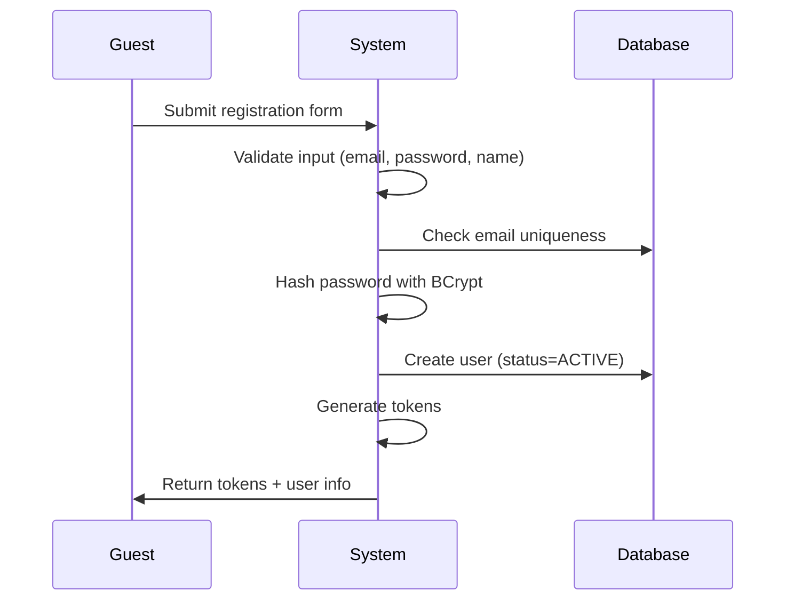
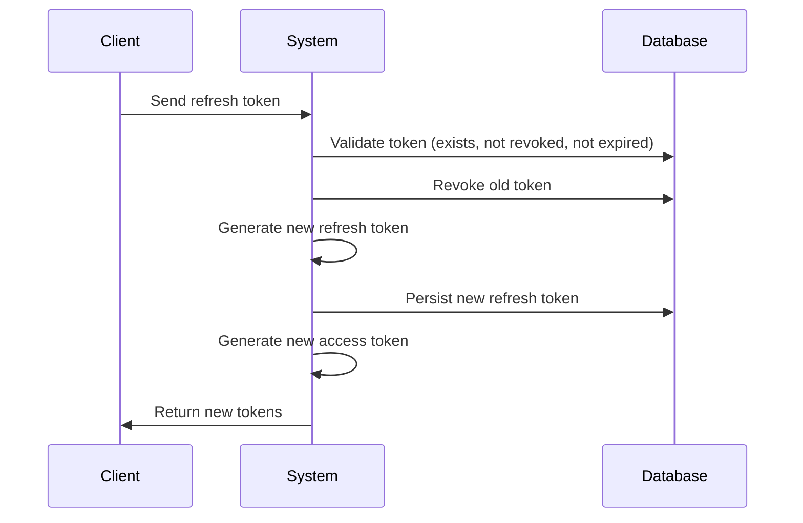
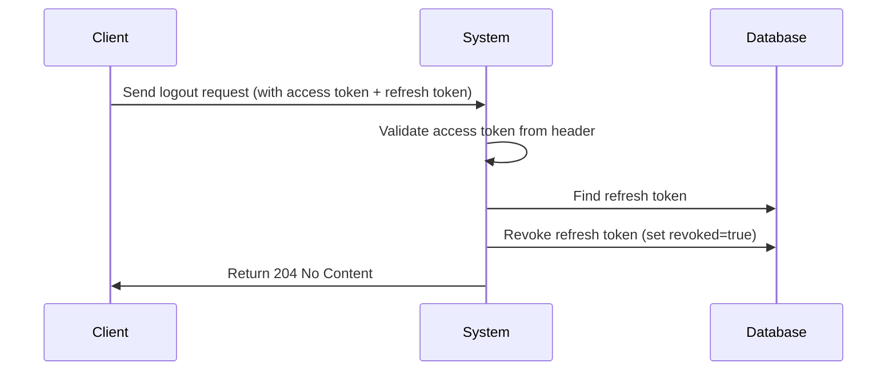
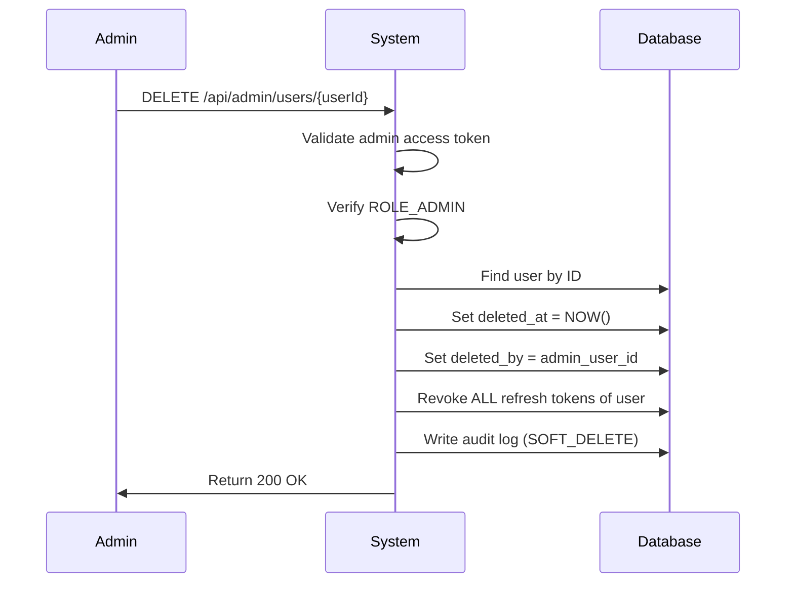
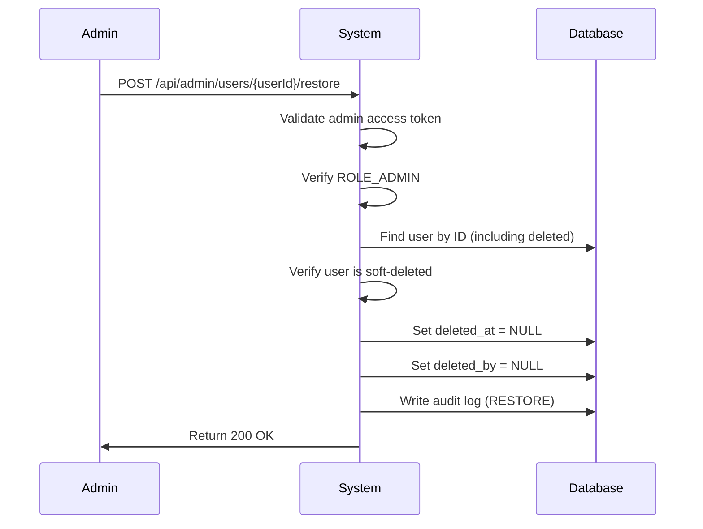

# SRS – Authentication & Authorization

---

## Validation Rules

### Email Validation

| Rule | Constraint |
|------|------------|
| Format | RFC 5322 compliant |
| Max length | 255 characters |
| Required | ✅ Yes |
| Unique | ✅ Yes |

### Password Validation

| Rule | Constraint |
|------|------------|
| Min length | 8 characters |
| Max length | 128 characters |
| Uppercase | ≥ 1 character |
| Lowercase | ≥ 1 character |
| Digit | ≥ 1 character |
| Special char | ≥ 1 of `@$!%*?&` |
| Required | ✅ Yes |

**Regex Pattern:**
```regex
^(?=.*[a-z])(?=.*[A-Z])(?=.*\d)(?=.*[@$!%*?&])[A-Za-z\d@$!%*?&]{8,128}$
```

### Name Validation (for Registration)

| Rule | Constraint |
|------|------------|
| Min length | 2 characters |
| Max length | 100 characters |
| Pattern | Letters (Unicode), spaces, hyphens only |
| Required | ✅ Yes |

**Regex Pattern:**
```regex
^[\p{L}\s\-]{2,100}$
```

**Note**: `\p{L}` matches any Unicode letter (supports Vietnamese names like "Nguyễn Văn A")

---

## UC-REGISTER – User Registration

### Actor

- Guest (unauthenticated user)

### Pre-conditions

- ❌ Email must NOT exist in database

### Input

```json
{
  "email": "student@university.edu",
  "password": "SecurePass@123",
  "confirmPassword": "SecurePass@123",
  "fullName": "Nguyen Van A",
  "role": "STUDENT"
}
```

### Main Flow



**Steps:**

1. Guest submits registration form
2. System validates all input fields
3. System checks email uniqueness in database
4. System hashes password with BCrypt (strength 10)
5. System creates user with `status = ACTIVE`
6. System generates access token & refresh token
7. System returns tokens and user info

### Response (Success)

```json
{
  "user": {
    "id": 1,
    "email": "student@university.edu",
    "fullName": "Nguyen Van A",
    "role": "STUDENT",
    "status": "ACTIVE",
    "createdAt": "2026-01-24T10:30:00Z"
  },
  "accessToken": "eyJhbGciOiJIUzI1NiIsInR5cCI6IkpXVCJ9...",
  "refreshToken": "550e8400-e29b-41d4-a716-446655440000",
  "tokenType": "Bearer",
  "expiresIn": 900
}
```

### Alternate Flows

| Flow | Condition | Response Code | Message |
|------|-----------|---------------|---------|
| A1 | Email already exists | 409 Conflict | "Email already registered" |
| A2 | Invalid email format | 400 Bad Request | "Invalid email format" |
| A3 | Password too weak | 400 Bad Request | "Password does not meet requirements" |
| A4 | Passwords don't match | 400 Bad Request | "Passwords do not match" |
| A5 | Invalid role | 400 Bad Request | "Invalid role specified" |
| A6 | Name too short/long | 400 Bad Request | "Name must be 2-100 characters" |

### Allowed Roles for Registration

| Role | Self-Register | Admin-Only |
|------|---------------|------------|
| `STUDENT` | ✅ Yes | - |
| `LECTURER` | ❌ No | ✅ Yes |
| `ADMIN` | ❌ No | ✅ Yes |

---

## UC-LOGIN – User Login

### Actor

- Student
- Lecturer
- Admin

### Pre-conditions

- ✅ User exists in database
- ✅ User status = `ACTIVE`

### Input

```json
{
  "email": "user@example.com",
  "password": "securePassword123"
}
```

### Main Flow

```mermaid
sequenceDiagram
    Actor->>System: Submit credentials (email, password)
    System->>System: Validate email exists
    System->>System: Validate password with BCrypt
    System->>System: Generate access token (15min)
    System->>System: Generate refresh token (7 days)
    System->>Database: Persist refresh token
    System->>Actor: Return tokens
```

**Steps:**

1. User submits credentials (`email`, `password`)
2. System validates email exists → if not found, return "Invalid credentials"
3. System validates password with BCrypt → if incorrect, return "Invalid credentials"
4. System checks account status → if LOCKED, return "Account is locked"
5. System generates **access token** (JWT, 15 min TTL)
6. System generates **refresh token** (UUID, 7 days TTL)
7. System persists refresh token in database
8. System returns both tokens to client

> **Design Decision:** Password validation occurs BEFORE status check to prevent account enumeration. Attackers cannot determine if an account is locked without knowing the password.

### Response (Success)

```json
{
  "accessToken": "eyJhbGciOiJIUzI1NiIsInR5cCI6IkpXVCJ9...",
  "refreshToken": "550e8400-e29b-41d4-a716-446655440000",
  "tokenType": "Bearer",
  "expiresIn": 900
}
```

### Alternate Flows

| Flow | Condition              | Response Code | Message                |
|------|------------------------|---------------|------------------------|
| A1   | Email not found        | 401 Unauthorized | "Invalid credentials" |
| A2   | Password incorrect     | 401 Unauthorized | "Invalid credentials" |
| A3   | Account status = LOCKED| 403 Forbidden    | "Account is locked"   |

---

## UC-REFRESH-TOKEN – Refresh Access Token

### Actor

- Authenticated client (any role)

### Pre-conditions

- ✅ Valid refresh token exists
- ✅ Token not revoked
- ✅ Token not expired

### Input

```json
{
  "refreshToken": "550e8400-e29b-41d4-a716-446655440000"
}
```

### Main Flow



**Steps:**

1. Client sends refresh token
2. System validates token:
   - Token exists in database
   - Token is not revoked
   - Token has not expired
3. System **revokes old token** (set `revoked = true`)
4. System generates **new refresh token**
5. System persists new token in database
6. System generates **new access token**
7. System returns new tokens to client

### Response (Success)

```json
{
  "accessToken": "eyJhbGciOiJIUzI1NiIsInR5cCI6IkpXVCJ9...",
  "refreshToken": "a1b2c3d4-e5f6-47g8-h9i0-j1k2l3m4n5o6",
  "tokenType": "Bearer",
  "expiresIn": 900
}
```

### Alternate Flows

| Flow | Condition                     | Response Code     | Action                                      |
|------|-------------------------------|-------------------|---------------------------------------------|
| A1   | Token expired                 | 401 Unauthorized  | Return error "Token expired"                |
| A2   | Token revoked                 | 401 Unauthorized  | Return error "Token invalid"                |
| A3   | **Token reuse detected**      | 401 Unauthorized  | **Revoke ALL tokens** of user, force re-login |

### Security: Token Reuse Detection

⚠️ **Critical Security Feature**

If a client attempts to use a **revoked token**, it indicates:
- Token theft
- Security compromise
- Replay attack

**System Response:**
1. Detect revoked token usage
2. **Revoke ALL refresh tokens** for that user
3. Force user to re-login
4. Log security event

---

## UC-LOGOUT – User Logout

### Actor

- Authenticated user (Student, Lecturer, Admin)

### Pre-conditions

- ✅ Valid access token in Authorization header
- ✅ Valid refresh token in request body

### Input

**Headers:**
```
Authorization: Bearer <accessToken>
```

**Body:**
```json
{
  "refreshToken": "550e8400-e29b-41d4-a716-446655440000"
}
```

### Main Flow



**Steps:**

1. Client sends logout request with:
   - Access token in `Authorization` header
   - Refresh token in request body
2. System validates access token (JWT signature + expiration)
3. System finds refresh token in database
4. System revokes refresh token (set `revoked = true`)
5. System returns 204 No Content

### Response (Success)

```
HTTP/1.1 204 No Content
```

### Alternate Flows

| Flow | Condition | Response Code | Message |
|------|-----------|---------------|---------|
| A1 | Missing/Invalid access token | 401 Unauthorized | "Unauthorized" |
| A2 | Refresh token not found | 204 No Content | (Silent success - idempotent) |
| A3 | Refresh token already revoked | 204 No Content | (Silent success - idempotent) |

### Design Decisions

1. **Idempotent**: Logout is idempotent - calling multiple times has same effect
2. **Silent failure for token**: If refresh token not found/already revoked, still return 204 (no information leakage)
3. **Requires authentication**: Must have valid access token to logout (prevents abuse)

---

## API Endpoints Summary

### POST `/api/auth/register`

**Request:**
```json
{
  "email": "student@university.edu",
  "password": "SecurePass@123",
  "confirmPassword": "SecurePass@123",
  "fullName": "Nguyen Van A",
  "role": "STUDENT"
}
```

**Response:** 201 Created
```json
{
  "user": {
    "id": 1,
    "email": "student@university.edu",
    "fullName": "Nguyen Van A",
    "role": "STUDENT"
  },
  "accessToken": "eyJ...",
  "refreshToken": "550e...",
  "tokenType": "Bearer",
  "expiresIn": 900
}
```

---

### POST `/api/auth/login`

**Request:**
```json
{
  "email": "user@example.com",
  "password": "password123"
}
```

**Response:** 200 OK
```json
{
  "accessToken": "eyJ...",
  "refreshToken": "550e...",
  "tokenType": "Bearer",
  "expiresIn": 900
}
```

### POST `/api/auth/refresh`

**Request:**
```json
{
  "refreshToken": "550e8400-e29b-41d4-a716-446655440000"
}
```

**Response:** 200 OK
```json
{
  "accessToken": "eyJ...",
  "refreshToken": "a1b2...",
  "tokenType": "Bearer",
  "expiresIn": 900
}
```

### POST `/api/auth/logout`

**Headers:**
```
Authorization: Bearer <accessToken>
```

**Request:**
```json
{
  "refreshToken": "550e8400-e29b-41d4-a716-446655440000"
}
```

**Response:** 204 No Content

---

## ✅ Status

**READY FOR CONTROLLER IMPLEMENTATION**

---

## UC-SOFT-DELETE – Admin Soft Delete User

### Actor

- Admin (ROLE_ADMIN only)

### Pre-conditions

- ✅ Admin is authenticated with valid access token
- ✅ Target user exists in database
- ✅ Target user is not already soft-deleted

### Input

**Headers:**
```
Authorization: Bearer <adminAccessToken>
```

**Path Parameter:**
```
DELETE /api/admin/users/{userId}
```

### Main Flow



**Steps:**

1. Admin sends DELETE request with target user ID
2. System validates admin's access token
3. System verifies caller has `ROLE_ADMIN`
4. System finds target user in database
5. System sets `deleted_at = NOW()` and `deleted_by = admin_id`
6. System revokes all refresh tokens of the target user
7. System writes audit log with action `SOFT_DELETE`
8. System returns success response

### Response (Success)

```json
{
  "message": "User deleted successfully",
  "userId": "123"
}
```

### Alternate Flows

| Flow | Condition | Response Code | Message |
|------|-----------|---------------|---------|
| A1 | Not authenticated | 401 Unauthorized | "Unauthorized" |
| A2 | Not ROLE_ADMIN | 403 Forbidden | "Access denied" |
| A3 | User not found | 404 Not Found | "User not found" |
| A4 | User already deleted | 400 Bad Request | "User already deleted" || A5 | Admin deleting self | 400 Bad Request | "Cannot delete own account" || A5 | Admin deleting self | 400 Bad Request | "Cannot delete own account" |

### Post-conditions

- ✅ User's `deleted_at` is set to current timestamp
- ✅ User's `deleted_by` is set to admin's user ID
- ✅ All refresh tokens for user are revoked
- ✅ User cannot login (soft-deleted users are filtered)
- ✅ Audit log entry created

---

## UC-RESTORE – Admin Restore User

### Actor

- Admin (ROLE_ADMIN only)

### Pre-conditions

- ✅ Admin is authenticated with valid access token
- ✅ Target user exists in database (including soft-deleted)
- ✅ Target user is currently soft-deleted

### Input

**Headers:**
```
Authorization: Bearer <adminAccessToken>
```

**Path Parameter:**
```
POST /api/admin/users/{userId}/restore
```

### Main Flow



**Steps:**

1. Admin sends POST request to restore user
2. System validates admin's access token
3. System verifies caller has `ROLE_ADMIN`
4. System finds user by ID (bypassing soft-delete filter)
5. System verifies user is currently soft-deleted
6. System sets `deleted_at = NULL` and `deleted_by = NULL`
7. System writes audit log with action `RESTORE`
8. System returns success response

### Response (Success)

```json
{
  "message": "User restored successfully",
  "userId": "123"
}
```

### Alternate Flows

| Flow | Condition | Response Code | Message |
|------|-----------|---------------|---------|
| A1 | Not authenticated | 401 Unauthorized | "Unauthorized" |
| A2 | Not ROLE_ADMIN | 403 Forbidden | "Access denied" |
| A3 | User not found | 404 Not Found | "User not found" |
| A4 | User not deleted | 400 Bad Request | "User is not deleted" |

### Post-conditions

- ✅ User's `deleted_at` is NULL
- ✅ User's `deleted_by` is NULL
- ✅ User can login again (if status = ACTIVE)
- ✅ Audit log entry created

---

## UC-LOCK-ACCOUNT – Admin Lock User Account

### Actor

- Admin (ROLE_ADMIN only)

### Input

```
POST /api/admin/users/{userId}/lock?reason=Suspicious%20activity
```

### Main Flow

1. Admin sends lock request with optional reason
2. System validates admin authorization
3. System sets user `status = LOCKED`
4. System revokes all refresh tokens
5. System writes audit log with action `ACCOUNT_LOCKED`
6. System returns 200 OK

### Response

```json
{
  "message": "User locked successfully",
  "userId": "123"
}
```

### Alternate Flows

| Flow | Condition | Response Code | Message |
|------|-----------|---------------|---------||
| A1 | Not authenticated | 401 Unauthorized | "Unauthorized" |
| A2 | Not ROLE_ADMIN | 403 Forbidden | "Access denied" |
| A3 | User not found | 404 Not Found | "User not found" |
| A4 | Admin locking self | 400 Bad Request | "Cannot lock own account" |
| A5 | User already locked | 200 OK | (Idempotent - no error) |

### Idempotency

Locking an already-locked user returns **200 OK** (idempotent). No duplicate audit log is created.

---

## UC-UNLOCK-ACCOUNT – Admin Unlock User Account

### Actor

- Admin (ROLE_ADMIN only)

### Input

```
POST /api/admin/users/{userId}/unlock
```

### Main Flow

1. Admin sends unlock request
2. System validates admin authorization
3. System sets user `status = ACTIVE`
4. System writes audit log with action `ACCOUNT_UNLOCKED`
5. System returns 200 OK

### Response

```json
{
  "message": "User unlocked successfully",
  "userId": "123"
}
```

### Alternate Flows

| Flow | Condition | Response Code | Message |
|------|-----------|---------------|---------||
| A1 | Not authenticated | 401 Unauthorized | "Unauthorized" |
| A2 | Not ROLE_ADMIN | 403 Forbidden | "Access denied" |
| A3 | User not found | 404 Not Found | "User not found" |
| A4 | User not locked | 400 Bad Request | "User is not locked" |

---

## Admin API Endpoints Summary

### DELETE `/api/admin/users/{userId}` – Soft Delete

| Property | Value |
|----------|-------|
| Method | DELETE |
| Auth | Bearer Token (ROLE_ADMIN) |
| Success | 200 OK |
| Errors | 401 (Unauthorized), 403 (Not Admin), 404 (User not found), 400 (Already deleted, Self-delete) |

### POST `/api/admin/users/{userId}/restore` – Restore

| Property | Value |
|----------|-------|
| Method | POST |
| Auth | Bearer Token (ROLE_ADMIN) |
| Success | 200 OK |
| Errors | 401, 403, 404, 400 |

### POST `/api/admin/users/{userId}/lock` – Lock Account

| Property | Value |
|----------|-------|
| Method | POST |
| Auth | Bearer Token (ROLE_ADMIN) |
| Query Param | `reason` (optional) |
| Success | 200 OK |
| Errors | 401 (Unauthorized), 403 (Not Admin), 404 (User not found), 400 (Self-lock) |

### POST `/api/admin/users/{userId}/unlock` – Unlock Account

| Property | Value |
|----------|-------|
| Method | POST |
| Auth | Bearer Token (ROLE_ADMIN) |
| Success | 200 OK |
| Errors | 401 (Unauthorized), 403 (Not Admin), 404 (User not found), 400 (User not locked) |

---

## Audit Log Query Endpoints (Admin Only)

### GET `/api/admin/audit/entity/{entityType}/{entityId}`

Get audit history for a specific entity.

**Example:** `GET /api/admin/audit/entity/User/123`

### GET `/api/admin/audit/actor/{actorId}`

Get all actions performed by a specific user.

**Example:** `GET /api/admin/audit/actor/1`

### GET `/api/admin/audit/range`

Get audit logs within a date range.

**Query Parameters:**
- `startDate`: ISO 8601 datetime
- `endDate`: ISO 8601 datetime

**Example:** `GET /api/admin/audit/range?startDate=2026-01-01T00:00:00&endDate=2026-01-31T23:59:59`

### GET `/api/admin/audit/security-events`

Get security-related events (login failures, token reuse, etc.)

---

## ✅ Updated Status

**READY FOR IMPLEMENTATION** (including Admin & Audit endpoints)

