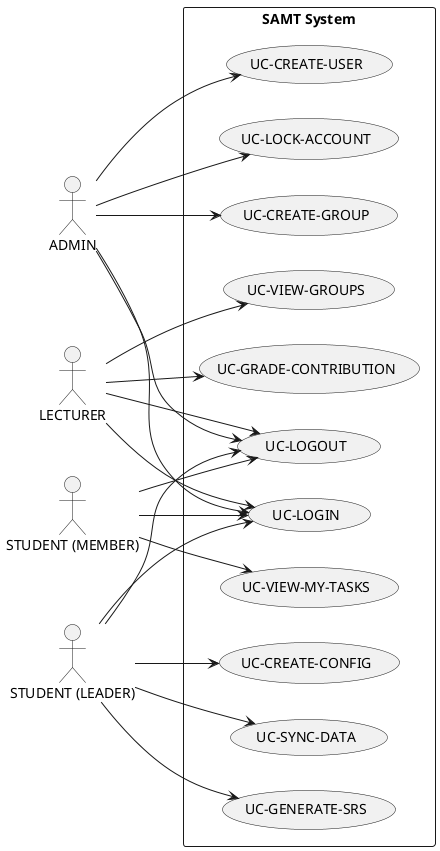

# **SOFTWARE REQUIREMENTS SPECIFICATION (SRS)**

## **Project: SWP391 Academic Management Tool (SAMT)**

**Version:** 1.3

**Date:** February 3, 2026

**Status:** Final Version (Refactored)

---

## **1. GIỚI THIỆU (INTRODUCTION) [CLO1]**

### **1.1 Mục tiêu (Purpose)**

Tài liệu này xác định các yêu cầu kỹ thuật và nghiệp vụ cho hệ thống **SAMT**. Hệ thống giúp tự động hóa việc tổng hợp dữ liệu từ Jira và GitHub để hỗ trợ sinh viên tạo tài liệu SRS chuẩn và giúp Giảng viên theo dõi tiến độ thực tế của dự án.

### **1.2 Phạm vi (Scope)**

* **Hệ thống:** Ứng dụng Web/Mobile tích hợp AI.  
* **Tích hợp:** Kết nối trực tiếp với Jira Software API và GitHub API.  
* **Đầu ra:** Báo cáo tiến độ, chỉ số đóng góp cá nhân và file đặc tả SRS.

---

## **2. MÔ TẢ TỔNG QUAN (OVERALL DESCRIPTION) [CLO1]**

### **2.1 Kiến trúc hệ thống**

Hệ thống triển khai theo mô hình **Microservices** trên nền tảng **Docker**, bao gồm:

1. **Identity Service:** Quản lý xác thực, phân quyền, và thông tin người dùng (authentication, users, roles, refresh tokens).
2. **User/Group Service:** Quản lý nhóm dự án và membership. Lấy thông tin user từ Identity Service qua **gRPC**.
3. **Project Config Service:** Quản lý cấu hình tích hợp Jira/GitHub cho từng nhóm. Sử dụng **gRPC** để validate groups và check leadership. **No REST API** - gRPC-only communication.
4. **Sync Service (Planned):** Đảm nhận việc crawl dữ liệu từ Jira/GitHub.
5. **AI Analysis Service (Planned):** Phân tích ngôn ngữ tự nhiên và chất lượng code.
6. **Reporting Service (Planned):** Xuất dữ liệu ra các định dạng văn bản học thuật.

**Inter-Service Communication:**
- **gRPC:** 
  - User/Group Service ↔ Identity Service (user data, validation)
  - Project Config Service ↔ User-Group Service (group validation, leadership check)
  - Sync Service ↔ Project Config Service (get decrypted tokens)
- **Client Communication:**
  - REST: Identity Service, User-Group Service (via API Gateway)
  - gRPC: Project Config Service (metadata authentication: userId, roles)

### **2.2 Các tác nhân (User Classes)**

#### **2.2.1 System Roles (Vai trò hệ thống)**

Hệ thống quản lý 3 vai trò cấp hệ thống (managed by Identity Service):

* **ADMIN:** Quản trị viên hệ thống
  - Quản lý người dùng (tạo, khóa, mở khóa, soft delete, restore)
  - Tạo và quản lý nhóm sinh viên
  - Phân công Giảng viên cho nhóm
  - Cấu hình tích hợp hệ thống
  - Truy cập mọi dữ liệu trong hệ thống

* **LECTURER:** Giảng viên hướng dẫn
  - Xem danh sách nhóm phụ trách
  - Theo dõi yêu cầu và công việc của nhóm
  - Xem báo cáo tiến độ và thống kê đóng góp
  - Đánh giá chất lượng đóng góp sinh viên
  - Xem thông tin profile của sinh viên (chỉ role STUDENT)

* **STUDENT:** Sinh viên
  - Quản lý thông tin cá nhân
  - Theo dõi task được giao
  - Cập nhật trạng thái công việc
  - Xem thống kê đóng góp cá nhân
  - Nếu là **Group Leader**: Quản lý cấu hình dự án, tạo SRS, phân công công việc
  - Nếu là **Group Member**: Chỉ xem và cập nhật task cá nhân

#### **2.2.2 Group Roles (Vai trò trong nhóm)**

Bên cạnh System Role, sinh viên còn có vai trò trong nhóm dự án:

* **LEADER:** Trưởng nhóm (1 nhóm chỉ có 1 LEADER)
  - Tạo và quản lý cấu hình tích hợp Jira/GitHub
  - Đồng bộ dữ liệu dự án
  - Tạo tài liệu SRS tự động
  - Phân công công việc cho thành viên

* **MEMBER:** Thành viên nhóm
  - Theo dõi task cá nhân
  - Cập nhật trạng thái công việc
  - Xem thống kê cá nhân

**Lưu ý:** Group Role KHÔNG thay thế System Role. Một sinh viên có `System Role = STUDENT` và `Group Role = LEADER` hoặc `MEMBER`.

---

## **3. YÊU CẦU CHỨC NĂNG (FUNCTIONAL REQUIREMENTS) [CLO1]**

### **3.1 TỔNG QUAN BIỂU ĐỒ USE CASE**

Hệ thống bao gồm 4 tác nhân chính tương tác với các nhóm chức năng: Quản trị hệ thống, Quản lý đào tạo, Quản lý dự án nhóm và Theo dõi cá nhân.

**[INSERT OVERALL USE CASE DIAGRAM HERE]**

---

### **3.2 DANH SÁCH USE CASE THEO TỪNG VAI TRÒ (ROLES)**

> **Lưu ý quan trọng:** Các Use Case dưới đây đã được thiết kế và triển khai ở các microservices cụ thể. Mỗi UC được đánh số theo service:
> - **UC-xxx:** Identity Service (Authentication & Authorization)
> - **UC2x:** User/Group Service 
> - **UC3x:** Project Config Service
> - **UC4x-5x:** Sync Service, AI Service, Reporting Service (chưa implement)

---

#### **3.2.1 Nhóm chức năng dành cho Admin (Quản trị viên)**

##### **A. Quản lý Xác thực & Người dùng (Identity Service)**

* **UC-REGISTER:** Đăng ký tài khoản mới (STUDENT tự đăng ký, LECTURER/ADMIN do Admin tạo)
* **UC-LOGIN:** Đăng nhập hệ thống bằng email/password
* **UC-REFRESH-TOKEN:** Làm mới access token bằng refresh token
* **UC-LOGOUT:** Đăng xuất và thu hồi refresh token
* **UC-SOFT-DELETE:** Admin soft delete user (đánh dấu deleted_at, thu hồi tokens)
* **UC-RESTORE:** Admin khôi phục user đã bị soft delete
* **UC-LOCK-ACCOUNT:** Admin khóa tài khoản người dùng (status = LOCKED)
* **UC-UNLOCK-ACCOUNT:** Admin mở khóa tài khoản người dùng
* **UC-MAP-EXTERNAL-ACCOUNTS:** Admin map/unmap Jira Account ID và GitHub Username cho user

##### **B. Quản lý User & Group (User/Group Service)**

* **UC21: Get User Profile:** Lấy thông tin user (Admin xem tất cả, Lecturer chỉ xem STUDENT)
* **UC22: Update User Profile:** Cập nhật thông tin user (Admin update tất cả, Student tự update)
* **UC23: Create Group:** Admin tạo nhóm dự án cho học kỳ
* **UC24: Add User to Group:** Admin thêm sinh viên vào nhóm
* **UC25: Assign Group Role:** Admin gán LEADER/MEMBER cho thành viên nhóm
* **UC26: Remove User from Group:** Admin xóa sinh viên khỏi nhóm
* **UC27: Update Group Lecturer:** Admin thay đổi lecturer phụ trách nhóm

##### **C. Quản lý Cấu hình Hệ thống**

* **UC-SYSTEM-CONFIG:** Cấu hình tham số toàn cục (encryption keys, API rate limits, etc.)

---

#### **3.2.2 Nhóm chức năng dành cho Lecturer (Giảng viên)**

##### **A. Quản lý Thông tin Cá nhân**

* **UC-LOGIN:** Đăng nhập hệ thống
* **UC-LOGOUT:** Đăng xuất hệ thống
* **UC21: Get User Profile:** Xem thông tin sinh viên (chỉ role STUDENT)

> **Lưu ý:** Lecturer KHÔNG được phép update profile qua UC22 (Update User Profile). Lecturer muốn đổi thông tin phải liên hệ Admin.

##### **B. Giám sát Nhóm Phụ trách**

* **UC-VIEW-SUPERVISED-GROUPS:** Xem danh sách các nhóm được phân công hướng dẫn
* **UC-VIEW-GROUP-MEMBERS:** Xem thông tin thành viên của nhóm phụ trách

##### **C. Theo dõi Tiến độ & Đánh giá (Chưa implement)**

* **UC-VIEW-GROUP-PROGRESS:** Xem báo cáo tiến độ dự án (Burndown chart, velocity)
* **UC-VIEW-TASKS:** Xem danh sách Epics, Stories, Tasks từ Jira
* **UC-VIEW-GITHUB-STATS:** Xem thống kê commit, LOC, chất lượng code
* **UC-GRADE-CONTRIBUTION:** Đánh giá và chấm điểm dựa trên dữ liệu thực tế

---

#### **3.2.3 Nhóm chức năng dành cho Student - Group Leader (Trưởng nhóm)**

##### **A. Quản lý Thông tin Cá nhân**

* **UC-REGISTER:** Đăng ký tài khoản (self-service)
* **UC-LOGIN:** Đăng nhập hệ thống
* **UC-LOGOUT:** Đăng xuất hệ thống
* **UC22: Update User Profile:** Cập nhật thông tin cá nhân

##### **B. Quản lý Cấu hình Dự án (Project Config Service - gRPC)**

* **UC30: Create Project Config:** Tạo cấu hình tích hợp Jira/GitHub cho nhóm (gRPC method)
* **UC31: Get Project Config:** Lấy thông tin cấu hình (tokens được mask theo role)
* **UC32: Update Project Config:** Cập nhật Jira/GitHub credentials
* **UC33: Delete Project Config:** Xóa cấu hình (soft delete)
* **UC34: Verify Config Connection:** Kiểm tra tính hợp lệ của cấu hình Jira/GitHub
* **UC35: Restore Project Config:** Khôi phục cấu hình đã xóa (Admin only)

**Giao tiếp:** Client gửi gRPC requests với metadata (userId, roles). Service validate qua User-Group Service (gRPC) để check group leadership.

##### **C. Quản lý Dự án & Tạo SRS (Chưa implement)**

* **UC-SYNC-PROJECT-DATA:** Đồng bộ dữ liệu từ Jira và GitHub về SAMT
* **UC-MAP-REQUIREMENTS:** Ánh xạ Jira Issues vào cấu trúc SRS
* **UC-GENERATE-SRS:** Tạo tài liệu SRS tự động theo chuẩn IEEE 830/29148
* **UC-ASSIGN-TASKS:** Phân công Task cho thành viên (đồng bộ với Jira)
* **UC-VIEW-TEAM-REPORT:** Xem báo cáo tổng hợp hiệu suất nhóm

---

#### **3.2.4 Nhóm chức năng dành cho Student - Group Member (Thành viên)**

##### **A. Quản lý Thông tin Cá nhân**

* **UC-REGISTER:** Đăng ký tài khoản (self-service)
* **UC-LOGIN:** Đăng nhập hệ thống
* **UC-LOGOUT:** Đăng xuất hệ thống
* **UC22: Update User Profile:** Cập nhật thông tin cá nhân

##### **B. Quản lý Công việc Cá nhân (Chưa implement)**

* **UC-VIEW-MY-TASKS:** Xem danh sách công việc được giao
* **UC-UPDATE-TASK-STATUS:** Cập nhật trạng thái Task (To-do, In Progress, Done)
* **UC-VIEW-MY-STATS:** Xem thống kê đóng góp cá nhân (commits, LOC, chất lượng)

---

#### **3.2.5 Nhóm chức năng dùng chung (Common Use Cases)**

Tất cả vai trò đều có thể:

* **UC-LOGIN:** Đăng nhập hệ thống
* **UC-LOGOUT:** Đăng xuất hệ thống
* **UC-REFRESH-TOKEN:** Làm mới access token
* **UC21: Get User Profile:** Xem thông tin cá nhân (với quyền hạn tương ứng)

---

### **3.3 TRẠNG THÁI TRIỂN KHAI CÁC USE CASE**

| Service | Use Cases | Status |
|---------|-----------|--------|
| **Identity Service** | UC-REGISTER, UC-LOGIN, UC-REFRESH-TOKEN, UC-LOGOUT, UC-SOFT-DELETE, UC-RESTORE, UC-LOCK-ACCOUNT, UC-UNLOCK-ACCOUNT, UC-MAP-EXTERNAL-ACCOUNTS | ✅ **IMPLEMENTED** |
| **User/Group Service** | UC21-UC27 | ✅ **IMPLEMENTED** |
| **Project Config Service** | UC30-UC35 | ✅ **IMPLEMENTED** |
| **Sync Service** | UC-SYNC-PROJECT-DATA, UC-MAP-REQUIREMENTS, UC-ASSIGN-TASKS | ⏳ **PLANNED** |
| **AI Analysis Service** | UC-ANALYZE-CODE-QUALITY, UC-POLISH-REQUIREMENTS | ⏳ **PLANNED** |
| **Reporting Service** | UC-GENERATE-SRS, UC-VIEW-TEAM-REPORT, UC-VIEW-GITHUB-STATS | ⏳ **PLANNED** |

---

### **3.4 MÔ TẢ USE CASE DIAGRAM (PLANTUML)**

**![][image1]**

https://app.diagrams.net/\#G1dIYlz7NYFMqShsOqYqw3pEyXYfOpgjYT\#%7B%22pageId%22%3A%22t-SDqpFQ4dpL-EcVTPzM%22%7D

---

## **4. YÊU CẦU PHI CHỨC NĂNG (NON-FUNCTIONAL REQUIREMENTS) [CLO1]**

### **4.1 Hiệu năng (Performance)**

* **Phản hồi truy vấn:** Phản hồi truy vấn dữ liệu báo cáo trong vòng < 5 giây.
* **Token generation:** Access token và refresh token được sinh trong < 100ms.
* **Database queries:** Tất cả truy vấn database có index thích hợp, response time < 200ms.

### **4.2 Bảo mật (Security)**

#### **4.2.1 Authentication & Authorization**

* **JWT Tokens:**
  - Access Token: JWT với HS256, TTL = 15 minutes
  - Refresh Token: Opaque UUID, TTL = 7 days, stored in database
  - Token Rotation: Refresh token bị revoke và sinh token mới mỗi lần refresh
  - Reuse Detection: Nếu revoked token bị reuse → thu hồi TẤT CẢ tokens của user (force re-login)

* **Password Security:**
  - Hash algorithm: BCrypt with strength 10
  - Password requirements:
    - Min 8 characters, max 128 characters
    - ≥1 uppercase, ≥1 lowercase, ≥1 digit, ≥1 special char (@$!%*?&)

* **Account Protection:**
  - Status: ACTIVE, INACTIVE, LOCKED
  - Admin có thể LOCK tài khoản (revoke all tokens)
  - Soft delete: User không bị xóa vĩnh viễn, có thể restore

#### **4.2.2 Token Encryption**

* **API Credentials:**
  - Algorithm: AES-256-GCM
  - Key management: Encryption key stored in environment variable
  - Rotation policy: 90 days (configurable)
  - Atomic encryption: Cả 2 tokens (Jira + GitHub) phải encrypt thành công, nếu 1 token fail → rollback transaction

* **Token Masking:**
  - Jira token: Hiển thị 6 ký tự đầu + `***...`
  - GitHub token: Hiển thị 4 ký tự đầu + `***...`
  - Decrypted tokens chỉ được trả về cho internal services qua authenticated endpoints

#### **4.2.3 Service-to-Service Authentication**

* **Internal API Security:**
  - Headers required: `X-Service-Name`, `X-Service-Key`
  - Service Key: 256-bit random hex string
  - Validation: Constant-time comparison để tránh timing attacks
  - Audit logging: Mọi internal API call được ghi log (serviceName, action, resourceId, outcome, sourceIp)

* **Permission Model:**
  - SYNC_SERVICE, AI_SERVICE: READ_DECRYPTED_TOKENS
  - REPORTING_SERVICE: READ_ONLY (masked tokens)
  - NO DEFAULT PERMISSIONS: Phải explicit mapping trong ServicePermissionRegistry

### **4.3 Khả dụng (Availability)**

* Giao diện tối ưu hóa cho cả trình duyệt desktop và thiết bị di động.
* Microservices architecture cho phép scaling độc lập từng service.
* Soft delete đảm bảo data integrity và khả năng recovery.

### **4.4 Data Integrity**

* **Transaction Management:**
  - Create config: Encrypt + Save trong 1 transaction
  - Verify connection: Separate async transaction (không rollback config nếu verify failed)
  - Update critical fields (tokens, URLs): Trigger re-verification, clear last_verified_at

* **Soft Delete:**
  - Users, Groups, User_Groups, Project_Configs: Chỉ soft delete, không hard delete
  - Hibernate `@SQLRestriction("deleted_at IS NULL")` auto-filter deleted records
  - Admin có quyền restore deleted records

* **Consistency:**
  - 1 group chỉ có 1 LEADER (enforced bằng pessimistic lock)
  - 1 group chỉ có 1 config (UNIQUE constraint)
  - 1 user chỉ thuộc 1 group mỗi semester (enforced ở service layer)

---

## **5. ÁP DỤNG DESIGN PATTERNS (DESIGN PATTERNS APPLICATION) [CLO6]**

Việc thiết kế hệ thống SAMT tuân theo kiến trúc Microservices đòi hỏi sự phối hợp chặt chẽ giữa các thành phần để đảm bảo tính linh hoạt, khả năng bảo trì và hiệu năng. Phần này trình bày chi tiết việc áp dụng các mẫu thiết kế (Design Patterns) tiêu chuẩn để giải quyết các vấn đề về khởi tạo đối tượng, cấu trúc hệ thống và hành vi tương tác giữa các module.

### **5.1 Nhóm Creational Patterns (Mẫu Khởi tạo)**

Nhóm này giải quyết các vấn đề liên quan đến việc khởi tạo đối tượng, giúp hệ thống độc lập với cách thức các đối tượng được tạo ra, cấu thành và biểu diễn.

#### **5.1.1 Singleton Pattern (Đơn bản)**

* **Áp dụng:** Class DatabaseConnector trong module quản lý dữ liệu.  
* **Mô tả kỹ thuật:**  
  * Hệ thống SAMT sử dụng cơ sở dữ liệu quan hệ PostgreSQL để lưu trữ dữ liệu đồng bộ từ Jira và GitHub. Việc thiết lập kết nối đến cơ sở dữ liệu là một thao tác tốn kém tài nguyên và thời gian.  
  * DatabaseConnector được thiết kế với một private static instance và một private constructor. Phương thức getInstance() đảm bảo rằng tại bất kỳ thời điểm nào, toàn bộ ứng dụng chỉ tồn tại duy nhất một thể hiện của lớp kết nối này.  
* **Lợi ích trong SAMT:**  
  * **Quản lý tài nguyên:** Ngăn chặn việc tạo tràn lan các kết nối thừa thãi gây quá tải cho PostgreSQL server.  
  * **Tính nhất quán:** Đảm bảo tất cả các luồng xử lý (threads) khi truy xuất dữ liệu Users hay Groups đều đi qua một điểm kiểm soát cấu hình duy nhất (Connection Pool).

#### **5.1.2 Factory Method Pattern (Phương thức nhà máy)**

* **Áp dụng:** Module ExportService phục vụ chức năng xuất báo cáo.  
* **Mô tả kỹ thuật:**  
  * Hệ thống yêu cầu đầu ra là các định dạng văn bản học thuật khác nhau như file SRS (Word/Docx) hoặc báo cáo tiến độ (PDF).  
  * Interface IReportExporter định nghĩa phương thức chung exportReport().  
  * Lớp ReportFactory sẽ dựa trên tham số đầu vào từ người dùng (loại báo cáo: SRS hay Progress) để quyết định khởi tạo đối tượng PDFExporter hay DocxExporter tương ứng.  
* **Lợi ích trong SAMT:**  
  * **Tính mở rộng (Open/Closed Principle):** Nếu trong tương lai Giảng viên yêu cầu xuất báo cáo dạng Excel (.xlsx) hoặc Markdown (.md), lập trình viên chỉ cần tạo thêm class mới hiện thực IReportExporter mà không cần sửa đổi mã nguồn cốt lõi của chức năng xuất file.

**[INSERT UML CLASS DIAGRAM – CREATIONAL PATTERNS HERE]**

---

### **5.2 Nhóm Structural Patterns (Mẫu Cấu trúc)**

Nhóm này tập trung vào việc tổ chức các lớp và đối tượng để tạo nên các cấu trúc lớn hơn, giúp tích hợp các hệ thống con khác biệt.

#### **5.2.1 Adapter Pattern (Người chuyển đổi)**

* **Áp dụng:** Tầng tích hợp Sync Service kết nối với Jira và GitHub.  
* **Mô tả kỹ thuật:**  
  * Jira cung cấp dữ liệu qua REST API với cấu trúc JSON phức tạp (fields, changelogs). GitHub cung cấp dữ liệu qua GraphQL hoặc REST API (commits, stats).  
  * Cấu trúc dữ liệu nội bộ của SAMT đã được chuẩn hóa trong các bảng Jira\_Issues và Github\_Commits.  
  * Lớp JiraAdapter và GithubAdapter đóng vai trò trung gian, chuyển đổi ("adapt") dữ liệu thô từ API của bên thứ ba thành các đối tượng Issue và Commit đúng chuẩn entity của SAMT.  
* **Lợi ích trong SAMT:**  
  * **Độc lập hệ thống:** Nếu Jira hoặc GitHub thay đổi phiên bản API, chỉ cần sửa đổi logic trong lớp Adapter. Các module xử lý nghiệp vụ như tính điểm hay tạo SRS không bị ảnh hưởng.

#### **5.2.2 Facade Pattern (Mặt tiền)**

* **Áp dụng:** Lớp ProjectSummaryFacade phục vụ cho Frontend Dashboard.  
* **Mô tả kỹ thuật:**  
  * Để hiển thị "Báo cáo tổng hợp nhóm", Frontend cần dữ liệu từ nhiều nguồn: thông tin thành viên (Identity Service), tiến độ Task (Sync Service), và điểm chất lượng code (AI Analysis Service).  
  * Thay vì Frontend phải gọi 3-4 API riêng lẻ, ProjectSummaryFacade cung cấp một giao diện đơn giản hóa: getProjectOverview(groupID). Lớp Facade này sẽ tự động gọi đến các microservices cần thiết, tổng hợp dữ liệu và trả về một kết quả duy nhất.  
* **Lợi ích trong SAMT:**  
  * **Tối ưu hiệu năng mạng:** Giảm số lượng request từ client đến server.  
  * **Ẩn giấu sự phức tạp:** Frontend không cần biết logic lấy dữ liệu phân tán nằm ở đâu, chỉ cần giao tiếp với Facade.

**[INSERT UML CLASS DIAGRAM – STRUCTURAL PATTERNS HERE]**

---

### **5.3 Nhóm Behavioral Patterns (Mẫu Hành vi)**

Nhóm này giải quyết các vấn đề về phân công trách nhiệm và giao tiếp giữa các đối tượng, giúp luồng điều khiển linh hoạt hơn.

#### **5.3.1 Observer Pattern (Người quan sát)**

* **Áp dụng:** Hệ thống thông báo (Notification System) dành cho Giảng viên.  
* **Mô tả kỹ thuật:**  
  * **Subject (Chủ thể):** SyncService \- nơi theo dõi hoạt động commit code và tiến độ Jira.  
  * **Observer (Người quan sát):** NotificationService.  
  * Cơ chế hoạt động: Khi SyncService phát hiện một sự kiện đặc biệt (ví dụ: sinh viên commit \> 1000 dòng code/lần, hoặc trạng thái Sprint chuyển sang "Done"), nó sẽ kích hoạt phương thức notifyObservers().  
  * NotificationService nhận tín hiệu và gửi cảnh báo đến Giảng viên (Lecturer) qua email hoặc thông báo trên ứng dụng.  
* **Lợi ích trong SAMT:**  
  * **Phản ứng thời gian thực:** Giảng viên nắm bắt ngay lập tức các hành vi bất thường hoặc các mốc quan trọng của dự án mà không cần phải vào hệ thống kiểm tra thủ công liên tục.  
  * **Lỏng lẻo (Loose Coupling):** Module đồng bộ dữ liệu không cần biết chi tiết về cách gửi email/thông báo, chỉ cần phát đi sự kiện.

#### **5.3.2 Strategy Pattern (Chiến lược)**

* **Áp dụng:** Module Đánh giá và Chấm điểm (Grading Service).  
* **Mô tả kỹ thuật:**  
  * Mỗi Giảng viên có quan điểm chấm điểm khác nhau. Interface IGradingStrategy được định nghĩa với phương thức calculateScore().  
  * Hệ thống triển khai các chiến lược cụ thể:  
    * TaskVolumeStrategy: Chấm điểm dựa trên số lượng Task hoàn thành và Story Points (Dữ liệu Jira).  
    * CodeComplexityStrategy: Chấm điểm dựa trên độ khó của code và chỉ số AI Quality Score (Dữ liệu GitHub).  
  * Tại thời điểm chạy (runtime), Giảng viên có thể lựa chọn chiến lược chấm điểm mong muốn thông qua cấu hình, và Context sẽ chuyển đổi thuật toán xử lý tương ứng.  
* **Lợi ích trong SAMT:**  
  * **Tính linh hoạt cao:** Đáp ứng đa dạng nhu cầu đánh giá của Giảng viên mà không cần viết lại code logic nghiệp vụ (Business Logic).

**[INSERT UML SEQUENCE / INTERACTION DIAGRAM – BEHAVIORAL PATTERNS HERE]**

---

## **6. THIẾT KẾ CƠ SỞ DỮ LIỆU (DATABASE DESIGN) [CLO5]**

Hệ thống **SAMT** sử dụng hệ quản trị cơ sở dữ liệu quan hệ (RDBMS) là **PostgreSQL**. Thiết kế dưới đây tuân thủ chuẩn hóa mức 3 (3NF) để giảm thiểu dư thừa dữ liệu và đảm bảo tính nhất quán khi đồng bộ từ nhiều nguồn (Jira, GitHub).

### **6.1 Các thực thể chính (Entities)**

Dựa trên phân tích nghiệp vụ, các thực thể dữ liệu chính bao gồm:

1. **Users (Người dùng):** Quản lý thông tin định danh của Admin, Giảng viên và Sinh viên.
2. **Groups (Nhóm dự án):** Đơn vị quản lý chính của lớp học phần SWP391.
3. **Project\_Configs (Cấu hình dự án):** Lưu trữ thông tin nhạy cảm về kết nối API.
4. **Jira\_Issues (Yêu cầu/Công việc):** Bản sao dữ liệu các Ticket từ Jira.
5. **Github\_Commits (Mã nguồn):** Dữ liệu lịch sử commit và các chỉ số phân tích.
6. **Reports (Báo cáo):** Lưu trữ các file SRS hoặc báo cáo đã được hệ thống tạo ra.

### **6.2 Lược đồ Quan hệ Thực thể (ERD \- PlantUML)**

Dưới đây là mã nguồn để sinh lược đồ ERD minh họa mối quan hệ giữa các bảng:

**[INSERT ENTITY RELATIONSHIP DIAGRAM (ERD) HERE]**

### **6.3 Chi tiết các bảng dữ liệu**

#### **6.3.1 Bảng Users**

Lưu trữ thông tin người dùng hệ thống với khả năng soft delete và khóa tài khoản.

| Tên thuộc tính | Kiểu dữ liệu | Ràng buộc | Mô tả |
| :---- | :---- | :---- | :---- |
| **user\_id** | UUID | **PK** | Định danh duy nhất của người dùng. |
| email | VARCHAR(255) | UNIQUE, NOT NULL | Email đăng nhập. |
| password_hash | VARCHAR(255) | NOT NULL | Mật khẩu đã hash (BCrypt strength 10). |
| full\_name | VARCHAR(100) | NOT NULL | Tên hiển thị đầy đủ. |
| role | ENUM | CHECK (ADMIN, LECTURER, STUDENT) | System role (quản lý bởi Identity Service). |
| status | ENUM | CHECK (ACTIVE, INACTIVE, LOCKED), DEFAULT ACTIVE | Trạng thái tài khoản. |
| jira\_account\_id | VARCHAR(100) | NULL, UNIQUE | ID tài khoản Jira (dùng để map assignee). **KHÔNG được update qua UC22**. Chỉ ghi bởi: (1) Auto-sync process, (2) UC-MAP-EXTERNAL-ACCOUNTS (Admin). |
| github\_username | VARCHAR(100) | NULL, UNIQUE | Username GitHub (dùng để map author). **KHÔNG được update qua UC22**. Chỉ ghi bởi: (1) Auto-sync process, (2) UC-MAP-EXTERNAL-ACCOUNTS (Admin). |
| **deleted\_at** | TIMESTAMP | NULL | Thời điểm soft delete (NULL = chưa xóa). |
| **deleted\_by** | UUID | FK (Ref Users.user\_id), NULL | Admin đã thực hiện soft delete. |
| created\_at | TIMESTAMP | DEFAULT NOW() | Thời điểm tạo tài khoản. |
| updated\_at | TIMESTAMP | DEFAULT NOW() | Thời điểm cập nhật cuối cùng. |

**Lưu ý về Soft Delete:**
- Users có `deleted_at IS NOT NULL` bị ẩn khỏi các query thông thường (via `@SQLRestriction`)
- Chỉ Admin mới có quyền soft delete và restore users
- Khi soft delete, tất cả refresh tokens của user bị thu hồi

---

#### **6.3.2 Bảng Refresh_Tokens (Identity Service)**

Lưu trữ refresh tokens với khả năng rotation và reuse detection.

| Tên thuộc tính | Kiểu dữ liệu | Ràng buộc | Mô tả |
| :---- | :---- | :---- | :---- |
| **token\_id** | UUID | **PK** | Định danh duy nhất của token. |
| **user\_id** | UUID | **FK** (Ref Users.user\_id), NOT NULL | User sở hữu token. |
| token | VARCHAR(255) | UNIQUE, NOT NULL | Refresh token (UUID string). |
| revoked | BOOLEAN | DEFAULT FALSE | Token đã bị thu hồi chưa. |
| expires\_at | TIMESTAMP | NOT NULL | Thời điểm hết hạn (7 days from issue). |
| issued\_at | TIMESTAMP | DEFAULT NOW() | Thời điểm phát hành token. |

**Security Features:**
- Token rotation: Mỗi lần refresh, token cũ bị revoke và sinh token mới
- Reuse detection: Nếu token đã revoke bị dùng lại → thu hồi TẤT CẢ tokens của user (force re-login)
- Logout: Thu hồi token cụ thể
- Lock/Delete account: Thu hồi tất cả tokens

#### **6.3.3 Bảng Groups**

Quản lý thông tin nhóm dự án (Capstone/SWP Project) với soft delete.

| Tên thuộc tính | Kiểu dữ liệu | Ràng buộc | Mô tả |
| :---- | :---- | :---- | :---- |
| **group\_id** | UUID | **PK** | Định danh nhóm. |
| group\_name | VARCHAR(100) | NOT NULL | Tên nhóm (VD: SE1705-G1). |
| semester | VARCHAR(20) | NOT NULL | Học kỳ (VD: Spring2026). |
| **lecturer\_id** | UUID | **FK** (Ref Users.user\_id), NULL | Giảng viên hướng dẫn (Supervisor). |
| **deleted\_at** | TIMESTAMP | NULL | Thời điểm soft delete (NULL = chưa xóa). |
| created\_at | TIMESTAMP | DEFAULT NOW() | Thời điểm tạo nhóm. |

**Ràng buộc:**
- UNIQUE (group\_name, semester): Tên nhóm phải unique trong mỗi học kỳ

---

#### **6.3.4 Bảng User_Groups (Bảng nối với Group Roles)**

Giải quyết mối quan hệ N-N giữa Sinh viên và Nhóm, đồng thời xác định vai trò LEADER/MEMBER.

| Tên thuộc tính | Kiểu dữ liệu | Ràng buộc | Mô tả |
| :---- | :---- | :---- | :---- |
| **user\_id** | UUID | **PK, FK** (Ref Users.user\_id) | Sinh viên nào. |
| **group\_id** | UUID | **PK, FK** (Ref Groups.group\_id) | Thuộc về nhóm nào. |
| role | ENUM | CHECK (LEADER, MEMBER), DEFAULT MEMBER | Vai trò trong nhóm. |
| **deleted\_at** | TIMESTAMP | NULL | Thời điểm soft delete (NULL = chưa xóa). |
| joined\_at | TIMESTAMP | DEFAULT NOW() | Thời điểm tham gia nhóm. |

**Business Rules:**
- Mỗi group CHỈ có duy nhất 1 LEADER (enforced ở service layer + pessimistic lock)
- Mỗi user chỉ thuộc 1 group trong 1 semester (enforced ở service layer)
- Khi assign LEADER mới, LEADER cũ tự động demote xuống MEMBER

**Lưu ý:** Group Role (LEADER/MEMBER) KHÁC với System Role (ADMIN/LECTURER/STUDENT)

#### **6.3.5 Bảng Project\_Configs**

Lưu trữ cấu hình tích hợp với soft delete và state machine. Tokens được mã hóa AES-256-GCM.

| Tên thuộc tính | Kiểu dữ liệu | Ràng buộc | Mô tả |
| :---- | :---- | :---- | :---- |
| **config\_id** | UUID | **PK** | Định danh cấu hình. |
| **group\_id** | UUID | **FK** (Ref Groups.group\_id), UNIQUE, NOT NULL | Mỗi nhóm chỉ có 1 cấu hình tích hợp. |
| jira\_host\_url | VARCHAR(255) | NOT NULL | URL dự án Jira (VD: projects.atlassian.net). |
| jira\_api\_token\_encrypted | TEXT | NOT NULL | Token xác thực Jira (Encrypted với AES-256-GCM). |
| github\_repo\_url | VARCHAR(255) | NOT NULL | URL GitHub Repository. |
| github\_token\_encrypted | TEXT | NOT NULL | Token xác thực GitHub (Encrypted với AES-256-GCM). |
| **state** | ENUM | CHECK (DRAFT, VERIFIED, INVALID, DELETED), DEFAULT DRAFT | Trạng thái config (State Machine). |
| last\_verified\_at | TIMESTAMP | NULL | Lần cuối verify thành công. |
| invalid\_reason | TEXT | NULL | Lý do config INVALID (nếu verify failed). |
| **deleted\_at** | TIMESTAMP | NULL | Thời điểm soft delete (NULL = chưa xóa). |
| **deleted\_by** | UUID | FK (Ref Users.user\_id), NULL | User đã thực hiện soft delete. |
| created\_at | TIMESTAMP | DEFAULT NOW() | Thời điểm tạo config. |
| updated\_at | TIMESTAMP | DEFAULT NOW() | Thời điểm cập nhật cuối cùng. |

**State Machine (Config Lifecycle):**
- **DRAFT:** Config mới tạo, chưa verify hoặc đã update cần re-verify
- **VERIFIED:** Connection đã test thành công
- **INVALID:** Verify failed hoặc token bị thu hồi
- **DELETED:** Soft delete

**State Transitions:**
- DRAFT → VERIFIED: Verify success
- DRAFT → INVALID: Verify failed
- VERIFIED → DRAFT: Update critical fields (jiraApiToken, githubToken, URLs)
- VERIFIED → INVALID: Token revoked hoặc periodic check failed
- ANY → DELETED: Soft delete

**Security:**
- Tokens luôn được mã hóa AES-256-GCM trước khi lưu database
- Khi trả về client, tokens được mask (VD: `ghp_***...`)
- Internal service (Sync Service) lấy decrypted tokens qua endpoint `/internal/project-configs/{id}/tokens`

#### **6.3.6 Bảng Jira\_Issues**

Lưu trữ dữ liệu đồng bộ từ Jira. Đây là nguồn dữ liệu chính để tạo SRS (User Stories) và Dashboard (Tasks).

| Tên thuộc tính | Kiểu dữ liệu | Ràng buộc | Mô tả |
| :---- | :---- | :---- | :---- |
| **issue\_key** | VARCHAR(50) | **PK** | Key định danh trên Jira (VD: SWP-123). |
| **group\_id** | UUID | **FK** (Ref Groups) | Thuộc dự án nào. |
| summary | TEXT | NOT NULL | Tiêu đề Issue/Requirement. |
| description | TEXT | NULL | Mô tả chi tiết (Input cho SRS). |
| issue\_type | VARCHAR(20) | NOT NULL | Epic, Story, Task, Bug. |
| status | VARCHAR(50) | NOT NULL | To Do, In Progress, Done. |
| story\_points | INT | DEFAULT 0 | Điểm độ phức tạp. |
| **assignee\_id** | UUID | **FK** (Ref Users) | Người được giao việc (map qua jira\_account\_id). |

#### **6.3.7 Bảng Github\_Commits**

Lưu trữ dữ liệu đồng bộ từ GitHub và kết quả phân tích từ Module AI.

| Tên thuộc tính | Kiểu dữ liệu | Ràng buộc | Mô tả |
| :---- | :---- | :---- | :---- |
| **commit\_hash** | VARCHAR(40) | **PK** | Mã SHA-1 của commit. |
| **group\_id** | UUID | **FK** (Ref Groups) | Thuộc dự án nào. |
| **author\_id** | UUID | **FK** (Ref Users) | Người commit (map qua github\_username). |
| message | TEXT | NOT NULL | Nội dung commit message. |
| additions | INT | DEFAULT 0 | Số dòng code thêm vào. |
| deletions | INT | DEFAULT 0 | Số dòng code xóa đi. |
| commit\_date | TIMESTAMP | NOT NULL | Thời gian commit. |
| ai\_quality\_score | DECIMAL(4,2) | NULL | Điểm chất lượng code (0-10) do AI chấm. |
| ai\_analysis | TEXT | NULL | Nhận xét tự động của AI về commit này. |

#### **6.3.8 Bảng Reports**

Lưu trữ lịch sử các báo cáo đã tạo để Giảng viên/Sinh viên tải lại khi cần.

| Tên thuộc tính | Kiểu dữ liệu | Ràng buộc | Mô tả |
| :---- | :---- | :---- | :---- |
| **report\_id** | UUID | **PK** | Định danh báo cáo. |
| **group\_id** | UUID | **FK** (Ref Groups) | Báo cáo của nhóm nào. |
| type | VARCHAR(20) | CHECK (SRS, Progress) | Loại báo cáo. |
| file\_path | VARCHAR(255) | NOT NULL | Đường dẫn file (trên Server/Cloud Storage). |
| **created\_by** | UUID | **FK** (Ref Users) | Người yêu cầu tạo báo cáo (Leader). |
| created\_at | TIMESTAMP | DEFAULT NOW() | Thời gian tạo. |

### **6.4 Phân tích mối quan hệ (Relationships)**

**Lưu ý:** Hệ thống tuân theo **Database-per-Service pattern**. Mỗi service có database riêng, giao tiếp qua gRPC/REST API.

**Identity Service Database:**
1. **Users \- Refresh\_Tokens (1 \- N):** Một User có nhiều Refresh Tokens.

**User/Group Service Database:**
2. **Groups \- User\_Groups (1 \- N):** Một Nhóm có nhiều thành viên (qua bảng nối User\_Groups).
3. **User\_Groups references Users (via Identity Service gRPC):** User\_Groups.user\_id tham chiếu đến User trong Identity Service (không có FK constraint trong database, verify qua gRPC `VerifyUserExists()`).
4. **Groups.lecturer\_id references Users (via Identity Service gRPC):** Lecturer ID tham chiếu đến User trong Identity Service với role LECTURER (verify qua gRPC `GetUserRole()`).

**Project Config Service Database:**
5. **Groups \- Project\_Configs (1 \- 1):** Một Nhóm có duy nhất một bộ cấu hình API (Groups.group\_id được reference từ Project Config Service, verify existence qua User/Group Service API).

**Sync Service Database (Planned):**
6. **Groups \- Jira\_Issues (1 \- N):** Một Nhóm có nhiều Task/Story trên Jira.
7. **Groups \- Github\_Commits (1 \- N):** Một Nhóm có nhiều Commit mã nguồn.
8. **Users \- Jira\_Issues (1 \- N):** Một Sinh viên được assign nhiều Task (verify user qua Identity Service gRPC).
9. **Users \- Github\_Commits (1 \- N):** Một Sinh viên thực hiện nhiều Commit (verify user qua Identity Service gRPC).

**Cross-Service Data Integrity:**
- **No database-level foreign keys** across services
- **Runtime validation** via gRPC/REST API calls
- **Eventual consistency** for cross-service references
- **Soft delete propagation:** Khi Identity Service soft delete user, các services khác check `deleted` flag qua gRPC

---

## **7. COMET-BASED ANALYSIS MODEL [CLO2]**

### **7.1 Tổng quan phương pháp COMET**

COMET (Concurrent Object Modeling and Architectural Design Method) là phương pháp phân tích hướng đối tượng tập trung vào việc phân loại các đối tượng theo trách nhiệm. Hệ thống SAMT áp dụng mô hình 3 lớp:

* **Boundary Objects (Đối tượng biên):** Xử lý giao tiếp với actor bên ngoài (UI, API endpoints)
* **Control Objects (Đối tượng điều khiển):** Điều phối luồng xử lý nghiệp vụ giữa các thành phần
* **Entity Objects (Đối tượng thực thể):** Lưu trữ dữ liệu nghiệp vụ và logic miền

### **7.2 Phân tích Use Case → Object Responsibility**

#### **7.2.1 UC-LOGIN (User Authentication)**

| Object Type | Object Name | Responsibility |
|-------------|-------------|----------------|
| **Boundary** | LoginController | Nhận request (email, password) từ client, trả về JWT tokens |
| **Control** | AuthService | Xác thực credentials, tạo tokens, audit logging |
| **Entity** | User | Lưu trữ thông tin người dùng (email, password_hash, role, status) |
| **Entity** | RefreshToken | Lưu trữ refresh token với metadata (expires_at, revoked) |

**Luồng tương tác:**
1. LoginController (Boundary) nhận HTTP POST request
2. AuthService (Control) validate credentials với User (Entity)
3. AuthService tạo JWT và RefreshToken (Entity)
4. LoginController trả response cho client

#### **7.2.2 UC30 (Create Project Config - gRPC)**

| Object Type | Object Name | Responsibility |
|-------------|-------------|----------------|
| **Boundary** | ProjectConfigGrpcService | Nhận gRPC request với metadata (userId, roles) |
| **Control** | ProjectConfigService | Kiểm tra quyền LEADER, encrypt tokens, lưu database |
| **Control** | TokenEncryptionService | Mã hóa/giải mã tokens với AES-256-GCM |
| **Control** | UserGroupServiceGrpcClient | Verify user là LEADER của group qua gRPC |
| **Entity** | ProjectConfig | Lưu trữ encrypted tokens và state machine |

**Luồng tương tác:**
1. Client gửi gRPC request với metadata: userId, roles
2. AuthenticationInterceptor extract userId/roles từ metadata
3. ProjectConfigGrpcService nhận CreateConfigRequest protobuf
4. ProjectConfigService gọi UserGroupServiceGrpcClient để verify LEADER
5. TokenEncryptionService encrypt Jira và GitHub tokens (AES-256-GCM)
6. ProjectConfig entity được lưu vào database với state = DRAFT
7. ProjectConfigGrpcService trả về ProjectConfigResponse với masked tokens

**Security:**
- gRPC metadata authentication thay vì JWT headers
- Service-to-service auth cho internal methods (x-service-name, x-service-key)
- Tokens luôn được mã hóa trong database, mask khi trả về client

#### **7.2.3 UC-SYNC-PROJECT-DATA (Planned)**

| Object Type | Object Name | Responsibility |
|-------------|-------------|----------------|
| **Boundary** | SyncController | Nhận trigger request từ LEADER |
| **Control** | SyncOrchestrator | Điều phối quá trình đồng bộ Jira và GitHub |
| **Control** | JiraAdapter | Kết nối Jira API, parse dữ liệu Issues |
| **Control** | GithubAdapter | Kết nối GitHub API, parse dữ liệu Commits |
| **Entity** | JiraIssue | Lưu trữ tasks/stories từ Jira |
| **Entity** | GithubCommit | Lưu trữ commit history và metrics |

### **7.3 COMET Object Model Diagram**

**[INSERT COMET OBJECT MODEL DIAGRAM (BOUNDARY–CONTROL–ENTITY) HERE]**

*Diagram cần minh họa:*
- Phân lớp Boundary / Control / Entity cho các use case chính
- Mối quan hệ giữa các objects (dependency, association)
- Communication pattern giữa các lớp

---

## **8. SOFTWARE ANALYSIS MODEL (UML) [CLO3]**

### **8.1 Class Diagram (Core Domain Model)**

Class diagram mô tả cấu trúc tĩnh của các entity chính trong hệ thống và mối quan hệ giữa chúng.

**[INSERT UML CLASS DIAGRAM HERE]**

*Diagram cần bao gồm:*
- **Identity Service:** User, RefreshToken, AuditLog
- **User/Group Service:** Group, UserGroup (junction table)
- **Project Config Service:** ProjectConfig
- **Sync Service (Planned):** JiraIssue, GithubCommit, Report
- Hiển thị attributes (id, email, role, status, etc.)
- Hiển thị methods chính (login(), createGroup(), encryptToken(), etc.)
- Mối quan hệ: associations, multiplicities, aggregations

**Các quan hệ chính:**
- User "1" ←→ "0..*" RefreshToken (composition)
- Group "1" ←→ "0..*" UserGroup (composition)
- Group "1" ←→ "0..1" ProjectConfig (one-to-one)
- User "1" ←→ "0..*" JiraIssue (via assignee_id)
- User "1" ←→ "0..*" GithubCommit (via author_id)

### **8.2 Sequence Diagrams**

#### **8.2.1 UC-LOGIN (User Authentication)**

**[INSERT UML SEQUENCE DIAGRAM – UC-LOGIN HERE]**

*Sequence diagram cần thể hiện:*
1. Client → LoginController: POST /api/auth/login {email, password}
2. LoginController → AuthService: login(LoginRequest)
3. AuthService → UserRepository: findByEmail(email)
4. UserRepository → Database: SELECT * FROM users WHERE email=?
5. Database → UserRepository: User entity
6. AuthService → BCrypt: checkPassword(password, passwordHash)
7. AuthService → JwtService: generateAccessToken(user)
8. AuthService → RefreshTokenService: createRefreshToken(user)
9. RefreshTokenService → Database: INSERT INTO refresh_tokens
10. AuthService → AuditService: logLogin(userId, ipAddress)
11. LoginController → Client: 200 OK {accessToken, refreshToken}

**Error flow:**
- Nếu credentials invalid → 401 Unauthorized
- Nếu account locked → 403 Forbidden

#### **8.2.2 UC-SYNC-PROJECT-DATA (Planned)**

**[INSERT UML SEQUENCE DIAGRAM – UC-SYNC-PROJECT-DATA HERE]**

*Sequence diagram cần thể hiện:*
1. LEADER → SyncController: POST /api/sync/projects/{groupId}
2. SyncController → AuthService: validateJWT(token)
3. SyncController → ProjectConfigService: getConfig(groupId)
4. ProjectConfigService → TokenEncryptionService: decryptTokens(encryptedTokens)
5. SyncController → SyncOrchestrator: syncData(groupId, jiraToken, githubToken)
6. **Parallel execution:**
   - SyncOrchestrator → JiraAdapter: fetchIssues(jiraToken)
   - SyncOrchestrator → GithubAdapter: fetchCommits(githubToken)
7. JiraAdapter → JiraAPI: GET /rest/api/3/search
8. GithubAdapter → GithubAPI: GET /repos/{owner}/{repo}/commits
9. SyncOrchestrator → Database: Bulk INSERT jira_issues, github_commits
10. SyncOrchestrator → NotificationService: notifyObservers(syncComplete)
11. SyncController → LEADER: 200 OK {syncedCount, lastSyncTime}

#### **8.2.3 UC-GENERATE-SRS (Planned)**

**[INSERT UML SEQUENCE DIAGRAM – UC-GENERATE-SRS HERE]**

*Sequence diagram cần thể hiện:*
1. LEADER → ReportController: POST /api/reports/generate {type: SRS}
2. ReportController → ReportingService: generateSRS(groupId)
3. ReportingService → JiraIssueRepository: findAllEpicsAndStories(groupId)
4. ReportingService → AIService: polishRequirements(rawIssues)
5. AIService → OpenAI API: POST /v1/chat/completions {prompt: "Polish requirements"}
6. AIService → ReportingService: polishedRequirements
7. ReportingService → DocxExporter: exportToDocx(srsData, template)
8. DocxExporter → FileStorage: saveFile(path, content)
9. ReportingService → ReportRepository: INSERT INTO reports
10. ReportController → LEADER: 200 OK {reportId, downloadUrl}

### **8.3 Statechart Diagrams**

#### **8.3.1 User Account Lifecycle**

**[INSERT UML STATECHART DIAGRAM – USER ACCOUNT HERE]**

*States:*
- **ACTIVE:** Account hoạt động bình thường
- **LOCKED:** Admin khóa tài khoản (revoke all tokens)
- **SOFT_DELETED:** Account bị soft delete (deleted_at IS NOT NULL)

*Transitions:*
- ACTIVE → LOCKED: Admin execute UC-LOCK-ACCOUNT
- LOCKED → ACTIVE: Admin execute UC-UNLOCK-ACCOUNT
- ACTIVE → SOFT_DELETED: Admin execute UC-SOFT-DELETE
- LOCKED → SOFT_DELETED: Admin execute UC-SOFT-DELETE
- SOFT_DELETED → ACTIVE: Admin execute UC-RESTORE

*Events:*
- lock(): Set status=LOCKED, revoke all refresh tokens
- unlock(): Set status=ACTIVE
- softDelete(): Set deleted_at=NOW(), revoke all tokens
- restore(): Set deleted_at=NULL

#### **8.3.2 Project Config State Machine**

**[INSERT UML STATECHART DIAGRAM – PROJECT CONFIG HERE]**

*States:*
- **DRAFT:** Config mới tạo hoặc đã update chưa verify
- **VERIFIED:** Connection test thành công, sẵn sàng sync
- **INVALID:** Verify failed hoặc token bị thu hồi
- **DELETED:** Soft delete (deleted_at IS NOT NULL)

*Transitions:*
- DRAFT → VERIFIED: Execute UC34 (Verify Config), test success
- DRAFT → INVALID: Execute UC34, test failed
- VERIFIED → DRAFT: Execute UC32 (Update Config), thay đổi critical fields
- VERIFIED → INVALID: Periodic verification failed hoặc token revoked
- INVALID → VERIFIED: Fix config và re-verify success
- ANY → DELETED: Execute UC33 (Delete Config)

*Events:*
- verify(): Test connection đến Jira và GitHub APIs
- update(): Cập nhật URLs hoặc tokens
- markInvalid(reason): Set state=INVALID, log reason
- softDelete(): Set deleted_at=NOW(), state=DELETED

---

## **9. SOFTWARE ARCHITECTURE DESIGN [CLO4]**

### **9.1 Component Architecture**

Hệ thống SAMT được thiết kế theo kiến trúc Microservices với các thành phần độc lập, mỗi service đảm nhận một nhóm chức năng nghiệp vụ cụ thể.

**[INSERT UML COMPONENT DIAGRAM HERE]**

*Diagram cần thể hiện:*

**Microservices Layer:**
- Identity Service (Port 8081, gRPC 9091)
- User/Group Service (Port 8082, gRPC 9092)
- Project Config Service (Port 8084)
- Sync Service (Planned)
- AI Analysis Service (Planned)
- Reporting Service (Planned)

**Infrastructure Components:**
- API Gateway (Port 9080) - Single entry point
- PostgreSQL Cluster:
  - samt_identity (Port 5432)
  - samt_core (Port 5433)
- Redis Cache (Port 6379)
- Message Queue (RabbitMQ/Kafka) - Async events

**External Integrations:**
- Jira Cloud API (REST)
- GitHub API (REST/GraphQL)
- OpenAI API (ChatGPT)
- File Storage (S3/MinIO)

**Inter-Component Communication:**
- REST API: Client ↔ API Gateway ↔ Services
- gRPC: Service ↔ Service (synchronous)
- Message Queue: Service → Service (asynchronous events)

### **9.2 Deployment Architecture**

**[INSERT UML DEPLOYMENT DIAGRAM HERE]**

*Diagram cần thể hiện:*

**Production Environment:**

```
[Client Tier]
  - Web Browser
  - Mobile App
    ↓ HTTPS
[Load Balancer Layer]
  - Nginx/HAProxy
  - SSL Termination
    ↓
[Application Tier]
  - Docker Swarm/Kubernetes Cluster
  - Containers:
    * identity-service (replicas: 3)
    * user-group-service (replicas: 2)
    * project-config-service (replicas: 2)
    * sync-service (replicas: 2)
    * ai-service (replicas: 1)
    * reporting-service (replicas: 2)
    ↓
[Data Tier]
  - PostgreSQL Primary-Replica Cluster
  - Redis Sentinel Cluster
  - Object Storage (S3)
    ↓
[External Services]
  - Jira Cloud
  - GitHub
  - OpenAI API
```

**Deployment Specifications:**
- Container orchestration: Kubernetes (GKE/EKS/AKS)
- Service mesh: Istio (traffic management, security, observability)
- CI/CD: GitHub Actions + ArgoCD
- Monitoring: Prometheus + Grafana
- Logging: ELK Stack (Elasticsearch, Logstash, Kibana)
- Secret management: HashiCorp Vault

### **9.3 Architectural Analysis and AI-Driven Improvements**

#### **9.3.1 Current Architecture Strengths**

**Microservices Benefits:**
- **Independent scaling:** Sync Service có thể scale riêng khi có nhiều requests crawl data
- **Technology diversity:** AI Service có thể dùng Python/TensorFlow, các service khác dùng Java/Spring Boot
- **Fault isolation:** Nếu AI Service down, các chức năng core (login, group management) vẫn hoạt động
- **Deployment independence:** Deploy Identity Service mới không ảnh hưởng User/Group Service

**Database-per-Service Pattern:**
- Mỗi service tự quản lý schema của mình
- Tránh lock contention khi nhiều services cùng truy xuất
- Dễ dàng migrate sang database khác nhau (PostgreSQL cho Identity, MongoDB cho AI Analysis)

#### **9.3.2 Identified Architectural Risks**

**Performance Bottlenecks:**
- gRPC calls giữa services tăng latency (network overhead)
- Không có caching layer cho User data → mỗi request đều query database
- Sync Service có thể overload khi crawl dữ liệu lớn từ Jira/GitHub

**Security Concerns:**
- Internal gRPC communication không mã hóa (plaintext)
- Service-to-service authentication dựa vào static API keys (X-Service-Key)
- Decrypted tokens được truyền qua internal network

**Scalability Limitations:**
- Single database instance cho mỗi service (no read replicas)
- Không có circuit breaker pattern → cascading failures risk
- Reporting Service đồng bộ → block request khi generate file lớn

#### **9.3.3 AI-Assisted Architectural Improvements**

**Recommendation 1: Implement API Gateway with Rate Limiting**

*AI Analysis:*
- Hiện tại clients gọi trực tiếp đến từng service → khó quản lý, CORS issues
- API Gateway (Kong/Envoy) cung cấp single entry point, rate limiting, JWT validation

*Implementation:*
- Deploy Kong Gateway với plugins: JWT authentication, rate limiting (100 req/min/user)
- Centralized logging và metrics tại gateway layer
- Dynamic routing: `/api/auth/*` → Identity Service, `/api/groups/*` → User/Group Service

**Recommendation 2: Implement Redis Cache for User Data**

*AI Analysis:*
- User profile được query rất thường xuyên (mỗi authenticated request)
- Cache hit ratio ước tính: 85% (giảm database load đáng kể)

*Implementation:*
- Cache strategy: Write-through (update cache khi update database)
- TTL: 15 minutes (đồng bộ với JWT access token expiration)
- Cache key pattern: `user:{userId}:profile`
- Invalidation: Clear cache khi Admin update user hoặc soft delete

**Recommendation 3: Introduce Event-Driven Architecture**

*AI Analysis:*
- Sync Service xử lý đồng bộ → block response, poor UX
- Notification Service cần real-time events → Observer pattern không đủ với distributed system

*Implementation:*
- Message broker: Kafka hoặc RabbitMQ
- Events:
  - `SyncCompleted(groupId, timestamp, itemCount)`
  - `UserLockedEvent(userId, reason)`
  - `ConfigVerifiedEvent(configId, status)`
- Async workers consume events và xử lý background tasks

**Recommendation 4: Circuit Breaker Pattern for External APIs**

*AI Analysis:*
- Jira/GitHub API có thể down hoặc rate limited → SAMT không nên chờ timeout
- Circuit Breaker (Resilience4j) prevent cascading failures

*Implementation:*
- Thresholds: Open circuit sau 5 failed calls trong 1 phút
- Half-open state: Thử 1 request sau 30s để kiểm tra recovery
- Fallback strategy: Trả về cached data hoặc stale data với warning

**Recommendation 5: Read Replicas for Database Scaling**

*AI Analysis:*
- Query-heavy operations: List groups, view reports, dashboard metrics
- PostgreSQL read replicas phân tải read traffic

*Implementation:*
- Master-Replica topology: 1 Primary (write), 2 Replicas (read)
- Application routing: Write → Primary, Read → Load-balanced Replicas
- Replication lag monitoring: Alert nếu lag > 1 second

---

## **10. AI TOOLS UTILIZATION IN SOFTWARE DEVELOPMENT [CLO7]**

### **10.1 AI-Assisted Requirements Analysis**

#### **10.1.1 ChatGPT for Eliciting and Refining Requirements**

**Use Case: Chuyển đổi Jira Issues thành Functional Requirements**

*Input prompt structure:*
```
Role: You are a Software Requirements Engineer.
Task: Convert the following Jira issue into a formal functional requirement following IEEE 830 standard.

Jira Issue:
- Key: SWP-45
- Summary: As a LEADER, I want to sync Jira data to SAMT
- Description: The system should periodically fetch all issues from my Jira project and store them locally for report generation

Output format:
- Requirement ID: FR-XXX
- Description: [Clear, testable statement]
- Preconditions: [States before execution]
- Postconditions: [States after execution]
- Priority: [High/Medium/Low]
```

*AI Output Example:*
```
Requirement ID: FR-SYNC-001
Description: The system SHALL allow Group LEADER to initiate data synchronization from configured Jira workspace.
Preconditions:
  - User has STUDENT role with LEADER group role
  - Project Config exists with state = VERIFIED
  - Jira API token is valid
Postconditions:
  - All Epics, Stories, Tasks from Jira are stored in jira_issues table
  - Sync timestamp is recorded in project_configs.last_synced_at
  - NotificationService sends email to LEADER upon completion
Priority: HIGH
```

**Benefits:**
- **Consistency:** AI đảm bảo format chuẩn IEEE 830
- **Completeness:** AI gợi ý preconditions/postconditions thiếu
- **Time-saving:** Giảm 60% thời gian viết requirements thủ công

#### **10.1.2 AI for Requirements Validation**

*Validation prompt:*
```
Analyze the following SRS section for:
1. Ambiguous terms (shall/should/may usage)
2. Testability (can we write a test case?)
3. Completeness (missing error scenarios?)
4. Consistency with other requirements

SRS Section:
[Paste requirement text]
```

*AI detects issues:*
- "System should send notification" → Ambiguous (should vs shall)
- Missing error handling: What if Jira API rate limited?
- Contradiction: FR-001 says "real-time sync", FR-002 says "batch sync every hour"

### **10.2 PlantUML for Automated Diagram Generation**

#### **10.2.1 ChatGPT → PlantUML Workflow**

**Prompt engineering for diagram generation:**

*Example: Generate Use Case Diagram*
```
Generate PlantUML code for a use case diagram based on this description:

Actors:
- ADMIN: Manage users, groups, configs
- LECTURER: View supervised groups, grade students
- STUDENT (LEADER): Create config, sync data, generate SRS
- STUDENT (MEMBER): View tasks, update status

System boundary: SAMT System

Use cases:
- ADMIN: UC-CREATE-USER, UC-LOCK-ACCOUNT, UC-CREATE-GROUP
- LECTURER: UC-VIEW-GROUPS, UC-VIEW-REPORTS, UC-GRADE-CONTRIBUTION
- LEADER: UC-CREATE-CONFIG, UC-SYNC-DATA, UC-GENERATE-SRS
- MEMBER: UC-VIEW-MY-TASKS, UC-UPDATE-TASK-STATUS
- All actors: UC-LOGIN, UC-LOGOUT
```

*AI generates PlantUML:*


**Advantages:**
- **Version control:** PlantUML text-based, dễ track changes trong Git
- **Consistency:** AI generate theo template chuẩn
- **Rapid prototyping:** Thay đổi description → AI re-generate diagram trong < 10 giây

#### **10.2.2 AI-Generated Sequence Diagrams**

*Prompt:*
```
Generate PlantUML sequence diagram for UC-LOGIN:

Steps:
1. Client sends POST /api/auth/login {email, password}
2. LoginController calls AuthService.login()
3. AuthService queries UserRepository.findByEmail()
4. UserRepository queries PostgreSQL database
5. AuthService validates password with BCrypt
6. AuthService calls JwtService.generateAccessToken()
7. AuthService calls RefreshTokenService.createRefreshToken()
8. RefreshTokenService saves to database
9. AuthService calls AuditService.logLogin()
10. LoginController returns 200 OK with tokens

Include error scenarios:
- Invalid credentials → 401 Unauthorized
- Account locked → 403 Forbidden
```

*AI generates complete sequence diagram với alt/opt fragments cho error handling*

### **10.3 AI-Driven Architecture Evaluation**

#### **10.3.1 Architectural Smells Detection**

*AI analysis prompt:*
```
Evaluate this microservices architecture for common anti-patterns:

Services:
1. Identity Service (authentication, users, roles)
2. User/Group Service (groups, membership)
3. Project Config Service (API credentials)
4. Sync Service (Jira/GitHub crawling)

Communication:
- gRPC between services (synchronous)
- No message queue
- No API gateway
- Direct database access per service

Identify:
1. Coupling issues
2. Single points of failure
3. Performance bottlenecks
4. Security risks
```

*AI identifies:*
- **Chatty services:** User/Group Service calls Identity Service on every request → add caching
- **Lack of circuit breaker:** Jira API down → Sync Service hangs indefinitely
- **Missing API gateway:** No centralized authentication → duplicate JWT validation code
- **Synchronous reporting:** Generate SRS blocks HTTP thread → use async job queue

#### **10.3.2 AI-Suggested Design Patterns**

*Scenario: How to handle token refresh across microservices?*

*AI recommendation:*
```
Pattern: Token Introspection Service

Problem:
- Identity Service issues JWT
- Other services validate JWT independently
- If user locked → old JWTs still valid until expiration

Solution:
- Identity Service exposes gRPC: ValidateToken(token) → {valid, userId, roles}
- Other services call this on first request, cache result in Redis (TTL = token expiry)
- On UC-LOCK-ACCOUNT, Identity Service clears Redis cache → force re-validation

Benefits:
- Centralized token revocation
- Consistent validation logic
- Cached validation → low latency (< 5ms)
```

### **10.4 AI for Documentation Generation**

#### **10.4.1 Code → API Documentation**

*AI prompt:*
```
Generate OpenAPI 3.0 specification from this Spring Boot controller:

@RestController
@RequestMapping("/api/auth")
public class AuthController {
  
  @PostMapping("/login")
  public ResponseEntity<LoginResponse> login(@Valid @RequestBody LoginRequest request) {
    // Implementation
  }
}

class LoginRequest {
  @Email String email;
  @NotBlank String password;
}

class LoginResponse {
  String accessToken;
  String refreshToken;
  String tokenType;
  long expiresIn;
}
```

*AI generates:*
```yaml
openapi: 3.0.0
paths:
  /api/auth/login:
    post:
      summary: User Login
      requestBody:
        required: true
        content:
          application/json:
            schema:
              type: object
              properties:
                email:
                  type: string
                  format: email
                password:
                  type: string
                  minLength: 8
      responses:
        '200':
          description: Login successful
          content:
            application/json:
              schema:
                type: object
                properties:
                  accessToken:
                    type: string
                  refreshToken:
                    type: string
                  tokenType:
                    type: string
                  expiresIn:
                    type: integer
        '401':
          description: Invalid credentials
```

#### **10.4.2 Automated Test Case Generation**

*AI prompt:*
```
Generate JUnit test cases for UC-LOGIN covering:
- Happy path (valid credentials)
- Invalid email format
- Wrong password
- Account locked
- Account soft deleted

Use Mockito for mocking dependencies.
```

*AI generates 5 test methods với proper assertions và mocking setup*

### **10.5 Limitations and Ethical Considerations**

**AI Tool Limitations:**
- **Hallucination risk:** AI có thể generate code không chạy được → cần human review
- **Context window limits:** Không thể analyze toàn bộ codebase 100K+ lines
- **Domain knowledge gaps:** AI không biết business rules cụ thể của SAMT

**Best Practices:**
1. **Verify AI output:** Luôn test code/diagram do AI generate
2. **Iterative refinement:** Prompt engineering cần nhiều lần thử nghiệm
3. **Human oversight:** Final decision vẫn do Software Architect đưa ra
4. **Cite AI usage:** Ghi rõ phần nào dùng AI assist trong documentation

**Ethical Guidelines:**
- Không dùng AI để generate entire SRS mà không review
- Không paste sensitive data (passwords, API keys) vào ChatGPT
- Tuân thủ license khi AI generate code dựa trên open-source training data

---

## **APPENDIX: CLO MAPPING SUMMARY**

| Section | Title | CLO |
|---------|-------|-----|
| 1 | GIỚI THIỆU (INTRODUCTION) | CLO1 |
| 2 | MÔ TẢ TỔNG QUAN (OVERALL DESCRIPTION) | CLO1 |
| 3 | YÊU CẦU CHỨC NĂNG (FUNCTIONAL REQUIREMENTS) | CLO1 |
| 4 | YÊU CẦU PHI CHỨC NĂNG (NON-FUNCTIONAL REQUIREMENTS) | CLO1 |
| 5 | ÁP DỤNG DESIGN PATTERNS (DESIGN PATTERNS APPLICATION) | CLO6 |
| 6 | THIẾT KẾ CƠ SỞ DỮ LIỆU (DATABASE DESIGN) | CLO5 |
| 7 | COMET-BASED ANALYSIS MODEL | CLO2 |
| 8 | SOFTWARE ANALYSIS MODEL (UML) | CLO3 |
| 9 | SOFTWARE ARCHITECTURE DESIGN | CLO4 |
| 10 | AI TOOLS UTILIZATION IN SOFTWARE DEVELOPMENT | CLO7 |

---

**END OF DOCUMENT**
