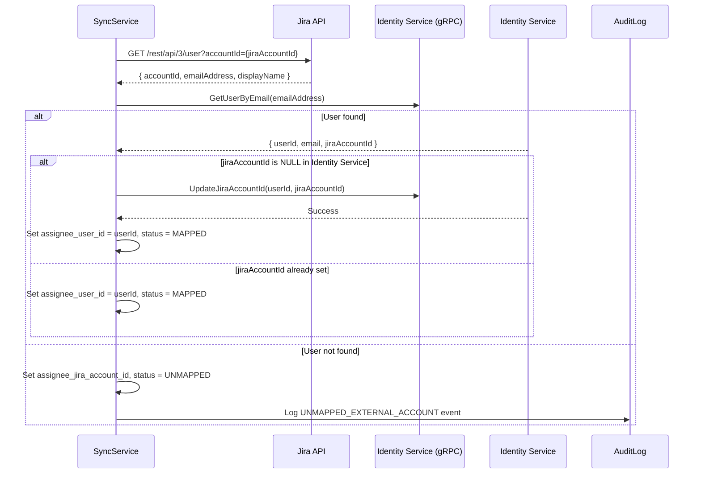
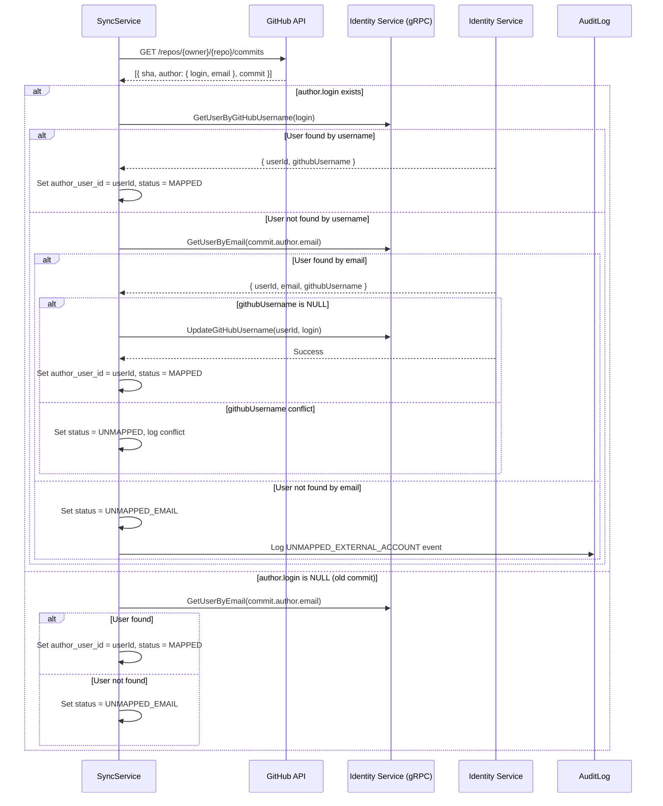

# Sync Service – Design Document

**Version:** 1.0  
**Date:** January 30, 2026  
**Status:** ⏳ PLANNED (Phase 2)

---

## 1. Service Overview

**Purpose:** Đồng bộ dữ liệu từ Jira Software API và GitHub API về hệ thống SAMT để phục vụ:
- Tạo tài liệu SRS tự động (requirements mapping)
- Báo cáo tiến độ dự án (burndown chart, velocity)
- Phân tích đóng góp cá nhân (commits, LOC, chất lượng code)

**Key Responsibilities:**
1. Crawl Jira Issues (Epics, Stories, Tasks, Bugs)
2. Crawl GitHub Commits, Pull Requests, Code Reviews
3. Map external accounts (Jira Account ID, GitHub Username) to SAMT Users
4. Store synchronized data in Sync Service database
5. Expose data via REST API for Reporting Service and AI Service

---

## 2. Database Schema

### 2.1 Bảng `jira_issues`

```sql
CREATE TABLE jira_issues (
  id UUID PRIMARY KEY DEFAULT gen_random_uuid(),
  issue_key VARCHAR(50) NOT NULL UNIQUE,      -- e.g., SWP-123
  group_id UUID NOT NULL,                      -- FK reference (validate via UserGroup Service API)
  
  summary TEXT NOT NULL,
  description TEXT NULL,
  issue_type VARCHAR(20) NOT NULL,             -- Epic, Story, Task, Bug
  status VARCHAR(50) NOT NULL,                 -- To Do, In Progress, Done
  story_points INT DEFAULT 0,
  
  assignee_user_id UUID NULL,                  -- SAMT user (mapped via jira_account_id)
  assignee_jira_account_id VARCHAR(100) NULL,  -- Original Jira assignee ID
  assignee_mapping_status ENUM('MAPPED', 'UNMAPPED') DEFAULT 'UNMAPPED',
  
  created_date TIMESTAMP NOT NULL,
  updated_date TIMESTAMP NOT NULL,
  resolved_date TIMESTAMP NULL,
  
  synced_at TIMESTAMP NOT NULL DEFAULT NOW(),
  
  CONSTRAINT chk_issue_type CHECK (issue_type IN ('Epic', 'Story', 'Task', 'Bug')),
  CONSTRAINT chk_mapping_status CHECK (assignee_mapping_status IN ('MAPPED', 'UNMAPPED'))
);

CREATE INDEX idx_jira_issue_key ON jira_issues(issue_key);
CREATE INDEX idx_jira_group_id ON jira_issues(group_id);
CREATE INDEX idx_jira_assignee_user ON jira_issues(assignee_user_id);
CREATE INDEX idx_jira_mapping_status ON jira_issues(assignee_mapping_status);
```

**Business Rules:**
- `issue_key` must be unique (Jira global identifier)
- `group_id` must exist in UserGroup Service (validate before insert)
- `assignee_user_id` references User in Identity Service (validate via gRPC if mapped)
- `assignee_mapping_status`:
  - `MAPPED`: Successfully mapped Jira assignee to SAMT user
  - `UNMAPPED`: No matching SAMT user found (requires manual mapping via UC-MAP-EXTERNAL-ACCOUNTS)

---

### 2.2 Bảng `github_commits`

```sql
CREATE TABLE github_commits (
  id UUID PRIMARY KEY DEFAULT gen_random_uuid(),
  commit_hash VARCHAR(40) NOT NULL UNIQUE,     -- SHA-1 hash
  group_id UUID NOT NULL,                       -- FK reference (validate via UserGroup Service API)
  
  message TEXT NOT NULL,
  additions INT DEFAULT 0,
  deletions INT DEFAULT 0,
  
  author_user_id UUID NULL,                     -- SAMT user (mapped via github_username)
  author_github_username VARCHAR(100) NULL,     -- Original GitHub author username
  author_github_email VARCHAR(255) NULL,        -- Commit author email (used for mapping)
  author_mapping_status ENUM('MAPPED', 'UNMAPPED', 'UNMAPPED_EMAIL') DEFAULT 'UNMAPPED',
  
  commit_date TIMESTAMP NOT NULL,
  
  ai_quality_score DECIMAL(4,2) NULL,           -- 0-10, set by AI Service
  ai_analysis TEXT NULL,                        -- AI feedback on commit quality
  
  synced_at TIMESTAMP NOT NULL DEFAULT NOW(),
  
  CONSTRAINT chk_quality_score CHECK (ai_quality_score BETWEEN 0 AND 10),
  CONSTRAINT chk_author_mapping_status CHECK (author_mapping_status IN ('MAPPED', 'UNMAPPED', 'UNMAPPED_EMAIL'))
);

CREATE INDEX idx_github_commit_hash ON github_commits(commit_hash);
CREATE INDEX idx_github_group_id ON github_commits(group_id);
CREATE INDEX idx_github_author_user ON github_commits(author_user_id);
CREATE INDEX idx_github_mapping_status ON github_commits(author_mapping_status);
CREATE INDEX idx_github_commit_date ON github_commits(commit_date);
```

**Business Rules:**
- `commit_hash` must be unique (Git global identifier)
- `group_id` must exist in UserGroup Service
- `author_user_id` references User in Identity Service (validate via gRPC if mapped)
- `author_mapping_status`:
  - `MAPPED`: Successfully mapped GitHub author to SAMT user
  - `UNMAPPED`: No matching SAMT user found by username
  - `UNMAPPED_EMAIL`: No matching SAMT user found by email (requires manual mapping)

---

## 3. External Account Auto-Mapping Strategy

### 3.1 Jira Account Mapping

**Strategy:** Map by email



**Implementation Steps:**

1. **Fetch Jira User Info:**
   ```http
   GET https://your-domain.atlassian.net/rest/api/3/user?accountId={accountId}
   Authorization: Basic {base64(email:api_token)}
   ```

2. **Call Identity Service to find user by email:**
   ```protobuf
   rpc GetUserByEmail(GetUserByEmailRequest) returns (GetUserByEmailResponse);
   
   message GetUserByEmailRequest {
     string email = 1;
   }
   
   message GetUserByEmailResponse {
     string user_id = 1;
     string email = 2;
     string full_name = 3;
     string jira_account_id = 4;  // May be NULL
     bool deleted = 5;
   }
   ```

3. **Auto-update `jira_account_id` if NULL:**
   ```protobuf
   rpc UpdateJiraAccountId(UpdateJiraAccountIdRequest) returns (UpdateJiraAccountIdResponse);
   
   message UpdateJiraAccountIdRequest {
     string user_id = 1;
     string jira_account_id = 2;
   }
   ```

4. **Handle mapping result:**
   - **Success:** Set `assignee_user_id`, `assignee_mapping_status = MAPPED`
   - **Failure:** Set `assignee_jira_account_id`, `assignee_mapping_status = UNMAPPED`, log event

**Validation Rules:**
- Email match must be exact (case-insensitive)
- User must NOT be deleted (`deleted_at IS NULL`)
- If `jira_account_id` conflict detected → fail sync, require Admin resolution via UC-MAP-EXTERNAL-ACCOUNTS

---

### 3.2 GitHub Account Mapping

**Strategy:** Map by username first, fallback to commit email



**Implementation Steps:**

1. **Fetch GitHub Commits:**
   ```http
   GET https://api.github.com/repos/{owner}/{repo}/commits
   Authorization: token {github_token}
   ```

2. **Try mapping by GitHub username:**
   ```protobuf
   rpc GetUserByGitHubUsername(GetUserByGitHubUsernameRequest) returns (GetUserByGitHubUsernameResponse);
   
   message GetUserByGitHubUsernameRequest {
     string github_username = 1;
   }
   
   message GetUserByGitHubUsernameResponse {
     string user_id = 1;
     string email = 2;
     string github_username = 3;
     bool deleted = 4;
   }
   ```

3. **Fallback to email mapping:**
   ```protobuf
   rpc GetUserByEmail(GetUserByEmailRequest) returns (GetUserByEmailResponse);
   ```

4. **Auto-update `github_username` if NULL:**
   ```protobuf
   rpc UpdateGitHubUsername(UpdateGitHubUsernameRequest) returns (UpdateGitHubUsernameResponse);
   
   message UpdateGitHubUsernameRequest {
     string user_id = 1;
     string github_username = 2;
   }
   ```

5. **Handle mapping result:**
   - **Success:** Set `author_user_id`, `author_mapping_status = MAPPED`
   - **Username not found, email found:** Auto-update username, set `MAPPED`
   - **Username conflict:** Set `UNMAPPED`, log conflict
   - **Email not found:** Set `UNMAPPED_EMAIL`, log event

**Edge Cases:**
- **GitHub username changed:** Old commits still have old username → cannot map → status = `UNMAPPED`
- **Multiple SAMT users with same email:** Conflict → fail sync, require Admin resolution
- **Commit author is not SAMT user:** Valid case (e.g., external contributor) → status = `UNMAPPED`

---

### 3.3 Manual Mapping Override

When auto-mapping fails, Admin must use **UC-MAP-EXTERNAL-ACCOUNTS** (Identity Service):

**PUT** `/api/admin/users/{userId}/external-accounts`
```json
{
  "jiraAccountId": "5f9d8c7b6a5e4d3c2b1a0987",
  "githubUsername": "student-github-handle"
}
```

**After manual mapping:**
1. Admin updates user in Identity Service
2. Next sync cycle, Sync Service re-checks mapping:
   - Query Identity Service: `GetUserByJiraAccountId()`, `GetUserByGitHubUsername()`
   - Update `assignee_user_id` / `author_user_id` in existing records
   - Change `mapping_status` from `UNMAPPED` → `MAPPED`

**Batch re-mapping:**
```sql
-- After Admin maps user 123 with jiraAccountId = "abc"
UPDATE jira_issues
SET assignee_user_id = '123',
    assignee_mapping_status = 'MAPPED'
WHERE assignee_jira_account_id = 'abc'
  AND assignee_mapping_status = 'UNMAPPED';

-- After Admin maps user 456 with githubUsername = "xyz"
UPDATE github_commits
SET author_user_id = '456',
    author_mapping_status = 'MAPPED'
WHERE author_github_username = 'xyz'
  AND author_mapping_status IN ('UNMAPPED', 'UNMAPPED_EMAIL');
```

---

## 4. Service-to-Service Integration

### 4.1 Identity Service (gRPC)

**Service Contract:** `identity_external_mapping.proto`

```protobuf
service ExternalMappingGrpcService {
  // Query by email
  rpc GetUserByEmail(GetUserByEmailRequest) returns (GetUserByEmailResponse);
  
  // Query by external accounts
  rpc GetUserByJiraAccountId(GetUserByJiraAccountIdRequest) returns (GetUserByJiraAccountIdResponse);
  rpc GetUserByGitHubUsername(GetUserByGitHubUsernameRequest) returns (GetUserByGitHubUsernameResponse);
  
  // Auto-update external accounts (Sync Service only)
  rpc UpdateJiraAccountId(UpdateJiraAccountIdRequest) returns (UpdateJiraAccountIdResponse);
  rpc UpdateGitHubUsername(UpdateGitHubUsernameRequest) returns (UpdateGitHubUsernameResponse);
}
```

**Authentication:**
- Service-to-service authentication with X-Service-Name / X-Service-Key headers
- Only SYNC_SERVICE allowed to call `Update*` methods

**Error Handling:**
- `NOT_FOUND`: User not found
- `ALREADY_EXISTS`: External account already mapped to another user (conflict)
- `PERMISSION_DENIED`: Service not authorized

---

### 4.2 Project Config Service (REST API)

**GET** `/internal/project-configs/{groupId}/tokens`

**Headers:**
```
X-Service-Name: SYNC_SERVICE
X-Service-Key: {sync_service_key}
```

**Response:**
```json
{
  "groupId": "uuid",
  "jiraUrl": "https://your-domain.atlassian.net",
  "jiraEmail": "admin@example.com",
  "jiraApiToken": "decrypted_jira_token",    // Decrypted
  "githubRepoUrl": "https://github.com/org/repo",
  "githubToken": "decrypted_github_token"    // Decrypted
}
```

**Error Codes:**
- `401 Unauthorized`: Missing X-Service-Name or X-Service-Key
- `403 Forbidden`: Service not authorized for decrypted tokens
- `404 Not Found`: Config not found
- `400 Bad Request`: Config state is not VERIFIED

---

### 4.3 User/Group Service (REST API)

**GET** `/api/groups/{groupId}`

**Purpose:** Validate group existence before syncing data

**Response:**
```json
{
  "groupId": "uuid",
  "groupName": "SE1705-G1",
  "semester": "Spring2026",
  "lecturerId": "uuid"
}
```

---

## 5. Sync Process Flow

### 5.1 Scheduled Sync Job

**Trigger:** Cron job (every 1 hour) or manual trigger by Group Leader

**Algorithm:**

```python
def sync_group_data(group_id):
    # Step 1: Get Project Config
    config = project_config_service.get_decrypted_tokens(group_id)
    if not config or config.state != 'VERIFIED':
        log_error("Config not ready")
        return
    
    # Step 2: Sync Jira Issues
    jira_issues = jira_api.fetch_issues(config.jira_url, config.jira_api_token)
    for issue in jira_issues:
        assignee_user = map_jira_assignee(issue.assignee_jira_account_id)
        save_jira_issue(issue, assignee_user)
    
    # Step 3: Sync GitHub Commits
    github_commits = github_api.fetch_commits(config.github_repo_url, config.github_token)
    for commit in github_commits:
        author_user = map_github_author(commit.author_github_username, commit.author_email)
        save_github_commit(commit, author_user)
    
    # Step 4: Log sync completion
    log_sync_success(group_id, total_issues, total_commits)
```

**Error Handling:**
- **Jira API Error 401:** Token invalid → set config.state = INVALID, notify Group Leader
- **GitHub API Error 404:** Repo not found → set config.state = INVALID
- **Network timeout:** Retry with exponential backoff (3 attempts)
- **Partial sync:** If 80% success → still mark sync as SUCCESS, log warnings for failed items

---

### 5.2 Re-sync After Manual Mapping

**Trigger:** Admin completes UC-MAP-EXTERNAL-ACCOUNTS

**Algorithm:**

```python
def resync_after_mapping(user_id, jira_account_id, github_username):
    # Step 1: Update existing Jira issues
    if jira_account_id:
        updated_count = db.execute("""
            UPDATE jira_issues
            SET assignee_user_id = :user_id,
                assignee_mapping_status = 'MAPPED'
            WHERE assignee_jira_account_id = :jira_account_id
              AND assignee_mapping_status = 'UNMAPPED'
        """, user_id=user_id, jira_account_id=jira_account_id)
        log_info(f"Re-mapped {updated_count} Jira issues")
    
    # Step 2: Update existing GitHub commits
    if github_username:
        updated_count = db.execute("""
            UPDATE github_commits
            SET author_user_id = :user_id,
                author_mapping_status = 'MAPPED'
            WHERE author_github_username = :github_username
              AND author_mapping_status IN ('UNMAPPED', 'UNMAPPED_EMAIL')
        """, user_id=user_id, github_username=github_username)
        log_info(f"Re-mapped {updated_count} GitHub commits")
```

**Event-Driven Option:**
- Identity Service publishes `USER_EXTERNAL_MAPPING_UPDATED` event to message queue
- Sync Service subscribes and triggers re-sync automatically

---

## 6. API Endpoints (Sync Service)

### 6.1 Sync Operations (Group Leader)

**POST** `/api/sync/groups/{groupId}/jira`

Trigger manual Jira sync.

**Authorization:** Group Leader of the group

---

**POST** `/api/sync/groups/{groupId}/github`

Trigger manual GitHub sync.

**Authorization:** Group Leader of the group

---

**GET** `/api/sync/groups/{groupId}/status`

Get last sync status.

**Response:**
```json
{
  "groupId": "uuid",
  "lastSyncAt": "2026-01-30T10:00:00Z",
  "status": "SUCCESS",
  "jiraIssuesCount": 45,
  "githubCommitsCount": 230,
  "unmappedJiraAssignees": 2,
  "unmappedGithubAuthors": 3
}
```

---

### 6.2 Data Query (Reporting Service, AI Service)

**GET** `/internal/jira-issues?groupId={groupId}&status={status}`

**Headers:** `X-Service-Name`, `X-Service-Key`

**Query Params:**
- `groupId` (required)
- `status` (optional): To Do, In Progress, Done
- `assigneeUserId` (optional): Filter by mapped user

---

**GET** `/internal/github-commits?groupId={groupId}&authorUserId={userId}`

**Headers:** `X-Service-Name`, `X-Service-Key`

**Query Params:**
- `groupId` (required)
- `authorUserId` (optional): Filter by mapped user
- `startDate`, `endDate` (optional): Date range filter

---

## 7. Monitoring & Observability

### 7.1 Metrics to Track

- **Sync success rate:** % of successful syncs vs failed
- **Mapping success rate:** % of MAPPED vs UNMAPPED records
- **Sync latency:** Time taken to sync all data for a group
- **API rate limit usage:** Track Jira/GitHub API quota consumption

### 7.2 Alerting

- **Config state change:** Alert Group Leader when config becomes INVALID
- **High unmapped rate:** Alert Admin when > 30% of assignees/authors are UNMAPPED
- **API quota exhaustion:** Alert Admin when Jira/GitHub API quota < 20%

---

## 8. Future Enhancements

1. **Incremental Sync:** Only fetch data changed since last sync (using `updated_at` timestamps)
2. **Real-time Webhook:** Subscribe to Jira/GitHub webhooks instead of polling
3. **Smart Re-mapping:** Use AI to suggest user matches based on display name similarity
4. **Multi-Repository Support:** Allow one group to have multiple GitHub repos

---

## ✅ Status

**⏳ PLANNED for Phase 2** – Design complete, implementation pending

**Dependencies:**
- Identity Service: gRPC endpoints for external account queries/updates
- Project Config Service: Internal API for decrypted tokens
- User/Group Service: Group validation API

**Estimated Timeline:**
- Design & API contracts: 2 weeks
- Implementation: 6 weeks
- Testing & Integration: 2 weeks
- **Target Release:** Q3 2026
