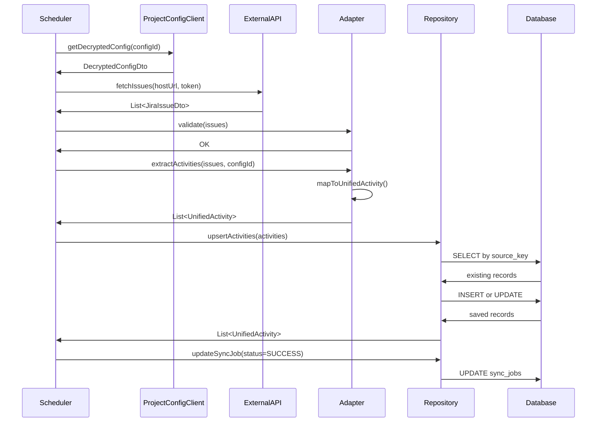

# Sync Service - Logic Design & Data Normalization

**Document:** Design Patterns & Data Flow  
**Version:** 1.0  
**Date:** February 5, 2026

---

## 1. Overview

Sync Service phải xử lý dữ liệu từ **2 nguồn hoàn toàn khác nhau** (Jira và GitHub) với cấu trúc JSON không tương đồng. Document này mô tả cách áp dụng **Strategy Pattern** và **Adapter Pattern** để chuẩn hóa dữ liệu thành **Common Data Model**.

---

## 2. Design Challenges

### 2.1 Problem Statement

**Jira API Response Example:**
```json
{
  "key": "SWP391-123",
  "id": "10025",
  "fields": {
    "summary": "Implement user authentication",
    "description": "Create login/logout endpoints",
    "issuetype": {
      "name": "Task"
    },
    "status": {
      "name": "In Progress"
    },
    "assignee": {
      "emailAddress": "john@example.com",
      "displayName": "John Doe"
    },
    "created": "2026-01-15T10:30:00.000+0000",
    "updated": "2026-02-01T14:25:00.000+0000"
  }
}
```

**GitHub Commit API Response Example:**
```json
{
  "sha": "abc123def456...",
  "commit": {
    "message": "Add login endpoint",
    "author": {
      "name": "John Doe",
      "email": "john@example.com",
      "date": "2026-01-20T08:15:00Z"
    }
  },
  "stats": {
    "additions": 150,
    "deletions": 20,
    "total": 170
  },
  "files": [
    {
      "filename": "AuthController.java",
      "additions": 80,
      "deletions": 5
    }
  ]
}
```

**Challenge:**
- Các field names hoàn toàn khác nhau
- Nested structure khác nhau (Jira: `fields.assignee.emailAddress`, GitHub: `commit.author.email`)
- Data types khác nhau (Jira: ISO-8601 with timezone, GitHub: ISO-8601 UTC)
- Semantic meaning khác nhau (Jira Story Points vs GitHub Lines Changed)

---

## 3. Solution Architecture

### 3.1 Strategy + Adapter Pattern

```
┌─────────────────────────────────────────────────────────────────┐
│                    SyncScheduler                                 │
│                  (Orchestrator)                                  │
└───────────┬─────────────────────────────────────┬───────────────┘
            │                                     │
            │ fetch data                          │ fetch data
            ▼                                     ▼
┌──────────────────────┐              ┌──────────────────────┐
│   JiraApiClient      │              │  GitHubApiClient     │
│                      │              │                      │
│ - fetchIssues()      │              │ - fetchCommits()     │
│ - fetchSprints()     │              │ - fetchPullRequests()│
└──────────┬───────────┘              └──────────┬───────────┘
           │                                     │
           │ raw JSON                            │ raw JSON
           ▼                                     ▼
┌──────────────────────┐              ┌──────────────────────┐
│   JiraAdapter        │              │  GitHubAdapter       │
│  (implements         │              │  (implements         │
│   DataExtractor)     │              │   DataExtractor)     │
│                      │              │                      │
│ - extractIssues()    │              │ - extractCommits()   │
│ - extractSprints()   │              │ - extractPRs()       │
└──────────┬───────────┘              └──────────┬───────────┘
           │                                     │
           │ UnifiedActivity[]                   │ UnifiedActivity[]
           └─────────────┬───────────────────────┘
                         │
                         ▼
              ┌──────────────────────┐
              │  ActivityRepository  │
              │                      │
              │ - saveAll()          │
              └──────────┬───────────┘
                         │
                         ▼
              ┌──────────────────────┐
              │  PostgreSQL          │
              │  - unified_activities│
              └──────────────────────┘
```

---

## 4. Interface Design

### 4.1 DataExtractor Interface

```java
public interface DataExtractor<T> {
    
    /**
     * Extract normalized activities from raw API response
     * 
     * @param rawData Raw JSON response from external API
     * @param projectConfigId Project config ID for FK
     * @return List of UnifiedActivity objects
     */
    List<UnifiedActivity> extractActivities(T rawData, Long projectConfigId);
    
    /**
     * Get activity type for this extractor
     * 
     * @return ActivityType enum (JIRA_ISSUE, GITHUB_COMMIT, etc.)
     */
    ActivityType getActivityType();
    
    /**
     * Validate raw data before extraction
     * 
     * @param rawData Raw data to validate
     * @throws DataExtractionException if data is invalid
     */
    void validate(T rawData) throws DataExtractionException;
}
```

---

### 4.2 Common Data Model

#### 4.2.1 UnifiedActivity Entity

```java
@Entity
@Table(name = "unified_activities")
@SQLRestriction("deleted_at IS NULL")
public class UnifiedActivity {
    
    @Id
    @GeneratedValue(strategy = GenerationType.IDENTITY)
    private Long id;
    
    @Column(name = "project_config_id", nullable = false)
    private Long projectConfigId;
    
    @Enumerated(EnumType.STRING)
    @Column(name = "activity_type", nullable = false, length = 50)
    private ActivityType activityType;
    
    @Column(name = "source_id", nullable = false)
    private Long sourceId;  // FK to jira_issues, github_commits, etc.
    
    @Column(name = "source_key", nullable = false, length = 100)
    private String sourceKey;  // Human-readable: "SWP391-123", "abc123d", "PR #42"
    
    @Column(name = "title", nullable = false, columnDefinition = "TEXT")
    private String title;
    
    @Column(name = "description", columnDefinition = "TEXT")
    private String description;
    
    @Column(name = "status", length = 50)
    private String status;
    
    @Column(name = "assignee_email")
    private String assigneeEmail;
    
    @Column(name = "assignee_name")
    private String assigneeName;
    
    @Column(name = "activity_date", nullable = false)
    private LocalDateTime activityDate;
    
    @Column(name = "completed_date")
    private LocalDateTime completedDate;
    
    @Column(name = "effort_points", precision = 10, scale = 2)
    private BigDecimal effortPoints;
    
    @Type(JsonBinaryType.class)
    @Column(name = "metadata_json", columnDefinition = "jsonb")
    private Map<String, Object> metadata;
    
    @Column(name = "created_at", nullable = false, updatable = false)
    private LocalDateTime createdAt;
    
    @Column(name = "updated_at", nullable = false)
    private LocalDateTime updatedAt;
    
    @Column(name = "deleted_at")
    private LocalDateTime deletedAt;
    
    @Column(name = "deleted_by")
    private Long deletedBy;
    
    // Getters, Setters, Lifecycle callbacks
}
```

#### 4.2.2 ActivityType Enum

```java
public enum ActivityType {
    JIRA_ISSUE("Jira Issue"),
    JIRA_SPRINT("Jira Sprint"),
    GITHUB_COMMIT("GitHub Commit"),
    GITHUB_PR("GitHub Pull Request");
    
    private final String displayName;
    
    ActivityType(String displayName) {
        this.displayName = displayName;
    }
    
    public String getDisplayName() {
        return displayName;
    }
}
```

---

## 5. Adapter Implementations

### 5.1 JiraIssueAdapter

```java
@Component
public class JiraIssueAdapter implements DataExtractor<List<JiraIssueDto>> {
    
    @Override
    public List<UnifiedActivity> extractActivities(List<JiraIssueDto> issues, Long projectConfigId) {
        return issues.stream()
                .map(issue -> mapToUnifiedActivity(issue, projectConfigId))
                .collect(Collectors.toList());
    }
    
    private UnifiedActivity mapToUnifiedActivity(JiraIssueDto issue, Long projectConfigId) {
        UnifiedActivity activity = new UnifiedActivity();
        
        // Basic fields
        activity.setProjectConfigId(projectConfigId);
        activity.setActivityType(ActivityType.JIRA_ISSUE);
        activity.setSourceKey(issue.getKey());  // "SWP391-123"
        activity.setTitle(issue.getFields().getSummary());
        activity.setDescription(issue.getFields().getDescription());
        activity.setStatus(issue.getFields().getStatus().getName());
        
        // Assignee
        if (issue.getFields().getAssignee() != null) {
            activity.setAssigneeEmail(issue.getFields().getAssignee().getEmailAddress());
            activity.setAssigneeName(issue.getFields().getAssignee().getDisplayName());
        }
        
        // Dates
        activity.setActivityDate(parseJiraDate(issue.getFields().getCreated()));
        activity.setCompletedDate(parseJiraDate(issue.getFields().getResolutionDate()));
        
        // Effort (Story Points)
        if (issue.getFields().getStoryPoints() != null) {
            activity.setEffortPoints(issue.getFields().getStoryPoints());
        }
        
        // Metadata (source-specific data)
        Map<String, Object> metadata = new HashMap<>();
        metadata.put("issueType", issue.getFields().getIssueType().getName());
        metadata.put("priority", issue.getFields().getPriority() != null 
                ? issue.getFields().getPriority().getName() : null);
        metadata.put("reporter", issue.getFields().getReporter() != null 
                ? issue.getFields().getReporter().getEmailAddress() : null);
        metadata.put("sprintName", issue.getFields().getSprint() != null 
                ? issue.getFields().getSprint().getName() : null);
        metadata.put("labels", issue.getFields().getLabels());
        
        activity.setMetadata(metadata);
        
        return activity;
    }
    
    @Override
    public ActivityType getActivityType() {
        return ActivityType.JIRA_ISSUE;
    }
    
    @Override
    public void validate(List<JiraIssueDto> issues) throws DataExtractionException {
        if (issues == null || issues.isEmpty()) {
            throw new DataExtractionException("Issues list is null or empty");
        }
        
        for (JiraIssueDto issue : issues) {
            if (issue.getKey() == null || issue.getFields() == null) {
                throw new DataExtractionException("Invalid issue data: missing key or fields");
            }
        }
    }
    
    private LocalDateTime parseJiraDate(String dateStr) {
        if (dateStr == null) return null;
        // Jira format: "2026-01-15T10:30:00.000+0000"
        return ZonedDateTime.parse(dateStr, DateTimeFormatter.ISO_OFFSET_DATE_TIME)
                .toLocalDateTime();
    }
}
```

---

### 5.2 GitHubCommitAdapter

```java
@Component
public class GitHubCommitAdapter implements DataExtractor<List<GitHubCommitDto>> {
    
    @Override
    public List<UnifiedActivity> extractActivities(List<GitHubCommitDto> commits, Long projectConfigId) {
        return commits.stream()
                .map(commit -> mapToUnifiedActivity(commit, projectConfigId))
                .collect(Collectors.toList());
    }
    
    private UnifiedActivity mapToUnifiedActivity(GitHubCommitDto commit, Long projectConfigId) {
        UnifiedActivity activity = new UnifiedActivity();
        
        // Basic fields
        activity.setProjectConfigId(projectConfigId);
        activity.setActivityType(ActivityType.GITHUB_COMMIT);
        activity.setSourceKey(commit.getSha().substring(0, 7));  // First 7 chars: "abc123d"
        activity.setTitle(commit.getCommit().getMessage().split("\n")[0]);  // First line only
        activity.setDescription(commit.getCommit().getMessage());
        activity.setStatus("committed");  // Commits don't have status
        
        // Author
        if (commit.getCommit().getAuthor() != null) {
            activity.setAssigneeEmail(commit.getCommit().getAuthor().getEmail());
            activity.setAssigneeName(commit.getCommit().getAuthor().getName());
        }
        
        // Dates
        activity.setActivityDate(parseGitHubDate(commit.getCommit().getAuthor().getDate()));
        activity.setCompletedDate(parseGitHubDate(commit.getCommit().getAuthor().getDate()));  // Same as activity date
        
        // Effort (Lines changed)
        if (commit.getStats() != null) {
            BigDecimal linesChanged = BigDecimal.valueOf(commit.getStats().getTotal());
            activity.setEffortPoints(linesChanged);
        }
        
        // Metadata
        Map<String, Object> metadata = new HashMap<>();
        metadata.put("sha", commit.getSha());
        metadata.put("branch", commit.getBranch());  // Requires additional API call or webhook data
        metadata.put("additions", commit.getStats() != null ? commit.getStats().getAdditions() : 0);
        metadata.put("deletions", commit.getStats() != null ? commit.getStats().getDeletions() : 0);
        metadata.put("filesChanged", commit.getFiles() != null ? commit.getFiles().size() : 0);
        metadata.put("files", commit.getFiles() != null 
                ? commit.getFiles().stream().map(GitHubFileDto::getFilename).collect(Collectors.toList()) 
                : Collections.emptyList());
        
        activity.setMetadata(metadata);
        
        return activity;
    }
    
    @Override
    public ActivityType getActivityType() {
        return ActivityType.GITHUB_COMMIT;
    }
    
    @Override
    public void validate(List<GitHubCommitDto> commits) throws DataExtractionException {
        if (commits == null || commits.isEmpty()) {
            throw new DataExtractionException("Commits list is null or empty");
        }
        
        for (GitHubCommitDto commit : commits) {
            if (commit.getSha() == null || commit.getCommit() == null) {
                throw new DataExtractionException("Invalid commit data: missing SHA or commit object");
            }
        }
    }
    
    private LocalDateTime parseGitHubDate(String dateStr) {
        if (dateStr == null) return null;
        // GitHub format: "2026-01-20T08:15:00Z"
        return ZonedDateTime.parse(dateStr, DateTimeFormatter.ISO_INSTANT.withZone(ZoneId.of("UTC")))
                .toLocalDateTime();
    }
}
```

---

### 5.3 GitHubPullRequestAdapter

```java
@Component
public class GitHubPullRequestAdapter implements DataExtractor<List<GitHubPullRequestDto>> {
    
    @Override
    public List<UnifiedActivity> extractActivities(List<GitHubPullRequestDto> pullRequests, Long projectConfigId) {
        return pullRequests.stream()
                .map(pr -> mapToUnifiedActivity(pr, projectConfigId))
                .collect(Collectors.toList());
    }
    
    private UnifiedActivity mapToUnifiedActivity(GitHubPullRequestDto pr, Long projectConfigId) {
        UnifiedActivity activity = new UnifiedActivity();
        
        // Basic fields
        activity.setProjectConfigId(projectConfigId);
        activity.setActivityType(ActivityType.GITHUB_PR);
        activity.setSourceKey("PR #" + pr.getNumber());  // "PR #42"
        activity.setTitle(pr.getTitle());
        activity.setDescription(pr.getBody());
        activity.setStatus(pr.getState());  // "open", "closed", "merged"
        
        // Author
        if (pr.getUser() != null) {
            activity.setAssigneeEmail(pr.getUser().getEmail());  // May be null if privacy settings
            activity.setAssigneeName(pr.getUser().getLogin());
        }
        
        // Dates
        activity.setActivityDate(parseGitHubDate(pr.getCreatedAt()));
        activity.setCompletedDate(pr.getMergedAt() != null 
                ? parseGitHubDate(pr.getMergedAt()) 
                : parseGitHubDate(pr.getClosedAt()));
        
        // Effort (Lines changed)
        BigDecimal linesChanged = BigDecimal.valueOf(pr.getAdditions() + pr.getDeletions());
        activity.setEffortPoints(linesChanged);
        
        // Metadata
        Map<String, Object> metadata = new HashMap<>();
        metadata.put("number", pr.getNumber());
        metadata.put("state", pr.getState());
        metadata.put("sourceBranch", pr.getHead().getRef());
        metadata.put("targetBranch", pr.getBase().getRef());
        metadata.put("additions", pr.getAdditions());
        metadata.put("deletions", pr.getDeletions());
        metadata.put("filesChanged", pr.getChangedFiles());
        metadata.put("commitsCount", pr.getCommits());
        metadata.put("reviewers", pr.getRequestedReviewers() != null 
                ? pr.getRequestedReviewers().stream().map(GitHubUserDto::getLogin).collect(Collectors.toList()) 
                : Collections.emptyList());
        
        activity.setMetadata(metadata);
        
        return activity;
    }
    
    @Override
    public ActivityType getActivityType() {
        return ActivityType.GITHUB_PR;
    }
    
    @Override
    public void validate(List<GitHubPullRequestDto> pullRequests) throws DataExtractionException {
        if (pullRequests == null || pullRequests.isEmpty()) {
            throw new DataExtractionException("Pull requests list is null or empty");
        }
        
        for (GitHubPullRequestDto pr : pullRequests) {
            if (pr.getNumber() == null || pr.getTitle() == null) {
                throw new DataExtractionException("Invalid PR data: missing number or title");
            }
        }
    }
    
    private LocalDateTime parseGitHubDate(String dateStr) {
        if (dateStr == null) return null;
        return ZonedDateTime.parse(dateStr, DateTimeFormatter.ISO_INSTANT.withZone(ZoneId.of("UTC")))
                .toLocalDateTime();
    }
}
```

---

## 6. Sync Orchestrator

### 6.1 SyncScheduler

```java
@Service
@RequiredArgsConstructor
@Slf4j
public class SyncScheduler {
    
    private final ProjectConfigClient projectConfigClient;
    private final JiraApiClient jiraApiClient;
    private final GitHubApiClient gitHubApiClient;
    
    private final JiraIssueAdapter jiraIssueAdapter;
    private final GitHubCommitAdapter gitHubCommitAdapter;
    private final GitHubPullRequestAdapter gitHubPullRequestAdapter;
    
    private final UnifiedActivityRepository activityRepository;
    private final SyncJobRepository syncJobRepository;
    
    @Scheduled(cron = "${sync.scheduler.jira-issues-cron}")
    public void syncJiraIssues() {
        log.info("Starting scheduled Jira issues sync");
        
        List<ProjectConfigDto> configs = getVerifiedConfigs();
        
        for (ProjectConfigDto config : configs) {
            syncJiraIssuesForConfig(config);
        }
        
        log.info("Completed Jira issues sync for {} configs", configs.size());
    }
    
    private void syncJiraIssuesForConfig(ProjectConfigDto config) {
        SyncJob job = createSyncJob(config.getId(), JobType.JIRA_ISSUES);
        
        try {
            // Step 1: Get decrypted tokens via gRPC
            DecryptedConfigDto decryptedConfig = projectConfigClient.getDecryptedConfig(config.getId());
            
            // Step 2: Fetch raw data from Jira API
            List<JiraIssueDto> issues = jiraApiClient.fetchIssues(
                    decryptedConfig.getJiraHostUrl(),
                    decryptedConfig.getJiraApiToken(),
                    config.getJiraProjectKey()
            );
            
            // Step 3: Validate data
            jiraIssueAdapter.validate(issues);
            
            // Step 4: Transform to UnifiedActivity
            List<UnifiedActivity> activities = jiraIssueAdapter.extractActivities(issues, config.getId());
            
            // Step 5: Save to database (upsert logic)
            List<UnifiedActivity> savedActivities = upsertActivities(activities);
            
            // Step 6: Update job status
            job.setStatus(JobStatus.SUCCESS);
            job.setRecordsFetched(issues.size());
            job.setRecordsSaved(savedActivities.size());
            job.setCompletedAt(LocalDateTime.now());
            
        } catch (Exception e) {
            log.error("Sync failed for config {}: {}", config.getId(), e.getMessage(), e);
            
            job.setStatus(JobStatus.FAILED);
            job.setErrorMessage(e.getMessage());
            job.setCompletedAt(LocalDateTime.now());
            
            // Check if token expired
            if (isTokenExpiredError(e)) {
                markConfigAsInvalid(config.getId());
            }
        } finally {
            syncJobRepository.save(job);
        }
    }
    
    private List<UnifiedActivity> upsertActivities(List<UnifiedActivity> activities) {
        // Check existing records by source_key + activity_type
        List<UnifiedActivity> saved = new ArrayList<>();
        
        for (UnifiedActivity activity : activities) {
            Optional<UnifiedActivity> existing = activityRepository
                    .findBySourceKeyAndActivityType(activity.getSourceKey(), activity.getActivityType());
            
            if (existing.isPresent()) {
                // Update existing
                UnifiedActivity existingActivity = existing.get();
                existingActivity.setTitle(activity.getTitle());
                existingActivity.setDescription(activity.getDescription());
                existingActivity.setStatus(activity.getStatus());
                existingActivity.setAssigneeEmail(activity.getAssigneeEmail());
                existingActivity.setAssigneeName(activity.getAssigneeName());
                existingActivity.setCompletedDate(activity.getCompletedDate());
                existingActivity.setEffortPoints(activity.getEffortPoints());
                existingActivity.setMetadata(activity.getMetadata());
                existingActivity.setUpdatedAt(LocalDateTime.now());
                
                saved.add(activityRepository.save(existingActivity));
            } else {
                // Insert new
                saved.add(activityRepository.save(activity));
            }
        }
        
        return saved;
    }
    
    private List<ProjectConfigDto> getVerifiedConfigs() {
        // Query project_configs table for configs with state=VERIFIED
        // Note: This requires querying Project Config Service database directly
        // OR exposing a gRPC method to list verified configs
        // For now, assume we have access to project_configs table via JPA
        return projectConfigRepository.findAllByStateAndDeletedAtIsNull(ConfigState.VERIFIED);
    }
    
    private SyncJob createSyncJob(Long configId, JobType jobType) {
        SyncJob job = new SyncJob();
        job.setProjectConfigId(configId);
        job.setJobType(jobType);
        job.setStatus(JobStatus.RUNNING);
        job.setStartedAt(LocalDateTime.now());
        return syncJobRepository.save(job);
    }
    
    private boolean isTokenExpiredError(Exception e) {
        // Check if error message contains "401", "Unauthorized", "expired token"
        String message = e.getMessage().toLowerCase();
        return message.contains("401") || message.contains("unauthorized") || message.contains("expired");
    }
    
    private void markConfigAsInvalid(Long configId) {
        // Update project_config state to INVALID
        // This requires either:
        // 1. Direct database update (if same DB)
        // 2. gRPC call to Project Config Service (if separate DB)
        // 3. Message queue event (Kafka, RabbitMQ)
        
        // For now, log the issue
        log.warn("Token expired for config {}. Manual intervention required.", configId);
    }
}
```

---

## 7. Data Flow Diagram

### 7.1 Complete Sync Flow (Mermaid)



---

## 8. Calculation Strategy for Contribution

### 8.1 Contribution Percentage Formula

**Goal:** Tính % đóng góp của sinh viên trong dự án dựa trên activities.

**Formula:**
```
Contribution % = (Student Points / Total Team Points) * 100

Where:
  Student Points = SUM(effort_points WHERE assignee_email = student.email)
  Total Team Points = SUM(effort_points WHERE project_config_id = X)
```

**Effort Points Mapping:**

| Activity Type | Effort Points |
|--------------|---------------|
| Jira Issue (Task) | Story Points (if available) |
| Jira Issue (Story) | Story Points * 1.5 |
| Jira Issue (Bug) | Story Points * 0.8 |
| GitHub Commit | Lines Changed / 10 |
| GitHub PR | Lines Changed / 10 |

**Query Example:**
```sql
-- Calculate contribution for student@example.com in project_config_id = 123
SELECT 
    assignee_email,
    SUM(effort_points) AS student_points,
    (SUM(effort_points) / (SELECT SUM(effort_points) FROM unified_activities WHERE project_config_id = 123)) * 100 AS contribution_percentage
FROM unified_activities
WHERE project_config_id = 123
  AND assignee_email = 'student@example.com'
  AND deleted_at IS NULL
GROUP BY assignee_email;
```

---

### 8.2 Query Optimization for Reporting

**Problem:** Reporting Service cần query theo nhiều chiều (by student, by sprint, by activity type, by date range).

**Solution:** Sử dụng database indexes và materialized views.

**Indexes (already defined in SYNC_SERVICE_OVERVIEW.md):**
```sql
CREATE INDEX idx_unified_activities_config ON unified_activities(project_config_id);
CREATE INDEX idx_unified_activities_assignee ON unified_activities(assignee_email);
CREATE INDEX idx_unified_activities_type ON unified_activities(activity_type);
CREATE INDEX idx_unified_activities_date ON unified_activities(activity_date);
```

**Materialized View (future enhancement):**
```sql
CREATE MATERIALIZED VIEW student_contribution_summary AS
SELECT 
    project_config_id,
    assignee_email,
    activity_type,
    DATE_TRUNC('week', activity_date) AS week_start,
    COUNT(*) AS activity_count,
    SUM(effort_points) AS total_effort,
    SUM(CASE WHEN status IN ('Done', 'merged', 'closed') THEN effort_points ELSE 0 END) AS completed_effort
FROM unified_activities
WHERE deleted_at IS NULL
  AND assignee_email IS NOT NULL
GROUP BY project_config_id, assignee_email, activity_type, week_start;

-- Refresh daily
REFRESH MATERIALIZED VIEW student_contribution_summary;
```

---

## 9. Error Handling Strategy

### 9.1 Exception Hierarchy

```java
public class DataExtractionException extends RuntimeException {
    private final String errorCode;
    private final Object[] args;
    
    public DataExtractionException(String errorCode, String message) {
        super(message);
        this.errorCode = errorCode;
    }
    
    public DataExtractionException(String errorCode, String message, Object... args) {
        super(message);
        this.errorCode = errorCode;
        this.args = args;
    }
}

public class ExternalApiException extends RuntimeException {
    private final int statusCode;
    private final String apiName;
    
    public ExternalApiException(String apiName, int statusCode, String message) {
        super(message);
        this.apiName = apiName;
        this.statusCode = statusCode;
    }
}

public class TokenExpiredException extends ExternalApiException {
    public TokenExpiredException(String apiName) {
        super(apiName, 401, "API token has expired");
    }
}
```

### 9.2 Retry Logic

```java
@Service
public class ResilientJiraApiClient {
    
    @Retry(name = "externalApi", fallbackMethod = "fetchIssuesFallback")
    @CircuitBreaker(name = "externalApi")
    @RateLimiter(name = "jiraApi")
    public List<JiraIssueDto> fetchIssues(String hostUrl, String token, String projectKey) {
        // Make HTTP call
    }
    
    private List<JiraIssueDto> fetchIssuesFallback(String hostUrl, String token, String projectKey, Exception e) {
        log.error("Failed to fetch Jira issues after retries: {}", e.getMessage());
        throw new ExternalApiException("Jira", 0, "Failed to fetch issues: " + e.getMessage());
    }
}
```

---

## 10. Testing Strategy

### 10.1 Unit Tests

**Test Adapter Logic:**
```java
@Test
public void testJiraIssueAdapter_extractActivities() {
    // Given
    JiraIssueDto issue = JiraIssueDtoFixture.createSampleIssue();
    List<JiraIssueDto> issues = List.of(issue);
    Long projectConfigId = 123L;
    
    // When
    List<UnifiedActivity> activities = jiraIssueAdapter.extractActivities(issues, projectConfigId);
    
    // Then
    assertThat(activities).hasSize(1);
    UnifiedActivity activity = activities.get(0);
    assertThat(activity.getProjectConfigId()).isEqualTo(projectConfigId);
    assertThat(activity.getActivityType()).isEqualTo(ActivityType.JIRA_ISSUE);
    assertThat(activity.getSourceKey()).isEqualTo("SWP391-123");
    assertThat(activity.getTitle()).isEqualTo("Implement user authentication");
    assertThat(activity.getAssigneeEmail()).isEqualTo("john@example.com");
}
```

### 10.2 Integration Tests

**Test Complete Sync Flow:**
```java
@SpringBootTest
@Testcontainers
public class SyncSchedulerIntegrationTest {
    
    @Container
    static PostgreSQLContainer<?> postgres = new PostgreSQLContainer<>("postgres:15-alpine");
    
    @MockBean
    private JiraApiClient jiraApiClient;
    
    @Autowired
    private SyncScheduler syncScheduler;
    
    @Autowired
    private UnifiedActivityRepository activityRepository;
    
    @Test
    public void testSyncJiraIssues_success() {
        // Given
        when(jiraApiClient.fetchIssues(any(), any(), any()))
                .thenReturn(JiraIssueDtoFixture.createSampleIssues());
        
        // When
        syncScheduler.syncJiraIssuesForConfig(ProjectConfigDtoFixture.createVerifiedConfig());
        
        // Then
        List<UnifiedActivity> activities = activityRepository.findAll();
        assertThat(activities).hasSize(5);
    }
}
```

---

## 11. Class Diagram (Text Representation)

```
┌─────────────────────────────────────────────────────────────────┐
│                    <<interface>>                                 │
│                    DataExtractor<T>                              │
├─────────────────────────────────────────────────────────────────┤
│ + extractActivities(T, Long): List<UnifiedActivity>             │
│ + getActivityType(): ActivityType                               │
│ + validate(T): void                                             │
└────────────────────────────┬────────────────────────────────────┘
                             │
                 ┌───────────┼────────────┐
                 │           │            │
                 ▼           ▼            ▼
    ┌──────────────────┐ ┌──────────────────┐ ┌──────────────────┐
    │ JiraIssueAdapter │ │GitHubCommitAdapt │ │GitHubPRAdapter   │
    ├──────────────────┤ ├──────────────────┤ ├──────────────────┤
    │ - extractActivit │ │ - extractActivit │ │ - extractActivit │
    │ - validate       │ │ - validate       │ │ - validate       │
    │ - parseJiraDate  │ │ - parseGitHubDat │ │ - parseGitHubDat │
    └──────────────────┘ └──────────────────┘ └──────────────────┘
                             │
                             │ produces
                             ▼
                  ┌──────────────────────┐
                  │  UnifiedActivity     │
                  ├──────────────────────┤
                  │ - id: Long           │
                  │ - projectConfigId    │
                  │ - activityType       │
                  │ - sourceKey          │
                  │ - title              │
                  │ - assigneeEmail      │
                  │ - effortPoints       │
                  │ - metadata           │
                  └──────────────────────┘
```

---

## Summary

Design này giải quyết vấn đề **heterogeneous data sources** bằng cách:

1. **Strategy Pattern:** Mỗi nguồn dữ liệu (Jira, GitHub) có một adapter riêng implement `DataExtractor` interface
2. **Adapter Pattern:** Convert raw JSON → common data model (`UnifiedActivity`)
3. **Single Source of Truth:** Reporting và AI Service chỉ cần query `unified_activities` table
4. **Extensibility:** Thêm nguồn dữ liệu mới (GitLab, Bitbucket) chỉ cần implement `DataExtractor`
5. **Separation of Concerns:** 
   - API Clients: Fetch raw data
   - Adapters: Transform data
   - Repository: Persist data
   - Scheduler: Orchestrate flow

**Key Benefits:**
- Clean separation between external API concerns and business logic
- Easy to test (mock adapters, test transformations independently)
- Flexible metadata storage (JSONB) for source-specific data
- Optimized for reporting queries (indexes on assignee, date, type)

**Next:** Xem [GRPC_INTEGRATION.md](GRPC_INTEGRATION.md) để hiểu cách gọi Project Config Service.
